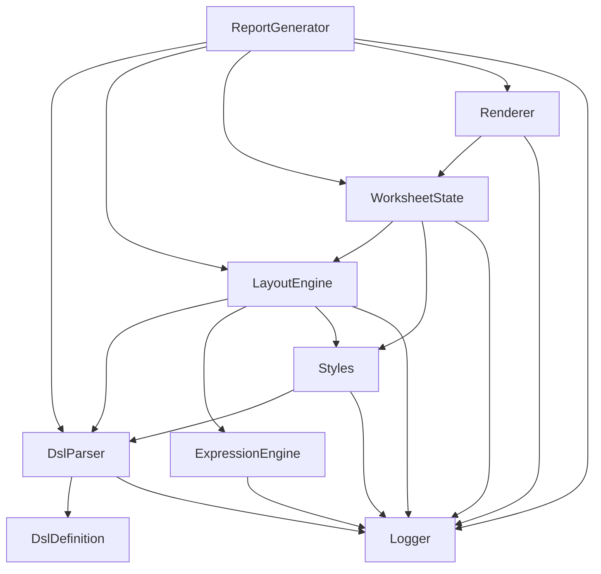

# 基本設計

最終更新: 2025-11-16  
Optimizer Excel Report Library — Basic Design

---

# 0. 変更概要 (Changelog)

---

## Status
- As-Is (Implemented): `DslParser + AST` のみ実装済み（証跡: `ExcelReport/ExcelReportLib/DSL/DslParser.cs:11`, `ExcelReport/ExcelReportLib/DSL/AST/WorkBookAst.cs:8`）。
- As-Is (Partial): XSD 検証オプションは定義済みだが実行無効（証跡: `ExcelReport/ExcelReportLib/DSL/DslParser.cs:47`, `ExcelReport/ExcelReportLib/DSL/DslParser.cs:318`）。
- To-Be (Planned): ExpressionEngine / LayoutEngine / WorksheetState / Renderer / Logger / ReportGenerator は未実装（証跡: `reports/implementation-inventory-2026-02-13.md:30`, `reports/implementation-inventory-2026-02-13.md:37`）。

---

## 0.2 文書規約（設計-実装整合）

## 0.2.1 As-Is / To-Be ラベル規約
- 主要設計書は先頭に `Status` セクションを持つこと。
- 仕様本文で実装事実を書くときは `As-Is:` を付けること。
- 将来計画を書くときは `To-Be:` を付けること。
- 未実装項目は `To-Be` とし、実装タスク必要性を明記すること。

## 0.2.2 命名・表記統一（実装準拠）
- `use` のインスタンス属性名は `instance` を正とする（`name` は非推奨）。
- 外部スタイル取込タグは `<styleImport>` を正とする（`<import>` は非推奨）。
- span 属性は `rowSpan` / `colSpan` を正とする（`rowspan` / `colspan` は非推奨）。
- DslParser API は `public static class DslParser` を As-Is 正とする。

## 0.2.3 証跡記載規約
- 実装言及箇所には必ず `ファイルパス:行番号` を付ける。
- 実装未着手モジュールの言及は、実装インベントリ等の証跡文書行番号を付ける。

# 1. 詳細設計の粒度ガイドライン (共通)

## 1.1 記述レベル (Do’s)
- 公開APIの一覧と契約条件（前提／事後／例外動作）。  
- データモデル（主要型のフィールド表、不変条件）。  
- モジュール内部の高レベル処理フロー（ステップ列挙）。  
- エラー分類（IssueKind）と対応方針。  
- 性能方針（オーダー・ボトルネック候補）。  
- テスト観点（正常/境界/異常/負荷/回復）。

## 1.2 除外レベル (Don’ts)
- 私的メソッドの網羅、細かい最適化、  
- 必要以上の擬似コード（例外：WorksheetState の座標割付など事故リスクが高い箇所のみ骨子可）、  
- XSD の全文定義と細粒度命名規則（詳細設計側で扱う）。

## 1.3 成果物フォーマット
- モジュール単位で 1 章構成（概要 → API → データモデル → フロー → エラー → 性能 → テスト）。  
- 図は任意（ASCII で可）。

---

# 2. モジュール別「詳細設計で書くべき範囲」

## 2.1 入力オブジェクトパーサ (ReportGenerator)
**MUST**
- 公開 API（例 `GenerateAsync`）。  
- 入力オブジェクト構造の前提（必須項目・既定値）。  
- 読込 → 構文解釈 → 検証 → Issues 生成の全体フロー。  
- エラーモデル（I/O／構文／未知タグ／不整合）。

---

## 2.2 DSL 定義 (DslDefinition)

**MUST**
- DSL 要素の種類（詳細設計が提供する最新仕様に従う）。  
  現時点での要素集合（参考・詳細設計を正とする）:  
  `workbook / styles / style / styleRef / styleImport / component / components / componentImport / sheet / grid / cell / use / repeat / sheetOptions / freeze / groupRows / groupCols / autoFilter`
- 主要属性の意味と排他関係（value/Excel数式/C#式、formulaRef、when）。  
- C# 式 `@( … )` の評価主体が ExpressionEngine であること。  
- XSD を提供すること（全文は詳細設計で管理）。  
- 命名規則/正規表現など仕様上必要な規範の提示。  

**NICE**
- 10〜20行規模の簡易 DSL サンプル。  

---

## 2.3 DSL パーサ XML→AST (DslParser)
**MUST**
- API（Parse/Validate）。  
- AST ノードの主要構造と関係図。  
- 検証順序（構文 → 意味 → 参照解決 → 静的レイアウト検証）。  
- C# 式の事前コンパイルとキャッシュ方針。

**OUT**
- ノード全プロパティの網羅。

---

## 2.4 C# 式評価 (ExpressionEngine)
**MUST**
- 許可名前空間（System/LINQ など）と  
  グローバル `root` / `data` / `vars` の参照設計。  
- 例外発生時 `#ERR(...)` 戻り値と Issues 記録。  
- 式→デリゲートのキャッシュ。

---

## 2.5 LayoutEngine（レイアウト計画生成）
**MUST**
- **入力: AST**  
- **出力: LayoutPlan（論理レイアウト）**  
- 責務:
  - 行列座標の割付  
  - データバインディング（AST と C# オブジェクトの紐づけ）
  - repeat 展開  
  - セル結合（merge）判定  
  - スタイル適用の計画（論理レベル）  
  - 名前付き範囲（Area）や formulaRef 計画の作成  
- LayoutEngine は Excel オブジェクトを触らない（ClosedXML 不使用）。  
- キャンセルポイントは基本不要（CPU 計算中心）。
- LayoutEngine は Styles モジュールから得たスタイル情報（StylePlan）をもとに、  
  スコープ・優先順位・競合解決を含む **スタイル適用結果を最終決定する**。  
- WorksheetState / Renderer は、LayoutEngine が決定した結果  
  （LayoutPlan + スタイル適用結果）を前提として動作し、  
  **スタイル優先順位の再解決は行わない**。
---

## 2.6 WorksheetState（シート状態管理）

**MUST**
- **入力: LayoutPlan（論理レイアウト + 最終スタイル適用結果）**  
- **出力: WorksheetState / WorkbookState（最終シート状態）**  
- 責務:
  - 行・列・セルの物理座標への展開  
  - CellState（値 / 数式 / エラー）の構築  
  - MergedRanges / NamedAreas / FormulaSeries の展開  
  - **StyleSnapshot（Excel に投影可能な最終スタイル辞書）の構築・保持**  
  - **SheetOptions（印刷設定・ビュー設定など）の確定・保持**  
- WorksheetState は「Renderer に引き渡す最終状態」とし、  
  **スタイル優先順位や衝突解決のロジックは持たない**（いずれも LayoutEngine 側で完了している前提）。  
- WorksheetState オブジェクトは不変（read-only）として扱い、  
  Renderer はこれを変更しない。

**OUT**
- セル内部の一時計算用キャッシュ戦略など、実装寄りの最適化。
- Excel 具象ライブラリ（ClosedXML 等）の型への直接依存。

---

## 2.7 Renderer（xlsx 出力）

**MUST**
- **入力: WorkbookState / WorksheetState（最終状態）**  
- **出力: xlsx ファイルまたはストリーム**  
- 責務:
  - WorksheetState の CellState / MergedRanges / NamedAreas / FormulaSeries を  
    Excel(OpenXML) 上のセル・範囲・名前にマッピングすること。  
  - WorksheetState が保持する **StyleSnapshot** を、  
    Excel のスタイル（セルスタイル / 書式 / 塗り / 罫線 等）として機械的に適用すること。  
  - WorksheetState が保持する **SheetOptions**（印刷設定・ビュー設定 等）を  
    該当シートに反映すること。  
  - Book / Sheet / CellBatch の進捗通知、および I/O エラーの Logger への記録。  
- Renderer は **WorksheetState の内容を一切変更しない**。  
- Renderer は **スタイルの優先順位や衝突解決の判断を行わない**。  
  （StyleSnapshot は WorksheetState 構築時点で完全に確定している前提。）

**OUT**
- Excel 内部 XML 要素名の列挙や、ClosedXML の API 詳細。  
- パフォーマンスチューニング（バッファサイズ・ストリーム戦略など）の実装詳細。

---

## 2.8 Styles（スタイル管理）

**MUST**
- **入力: DSL テンプレート内 `<styles>` 要素、および外部スタイル定義ファイル**  
- **出力: LayoutEngine が消費可能な中間スタイル定義（StyleDefinition / StylePlan 等）**  
- 責務:
  - DSL / 外部 XML からのスタイル定義の読込。  
  - スコープ（cell / grid / both）や対象要素の検証。  
  - 型・必須属性・参照整合性の検証。  
  - font / fill / border / numberFormat など、論理スタイル要素への正規化。  
  - LayoutEngine が「スタイル適用優先順位の最終決定」を行えるよう、  
    **スタイル定義と適用条件を情報落ちなく StylePlan として提供すること。**  
- Styles 自体は、  
  **スタイル優先順位の最終決定・複数スタイルの合成・StyleSnapshot の構築は行わない。**  
  これらは LayoutEngine（論理合成）および WorksheetStateBuilder（物理展開）の責務とする。

**OUT**
- Excel 実体のスタイル ID 採番や、Workbook 内のスタイル辞書構築。  
  （これは WorksheetState / Renderer 側の詳細設計で扱う。）  
- 個々のスタイルプロパティの全列挙（詳細は DSL 定義／XSD に委譲）。

---

## 2.9 進捗・ログ・監査 (Logger)
**MUST**
- レポート進捗粒度（Book→Sheet→Region→セルバッチ）。  
- 監査情報の格納先（隠しシート）。  

---

# 3. 詳細設計の成果物（期待）

| 章 | タイトル | 期待成果（MUST） |
|----|----------|------------------|
| 1 | ReportGenerator | API 契約／ドメイン型表／フロー／エラーモデル／テスト観点 |
| 2 | DslDefinition | 要素一覧／属性意味／排他関係／サンプル／テスト観点 |
| 3 | DslParser | API／AST／検証順序／エラーモデル／事前コンパイル方針 |
| 4 | ExpressionEngine | 許可NS／Globals／エラーポリシー／キャッシュ／テスト観点 |
| 5 | LayoutEngine | 論理レイアウト手順／継続条件／テスト観点 |
| 6 | WorksheetState | 占有管理／不変条件／疑似コード骨子／エラー／テスト観点 |
| 7 | Renderer | 物理反映手順／I/O／進捗／エラー／テスト観点 |
| 8 | Styles | 外部化要件／優先順位／テスト観点 |
| 9 | Logger | 進捗粒度／監査メタ格納方針／テスト観点 |

---

# 4. 受入基準 (Definition of Done)
- 各章の MUST が全て埋まっている。  
- 公開 API の契約が明確で矛盾がない。  
- Fatal 条件・警告条件が曖昧なく記述されている。  

---

# 5. モジュール一覧

| モジュール | 役割 | 境界 |
|------------|------|--------|
| ReportGenerator | 外部 API、進捗、全体調整 | 入力→AST→LayoutPlan→WorksheetState→xlsx |
| DslDefinition | DSL の意味論・構文・XSD | 詳細設計で完全定義 |
| DslParser | XML→AST＋静的検証 | String/File→AST/Issues |
| ExpressionEngine | C#式評価 | 文字列式→値 |
| LayoutEngine | 論理レイアウト計画 | AST→LayoutPlan |
| WorksheetState | 占有・結合・状態管理 | LayoutPlan→状態 |
| Renderer | Excel 物理出力 | WorksheetState→xlsx |
| Styles | スタイル定義・外部化読込 | style名→StyleSpec |

---

## 6. モジュール間依存関係

本章では Optimizer Excel Report Library を構成する各モジュールの  
**直接依存関係** を示す。  
矢印は「左のモジュールが右のモジュールに依存する」ことを表す。

## 6.1 依存関係一覧（直接依存）

| モジュール | 直接依存先 |
|-----------|------------|
| ReportGenerator | DslParser / LayoutEngine / WorksheetState / Renderer / Logger |
| DslParser | Styles / Logger |
| Styles | Logger |
| ExpressionEngine | Logger |
| LayoutEngine | Styles / ExpressionEngine / Logger |
| WorksheetState | Logger |
| Renderer | WorksheetState / Logger |

## 6.2 レイヤ構造と依存方向（Mermaid 図）

(以上)
