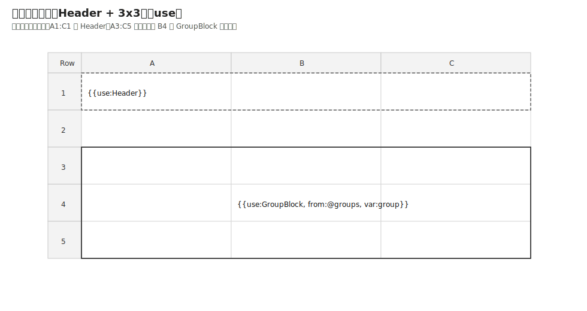
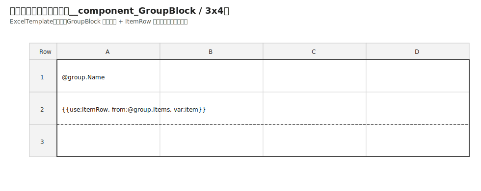
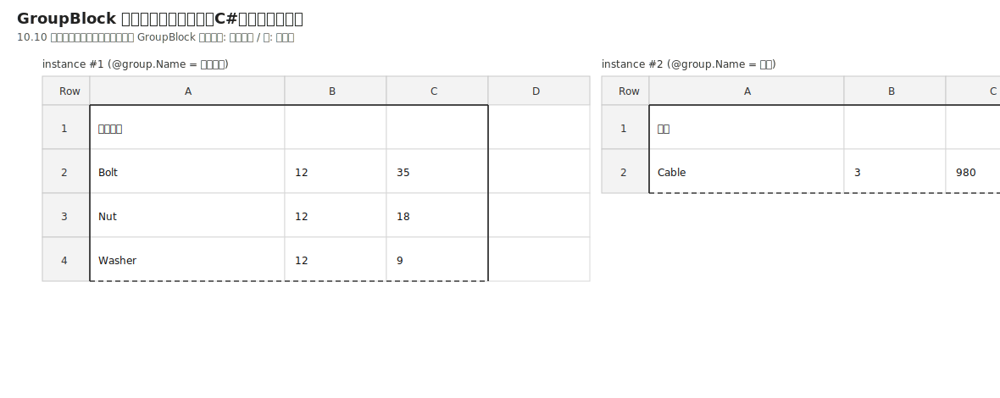
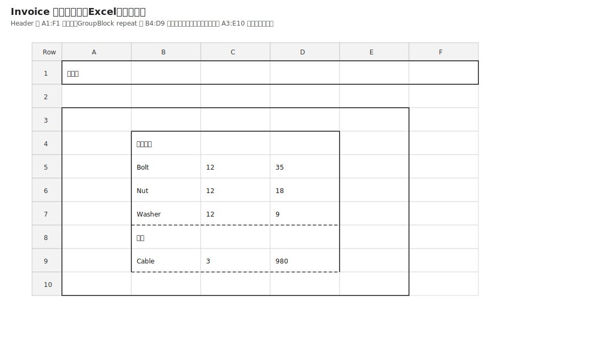
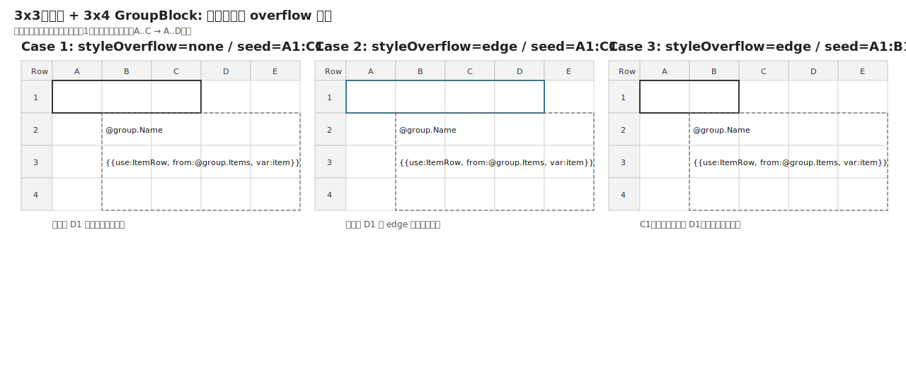

# Excelテンプレート対応 詳細設計（Issue #58 / 実装方針レビュー版）

- 作成日: 2026-04-07
- ステータス: **実装方針レビュー中**
- 対象Issue: https://github.com/ssaattww/ExcelReport/issues/58
- 設計対象: Excel形式テンプレートを DSL へ変換する機能（`Excel -> XML Template -> DSL`）

## 1. Excelテンプレート対応で合意したいこと（要約）
Issue本文（2026-04-07作成）から、以下を設計対象とする。

1. Excelテンプレートを入力にして、最終的に現行DSL/生成パイプラインへ接続したい
2. デバッグ用途として「Excel -> XML Template -> DSL -> Excel」の中間可視化を持ちたい
3. 本番では中間XMLを省略し「Excel -> DSL（直接変換）」も可能にしたい
4. コンポーネント定義方式は次の2案を比較検討する
   - A案: シート単位定義（特殊シート名）
   - B案: 名前付き範囲定義（シート内で定義）

## 2. 方針
### 2.1 段階導入（破壊的変更なし）
- **Phase A (Debug Path)**: Excel -> XmlTemplate を実装し、変換内容を可視化
- **Phase B (Production Path)**: Excel -> DSL 直接変換を追加
- 既存の `DSL -> ReportGenerator` パイプラインは再利用し、既存API互換を維持する

### 2.2 コンポーネント定義方式の採用（再検討）
ユーザー提案の A/B 案を前提にしつつ、追加で C 案を含めて比較した。

- **A案: シート単位定義（特殊シート名）**
  - 利点: 実装コストが低く、抽出境界が明確、デバッグしやすい
  - 欠点: シート数増加時に運用が冗長になる
- **B案: 名前付き範囲定義（シート内）**
  - 利点: 既存Excel運用に近く、シートを増やさず定義可能
  - 欠点: 同名管理・ネスト・範囲衝突で実装複雑度が上がる
- **C案: セルコメント/メタ情報ベース定義（追加検討）**
  - 利点: レイアウト自由度が高い
  - 欠点: Excel編集で壊れやすく、規約逸脱検知が難しい

**採用結論（初期リリース）: A案**
- 採用理由: 「最小コストで安定導入」「変換ロジックの可観測性」「TDDで仕様固定しやすい」の3点で優位。
- B/Cは将来拡張として残し、A案運用データを得てから再評価する。

## 3. 対象範囲
### In Scope
- ExcelTemplate 入力モデルの追加
- Excel -> XmlTemplate 変換器（デバッグ用途）
- Excel -> DSL 直接変換器（本番用途）
- シート単位コンポーネント抽出ルール
- 変換ログ（どのセル/範囲をどのDSL要素へ写像したか）
- 主要テスト（unit + e2e）

### Out of Scope（今回）
- 名前付き範囲ベースのコンポーネント定義（B案本実装）
- セルコメント/メタ情報ベース定義（C案本実装）
- GUI/CLIツールの本格追加
- 既存DSL構文の大幅拡張
- **グラフ作成機能（chart生成/設定DSL拡張）は今回の対象外**

## 4. アーキテクチャ設計

```text
[Excel Workbook]
   | (Phase A)
   v
[ExcelTemplateExtractor] -> [XmlTemplateSerializer]
   | (Phase B bypass possible)
   v
[DslEmitter]
   v
[Existing DslParser/Layout/Renderer]
   v
[Excel Output]
```

### 4.1 新規コンポーネント（案）
- `ExcelTemplate/ExcelTemplateExtractor`
  - Excelブックを読み取り、シート/セル/スタイル/名前情報を中間モデル化
- `ExcelTemplate/XmlTemplateSerializer`
  - 中間モデルをXML templateとして出力（デバッグ向け）
- `ExcelTemplate/DslEmitter`
  - 中間モデル（またはExcel直接）からDSL文字列へ変換

### 4.2 既存コンポーネントとの責務境界
- 既存 `DSL` パーサ以降には変更を極力入れない
- 変換層（ExcelTemplate系）で解決できる仕様はそこで閉じる

## 5. DSLマッピングルール（初版）
- シート名 `__component_<Name>` をコンポーネント定義シートとして扱う
- 通常シートは `<sheet>` に変換
- 値セルは `cell@value` へ変換
- 数式セルは原則 `cell@formula` へ変換する
- C# 側で Excel 関数の計算を再実装することは本仕様の対象外とし、数式は計算済み値へ潰さず保持する
- 最小限のスタイル属性（font/fill/numberFormat）から段階対応

### 5.1 コンポーネント定義範囲（Range）の決定ルール
初版では、コンポーネント定義シート `__component_<Name>` ごとに、次の優先順位で定義範囲を決定する。

1. 明示範囲指定（最優先）
   - Workbook DefinedName: `__component_range_<Name>`
   - 例: `__component_range_GroupBlock` -> `__component_GroupBlock!$A$1:$C$3`
2. 自動判定（DefinedName未指定時）
   - 候補セル: 値/数式/挿入トリガ/書式指定/結合セルに関与するセル
   - 候補セルの最小外接矩形を定義範囲とする
   - trailing側（右端/下端）の完全空行・完全空列はトリミングする

補足:
- 定義範囲は必ず単一矩形とする（離散領域は不可）。
- 明示範囲がシート名と不整合、または空矩形の場合は Error とする。
- 自動判定で候補セルが0件の場合は Error（`EmptyComponentRange`）とする。

## 6. 失敗時ポリシー
- 未対応Excel要素を検出した場合:
  - 変換を継続可能なら Warning として `ReportGeneratorResult.Issues` へ集約
  - 継続不能なら Error で停止
- どのセルが未対応だったかを座標付きでログ出力
- 追加ポリシー（範囲/挿入）:
  - 定義範囲が不正（空矩形/複数領域/シート不一致）の場合: Error（`InvalidComponentRange`）
  - 挿入元展開で挿入先想定範囲を超過した場合: Warning（`TemplateRangeOverflow`, `deltaRows`/`deltaCols` を記録）
  - 結合セルが挿入境界をまたいで破壊される場合: Error（`MergedCellBoundaryViolation`）

## 7. テスト戦略（TDD）
1. Unit
   - シート分類（通常/コンポーネント）
   - セル値/数式/最小スタイルの抽出
   - DslEmitterの要素生成
2. Integration
   - Excel -> DSL 変換結果のスナップショット比較
3. E2E
   - Excel -> DSL -> ReportGenerator で最終Excel生成まで確認

## 8. 互換性
- 既存公開APIは非変更
- 既存DSL実行機能に影響なし
- 破壊的変更は現時点では想定しない

## 9. 実装前の承認結果
- [x] 比較検討結果（A/B/C）を踏まえ、初期実装は A案で進める
- [x] デバッグ経路（Excel -> XML Template）を同時に入れる
- [x] 初版マッピング対象は 値/数式/最小スタイル とする
- [x] グラフ作成機能は今回スコープ外とする
- [x] コンポーネント定義範囲は「DefinedName明示指定 + 自動判定フォールバック」の二段構成とする
- [x] サイズ不一致時は「クリップせず展開 + overflow Warning」とする
- [x] 挿入先書式は任意（mustではない）とし、3x3外枠+中央useのフレームは展開サイズへ追従拡張する
- [x] 挿入先書式のoverflow補完は `styleOverflow`（`none`/`edge`）で選択可能、既定 `none` とする
- [x] merged cell は初版では「矩形内完結のみ」とする
- [x] 条件付き書式は初版対象外とする
- [x] 数式セルは `cell@formula` へ正規化し、C# 側で Excel 関数計算を行わない
- [x] 大規模テンプレートの性能閾値は当面不問とし、必要時に別途基準化する

---

## 10. 具体表現設計（入れ子コンポーネント / シート定義 / 挿入）

### 10.1 コンポーネント定義シートの表し方
- シート名規約: `__component_<ComponentName>`
- 例:
  - `__component_Header`
  - `__component_ItemRow`
  - `__component_GroupBlock`

このシートのセル配置を、そのまま component のレイアウト定義へ変換する。

### 10.2 通常シート定義の表し方
- コンポーネント定義シート以外は通常 `<sheet>` として扱う。
- 例: `Invoice` シートは DSL の `<sheet name="Invoice">` へ変換。

### 10.3 コンポーネント挿入の表し方（use）
Excel側で次の記法を挿入トリガとして扱う（初版案）:
- セル値: `{{use:Header}}`  -> `<use component="Header" />`
- セル値: `{{use:Header, styleOverflow:edge}}` -> `<use component="Header" styleOverflow="edge" />`
- セル値: `{{use:ItemRow, from:@items, var:item, styleOverflow:edge}}` -> `<repeat from="@(root.Items)" var="item" direction="down"><use component="ItemRow" styleOverflow="edge" /></repeat>`

> 注: 文字列トリガ構文は初版の暫定仕様。将来は名前付き範囲等への置換余地あり。
> 注: Excel側の shorthand expression（例: `@items`, `@group.Items`, `@item.Name`）は converter が emitted DSL 上で `@(root.Items)`, `@(group.Items)`, `@(item.Name)` へ正規化する。

### 10.4 入れ子コンポーネント定義の例

#### Excelテンプレート（概念）
- `__component_Header`: タイトル行
- `__component_ItemRow`: 明細1行（品名/数量/単価）
- `__component_GroupBlock`: 見出し + `{{use:ItemRow, from:@group.Items, var:item}}` を含む
- `Invoice`: `{{use:Header}}` の下に `{{use:GroupBlock, from:@groups, var:group}}`

#### 変換後 DSL 例（設計イメージ）
```xml
<workbook xmlns="urn:excelreport:v2">
  <components>
    <component name="Header">
      <grid>
        <cell value="請求書" />
      </grid>
    </component>

    <component name="ItemRow">
      <grid>
        <cell value="@(item.Name)" />
        <cell value="@(item.Qty)" />
        <cell value="@(item.Price)" />
      </grid>
    </component>

    <component name="GroupBlock">
      <grid>
        <cell value="@(group.Name)" />
      </grid>
      <repeat from="@(group.Items)" var="item" direction="down">
        <use component="ItemRow" styleOverflow="edge" />
      </repeat>
    </component>
  </components>

  <sheet name="Invoice">
    <use component="Header" />
    <repeat from="@(root.Groups)" var="group" direction="down">
      <use component="GroupBlock" styleOverflow="edge" />
    </repeat>
  </sheet>
</workbook>
```

### 10.5 挿入時の座標ルール（初版）
- `use` は「トリガセル位置」を挿入起点にする。
- component の高さ/幅ぶん展開し、後続行は下方へシフト（既存 LayoutEngine 規約に追従）。
- `repeat + use` は反復ごとに順次展開する。

### 10.6 検証観点（例ベース）
- 入れ子 repeat/use で scope (`group` / `item`) が衝突しないこと
- `sheet` 直下と component 内で同名 var を使っても期待通りに解決されること
- 展開後のセル位置が連続し、欠落・重複がないこと


### 10.7 セル値の具体例（Markdownテーブル）

#### 10.7.1 セル値トリガ -> DSL 変換例
| Excelセル値（例） | 意味 | 変換後DSL（例） | 備考 |
|---|---|---|---|
| `請求書` | 固定文字列 | `<cell value="請求書" />` | そのまま値セル |
| `@item.Name` | 式評価値 | `<cell value="@(item.Name)" />` | converter が DSL runtime 互換形へ正規化 |
| `{{use:Header}}` | コンポーネント挿入 | `<use component="Header" />` | 挿入トリガ |
| `{{use:ItemRow, from:@items, var:item, styleOverflow:edge}}` | 反復+挿入 | `<repeat from="@(root.Items)" var="item" direction="down"><use component="ItemRow" styleOverflow="edge" /></repeat>` | repeat展開 + styleOverflow |
| `=SUM(B2:B10)` | Excel数式 | `<cell formula="SUM(B2:B10)" />` | `cell@formula` で保持 |

#### 10.7.2 入れ子構成のセル配置イメージ（Excel側）
| シート | セル | 入力値 | 役割 |
|---|---|---|---|
| `__component_Header` | `A1` | `請求書` | ヘッダー定義 |
| `__component_GroupBlock` | `A1` | `@group.Name` | グループ見出し |
| `__component_GroupBlock` | `A2` | `{{use:ItemRow, from:@group.Items, var:item}}` | 子component反復挿入 |
| `Invoice` | `A1` | `{{use:Header}}` | 先頭ヘッダー挿入 |
| `Invoice` | `A3` | `{{use:GroupBlock, from:@groups, var:group}}` | グループ単位で入れ子展開 |

#### 10.7.3 罫線の競合が起こるセル例
| 位置 | 親component指定 | 子component指定 | 解決結果 |
|---|---|---|---|
| `Invoice!A10` の bottom | `thin` | `dashed` | 子優先で `dashed`（Warning記録） |
| `Invoice!B10` の right | `medium` | 未指定 | 親の `medium` を継承 |
| `Invoice!C10` の top | 未指定 | `thin` | 子の `thin` を採用 |
| `Invoice!D10` の left | `thin` | `thin` | 同値のためWarningなし |


### 10.8 Excelセル座標と一致する表現（セルマトリクス）

#### 10.8.1 挿入先シート（入力テンプレート）
| Row\Col | A | B | C |
|---|---|---|---|
| 1 | `{{use:Header}}` |  |  |
| 2 |  |  |  |
| 3 |  |  |  |
| 4 |  | `{{use:GroupBlock, from:@groups, var:group}}` |  |
| 5 |  |  |  |

#### 10.8.2 挿入元 `__component_GroupBlock` シート（3x3、入力テンプレート）
| Row\Col | A | B | C |
|---|---|---|---|
| 1 | `@group.Name` |  |  |
| 2 | `{{use:ItemRow, from:@group.Items, var:item}}` |  |  |
| 3 |  |  |  |

#### 10.8.3 挿入先セル値のSVG（表示値ベース）


注記:
- `use` セル周辺に描かれている罫線は「テンプレートで定義されている場合の例」であり、必須要件ではない。
- 挿入先書式が未定義でも `use` 展開は有効で、最終書式は 10.9/11章のルールで決定する。

#### 10.8.4 挿入元セル値のSVG（表示値ベース）


注:
- 10.8.3/10.8.4 のSVGは、実運用のExcelTemplate見た目に合わせるため、説明用の背景色強調は行わない。
- 挿入アンカーや有効範囲の意味づけは本文・表で説明し、セル塗り分けには反映しない。
- ただしテンプレートで事前定義する罫線（実線/破線）は、入力側SVGにも反映する。
- 本節の `GroupBlock` 定義範囲は `A1:C3` を採用する。周辺グリッドはシート表示であり、component 有効幅には含めない。

#### 10.8.5 書式説明（Markdownテーブル）
| 範囲/セル | 意味 | 備考 |
|---|---|---|
| 挿入先 `A3:C5` | 3x3 の親フレーム | 中央 `B4` が `use` アンカー |
| 挿入先 `A1` | `{{use:Header}}` | ヘッダー挿入トリガ |
| 挿入先 `A1:C1` | 例: 挿入先上辺の書式シード | 必須ではない（未設定でも展開可） |
| 挿入元 `A1:C3` | `GroupBlock` の定義範囲 | 行3列3。`repeat` 展開後の高さは item 件数で増加 |
| 挿入元 `A1` | `@group.Name` | グループ見出し |
| 挿入元 `A2` | `{{use:ItemRow, from:@group.Items, var:item}}` | 子コンポーネント挿入 |

使用データ（C# class 定義）:
`repeat + use` で挿入されるデータモデルは、初版の設計例として以下を基準にする。

```csharp
public sealed class InvoiceData
{
    public string Title { get; init; } = string.Empty;
    public IReadOnlyList<GroupData> Groups { get; init; } = Array.Empty<GroupData>();
}

public sealed class GroupData
{
    public string Name { get; init; } = string.Empty;
    public IReadOnlyList<ItemData> Items { get; init; } = Array.Empty<ItemData>();
}

public sealed class ItemData
{
    public string Name { get; init; } = string.Empty;
    public int Qty { get; init; }
    public decimal Price { get; init; }
}
```

サンプル入力（C#）:
```csharp
var data = new InvoiceData
{
    Title = "請求書",
    Groups =
    [
        new GroupData
        {
            Name = "機械部品",
            Items =
            [
                new ItemData { Name = "Bolt", Qty = 12, Price = 35m },
                new ItemData { Name = "Nut", Qty = 12, Price = 18m },
                new ItemData { Name = "Washer", Qty = 12, Price = 9m }
            ]
        },
        new GroupData
        {
            Name = "電材",
            Items = [ new ItemData { Name = "Cable", Qty = 3, Price = 980m } ]
        }
    ]
};
```

#### 10.8.8 C#データ展開後の挿入元（`GroupBlock` インスタンス）SVG
以下は本節のサンプルデータを `GroupBlock` 単位へ展開したときの、挿入元インスタンスの表示値イメージである。



#### 10.8.9 C#データ展開後セル値のSVG（`Invoice` 出力イメージ）
以下は本節のサンプルデータを `Invoice` シートへ挿入した出力イメージである。`Header` は `A1:F1` へ拡張し、`A3:C5` の 3x3 親フレームは `@groups` の連続展開結果をまとめて囲むため、最終的に `A3:E10` へ拡張される。`GroupBlock` 実体は 1件目が `B4:D7`、2件目が `B8:D9` に配置される。



#### 10.8.10 Header拡張と3x3中央useの状態整理
| 項目 | 入力（テンプレート） | 出力（展開後） |
|---|---|---|
| Header | `A1:C1` に `{{use:Header}}`、`styleOverflow=edge` | `A1:F1` まで外枠を拡張 |
| GroupBlock repeat | `A3:C5` 外枠、中央 `B4` に `{{use:GroupBlock,...}}` | 親外枠は連続展開全体をまとめて `A3:E10` へ拡張する |
| 1件目 GroupBlock | `repeat` の1件目 | `B4:D7` が挿入元実体。外周のみ罫線を持ち、`B7:D7` のみ下破線 |
| 2件目 GroupBlock | `repeat` の2件目 | `B8:D9` が挿入元実体。上辺は 1件目の `B7:D7` を共有境界として使い、自身は `B9:D9` の下破線を持つ |
| 子データ列 | 値が2列でも可 | 有効幅 `W=3`（値2列+書式1列）なら外枠幅は `W+2=5` 列（`A:E`） |

注:
- もし子の有効幅が本当に `W=2` なら、展開後外枠は `A3:D10`（4列）になる。
- 「2列の値」と「コンポーネント有効幅」は同義ではない。幅判定は 10.10 の定義範囲で決まる。

### 10.9 サイズ不一致時の挿入ルール（挿入元 > 挿入先想定範囲）
「挿入元 component が複数行/複数列」「挿入先 component / sheet 側の想定定義範囲が小さい」のようなサイズ不一致を、行・列の両方向で明示的に扱う。

1. 挿入先の事前定義範囲は **クリップ境界ではなくアンカー情報** とみなす。
2. 挿入先の書式指定は **任意**（mustではない）。
   - 書式未指定でも `use` 展開は有効。
   - 書式指定がある場合のみ、11章の合成ルールで最終書式を決定する。
3. `use` は挿入元 component の実サイズ（高さ/幅）まで必ず展開し、途中で切り詰めない。
4. 挿入先の事前定義範囲を超えたセル（overflow行/overflow列）は、挿入元 component 側の書式決定ルール（11章）をそのまま適用する。
5. overflow により既存セルが押し下げ/押し広げされる場合、既存セル値・既存書式・結合状態は相対位置を保ってシフトする。
6. 挿入先想定範囲より大きい展開が発生した場合、`Warning`（種別: `TemplateRangeOverflow`）を記録し、座標/シート名/挿入元component名/`deltaRows`/`deltaCols` を出力する。
7. 結合セルが挿入境界をまたいで壊れる場合は `Error` とし、当該挿入を停止する（自動補正しない）。

#### 10.9.1 挿入先外枠の追従拡張ルール（3x3 + 中央useケース）
挿入先側で `use` を囲む外枠（例: 3x3範囲の外枠 + 中央セルが `use`）を定義している場合、展開後は次で外枠を再計算する。

- 前提:
  - 初期外枠矩形を `R0`
  - `use` アンカーセルを `A`
  - `R0` 内でのアンカー余白を `topMargin/bottomMargin/leftMargin/rightMargin`
  - 挿入元展開サイズを `H x W`
  - `repeat` を含む場合の `H/W` は、`use` 起点で fully expand された結果全体の外接矩形サイズとする
- 展開後外枠:
  - `rowStart = A.row - topMargin`
  - `rowEnd   = A.row + (H - 1) + bottomMargin`
  - `colStart = A.col - leftMargin`
  - `colEnd   = A.col + (W - 1) + rightMargin`
- 結果:
  - 3x3で中央use（四辺余白=1）の場合、子component展開範囲を四辺1セルぶん拡張した外枠になる。
  - 行方向だけでなく列方向にも同じルールを適用する。
  - `repeat` が縦方向に 2 件連続展開される場合、`H` は各インスタンス高の合計、`W` はインスタンス幅の最大値とする。
  - 本節の `GroupBlock` 例では `H=6`、`W=3` なので、`A3:C5` の親フレームは `A3:E10` へ拡張される。
  - 現行の `use` 展開はアンカー起点で右方向 / 下方向へ成長するモデルとし、left/up 側の負方向 overflow は発生させない。

#### 10.9.2 挿入先書式の overflow 拡張ポリシー（`styleOverflow`）
「挿入先で定義した書式を、子展開で増えた領域にも伸ばすか」を `use` 単位で選択可能にする。

- 追加属性（`use`）:
  - `styleOverflow="none|edge"`
  - 既定値は `none`（後方互換優先）
- 例:

```xml
<repeat from="@groups" var="group" direction="down">
  <use component="GroupBlock" styleOverflow="none" />
</repeat>
<repeat from="@groups" var="group" direction="down">
  <use component="GroupBlock" styleOverflow="edge" />
</repeat>
```

- モード定義:
  - `none`: 挿入先書式は拡張しない。増分領域は挿入元コンポーネント側書式のみで決定する。
  - `edge`: 増分領域に対し、現行レイアウトモデルで実際に増える trailing edge（右辺 / 下辺）を基準に書式をコピーする。

- `edge` の決定ルール:
  1. 右方向に `deltaCols > 0` の場合、右辺基準列 `baseCol = originalColEnd` を取る。
  2. 下方向に `deltaRows > 0` の場合、下辺基準行 `baseRow = originalRowEnd` を取る。
  3. 右辺 / 下辺の辺拡張では、基準辺セルに書式がある場合のみ、増分領域へ同一書式をコピーする。
  4. 右下角領域が同時に増える場合、元範囲の右下角セルを書式基準にする。
  5. 基準辺または基準角が未設定なら、その行 / 列 / 角にはコピーしない。
  6. コピー後も競合は 11章ルール（辺単位優先順位）で解決する。
  7. left / up 側の負方向 overflow は現行 `use` レイアウトモデルでは発生しないため、本版の対象外とする。

- 3x3 + 中央`use` + 4列子component overflow ケースの具体化:
  - `A1:C1` が書式設定され、`styleOverflow=edge` の場合: `D1` へ拡張される。
  - `A1:C1` が書式設定され、`styleOverflow=none` の場合: `D1` へは拡張されない。
  - `A1:B1` のみ書式設定され、`styleOverflow=edge` の場合: 右辺基準 `C1` が未設定のため `D1` は拡張されない。
  - 同じ考え方で、`A3:A5` が書式設定され、下方向に `deltaRows > 0` の場合は `A6` 以降へ下辺基準で拡張する。

#### 10.9.3 書式 overflow のSVG比較（3x3 -> 4列子component）


#### 10.9.4 書式 overflow の期待結果（Markdownテーブル）
| ケース | 入力書式シード | 設定 | 増分方向 | 期待結果 |
|---|---|---|---|---|
| Case 1 | `A1:C1` | `styleOverflow=none` | 右 | `D1` へは拡張しない（未設定） |
| Case 2 | `A1:C1` | `styleOverflow=edge` | 右 | `C1` を基準に `D1` へ拡張する |
| Case 3 | `A1:B1` | `styleOverflow=edge` | 右 | `C1` が未設定なので `D1` へは拡張しない |
| Case 4 | `A3:A5` | `styleOverflow=edge` | 下 | `A5` を基準に `A6` 以降へ拡張する |
| Case 5 | `B2:D4` | `styleOverflow=edge` | 右下角 | 元範囲の右下角 `D4` を基準に角領域へ拡張する |

補足:
- `A1` は `Header` component 由来の固定値（`請求書`）。
- left / up 側の負方向 overflow は、現行 `use` 展開モデルでは対象外である。
- 10.8.9 のSVGでは、`@groups` の2件を連続展開した結果を示す。
- SVGの線種は 11章ルールに対応する。
  - 実線: 親component外枠、または挿入元実体の top/left/right
  - 破線: 挿入元実体の bottom

### 10.10 コンポーネント定義範囲の具体例
#### 10.10.1 明示範囲指定
- 定義名: `__component_range_GroupBlock`
- 参照先: `__component_GroupBlock!$A$1:$C$3`
- 挙動: この矩形外のセルはコンポーネント抽出対象外とする。

#### 10.10.2 自動判定時
- 候補セルが `A1`（`@group.Name`）と `A2`（`{{use:ItemRow,...}}`）のみの場合:
  - 初期矩形: `A1:A2`
  - 書式指定が `C3` に存在する場合:
    - 拡張矩形: `A1:C3`
- この最終矩形を component 展開サイズ（高さ/幅）の基準とする。

#### 10.10.3 バリデーション
| チェック項目 | 判定 | 失敗時 |
|---|---|---|
| DefinedName の参照先が対象シートか | 必須 | `InvalidComponentRange` Error |
| 範囲が単一矩形か | 必須 | `InvalidComponentRange` Error |
| 範囲内に有効セルが1つ以上あるか | 必須 | `EmptyComponentRange` Error |
| 自動判定で overflow が発生したか | 任意記録 | `TemplateRangeOverflow` Warning |


## 11. セル書式方針（特に罫線）

### 11.1 基本方針
- 値/数式だけでなく、セル書式（font/fill/numberFormat/border）も抽出対象にする。
- ただし初期段階では「既存StyleResolver/Rendererの表現可能範囲」に正規化して取り込む。

### 11.2 罫線の取り扱い原則
入れ子 component 展開時の見た目崩れを防ぐため、次の優先順位で罫線を決定する。

1. **セル直指定罫線（最優先）**
2. **component 内ローカル既定罫線**
3. **sheet 側既定罫線（最下位）**

補足:
- 罫線は辺単位（top/right/bottom/left）で合成し、未指定辺のみ下位ルールから補完する。
- 競合時（同じ辺に異なる指定）は上位優先とし、Warning を記録する。

### 11.3 入れ子時の罫線ルール
- 親componentと子componentの境界で、同一辺が二重定義された場合は「子component優先」。
- `repeat + use` で連続展開される行境界は、各行の bottom/top を辺単位で解決する。
- 列方向の境界（left/right）も同様に辺単位で解決する。
- 同一 `repeat` から生成された sibling instance 同士が連続配置される場合、共有境界は1本だけ描画する。
- 縦方向 repeat の共有境界では、先行 instance の `bottom` を採用し、後続 instance の `top` は重ね描きしない。
- 横方向 repeat の共有境界では、先行 instance の `right` を採用し、後続 instance の `left` は重ね描きしない。
- 共有境界で同優先度・異値の罫線が衝突した場合は「先行 instance の trailing edge 優先」とし、Warning を記録する。
- 外枠を親で管理し、内側明細線を子で管理する設計を推奨。
- 挿入先に外枠（フレーム）を定義する場合は 10.9.1 の追従拡張ルールで再配置する。

### 11.4 具体例（罫線）

#### 設計推奨パターン
- `GroupBlock`（親）: 外枠（top/left/right/bottom）
- `ItemRow`（子）: 明細行の下罫線（bottom）

このとき:
- 最終行以外: `ItemRow.bottom` が有効
- グループ末尾: 親 `GroupBlock.bottom` と子 `ItemRow.bottom` が競合しうるため、子優先で解決し Warning を記録
- `GroupBlock` が repeat で縦連結される場合: 先行 block の `bottom` を共有境界へ採用し、後続 block の `top` は描画しない

### 11.5 検証ケース（実装前にテスト化予定）
1. 親外枠 + 子内罫線の組み合わせが期待どおり描画される
2. 入れ子 + repeat 展開で行境界の二重線/線欠けが発生しない
3. 競合辺がある場合に Warning が `ReportGeneratorResult.Issues` に記録される
4. 既存 border mode（outer/all）との互換が維持される
5. 挿入元高さ > 挿入先想定行数（例: 3行 component を 1行定義領域へ挿入）でも、overflow行の書式が欠落しない
6. 挿入元幅 > 挿入先想定列数でも、overflow列の書式が欠落しない
7. 3x3外枠 + 中央use のテンプレートで、展開後に外枠が「子範囲+余白」で追従拡張される
8. overflow 発生時に `TemplateRangeOverflow` Warning が座標 + `deltaRows` + `deltaCols` 付きで記録される
9. `styleOverflow=none` で `A1:C1` 書式が `D1` へ拡張されない
10. `styleOverflow=edge` で `A1:C1` 書式が `D1` へ拡張される
11. `styleOverflow=edge` かつ `A1:B1` のみ書式時、`C1` 未設定のため `D1` へ拡張されない
12. `styleOverflow=edge` で下方向に `deltaRows > 0` が発生した場合、下辺基準で overflow 行へ書式が拡張される
13. `styleOverflow=edge` で右下角領域が増える場合、元範囲の右下角セルを基準に corner copy される
14. 同一 `repeat` の連続 instance 境界で、先行 instance の trailing edge が共有境界として1本だけ描画される

### 11.6 リスクと緩和策
- リスク: Excel側の自由入力で罫線指定が過剰に衝突する
  - 緩和: 競合Warningを必須化し、座標/辺情報付きでログ化
- リスク: 入れ子深度が増えると見た目把握が難しい
  - 緩和: デバッグ経路（Excel -> XmlTemplate）で罫線解決結果を可視化する

### 11.7 非罫線書式（font/fill/numberFormat）の合成方針
- 挿入元 component のセルが明示指定する属性は、そのまま採用する（最優先）。
- 明示指定がない属性は `component ローカル既定 -> sheet 既定` の順で補完する。
- `styleOverflow=none` の場合、挿入先の事前定義範囲にのみ存在する書式を overflow 行/列へ暗黙コピーしない。
- `styleOverflow=edge` の場合、10.9.2 の辺基準ルールに従い overflow 行/列へコピーする。
- ただし既存行を押し下げる際は、押し下げ対象セルの既存書式を保持する（破壊しない）。


## 12. 実装前に詰めるべき懸念点（事前合意チェックリスト）

以下は、実装前に合意しないと後戻りコストが高い項目。

### 12.1 変換契約の厳密化
| 懸念点 | 未合意時のリスク | 事前合意内容 |
|---|---|---|
| 数式セルの正規化方式（`cell@formula` vs `cell@value`） | 実装途中でDSL互換崩れ | 初版は `cell@formula` で統一する。C# 側で Excel 関数計算は行わず、計算済み値へ潰さない |
| 空セル/空白セルの扱い | 余計なセル生成、座標ずれ | 値/数式/書式/結合/useトリガのいずれもない空セルは非出力とする。空白文字列は値セルとして出力し、`styleOverflow` の種になる書式-onlyセルは保持する |
| 日付/数値の型解釈 | Excel表示とDSL評価の乖離 | まずは生値+numberFormatで保持し、型推論は段階導入 |

### 12.2 レイアウト展開の境界条件
| 懸念点 | 未合意時のリスク | 事前合意内容 |
|---|---|---|
| `use` 展開時の行/列シフト | component重なり/欠落 | 「トリガセル起点 + 高さ/幅ぶんシフト」を固定ルール化 |
| 入れ子 `repeat + use` の展開順 | varスコープ衝突 | 親repeat1回ごとに子を完全展開する深さ優先 |
| 挿入元サイズ > 挿入先想定範囲（行/列） | 書式欠落/罫線崩れ/既存セル上書き | 挿入先範囲はクリップしない。overflow行/列まで展開し、後続セルを相対シフト。`TemplateRangeOverflow` Warning必須 |
| 挿入先フレーム（外枠）の追従 | 外枠が狭いまま/拡張過剰 | 10.9.1 の余白保持ルール（子範囲+余白）で外枠を再計算 |
| merged cell 含有component | 結合領域崩れ | 初版は制限付き対応（矩形内完結のみ）で進める |

### 12.3 書式・罫線の実装リスク
| 懸念点 | 未合意時のリスク | 事前合意内容 |
|---|---|---|
| 挿入先書式の有無 | 「書式なしuseが無効」と誤解 | 挿入先書式は任意。未指定でも展開可、指定時のみ合成 |
| 罫線競合時の採用規則 | 見た目不一致 | 既定ルール（子優先/辺単位/Warning）を固定 |
| 非罫線書式のoverflow補完 | 色/フォント/表示形式の不整合 | `styleOverflow` を `none`/`edge` で明示選択し、既定は `none`。`edge` 時のみ辺基準で補完する |
| Style重複生成 | ファイル肥大/性能低下 | StyleKeyで重複排除し、同一スタイル再利用 |
| 条件付き書式との干渉 | 想定外の上書き | 初版は条件付き書式を非対象として進める |

### 12.4 運用・性能
| 懸念点 | 未合意時のリスク | 事前合意内容 |
|---|---|---|
| 大規模テンプレート（数万セル） | 変換時間増大 | 当面は性能閾値を設けず不問とする。Phase A では計測ログのみ必須とし、必要になった時点で別途基準化する |
| 失敗時の原因追跡 | 調査コスト増 | セル座標 + シート名 + 変換段階を必ず記録 |
| 仕様逸脱テンプレート入力 | 実行時クラッシュ | Validateフェーズを設け、Error/Warningを事前集約 |

### 12.5 今回の事前合意ゴール
- 実装開始条件として、上記表の「事前合意内容」を受け入れ条件に組み込む。
- 合意できない項目は実装スコープから除外し、設計書へ明示する。

### 12.6 実装前レビューで確認する質問
- 現時点で未解決の確認質問はない。追加の懸念が出た場合は本節へ追記する。

## 13. 実装方針

### 13.1 基本方針
- 既存の `ReportGenerator -> DslParser -> LayoutEngine -> WorksheetStateBuilder -> XlsxRenderer` は後段の安定基盤として再利用する。
- `ExcelTemplate` 対応は前段に追加し、Excelブックを DSL へ変換した上で既存パイプラインへ流す。
- 初版は additive change を優先し、既存の DSL 実行 API は壊さない。
- 実装は「DSL契約の不足補完」と「ExcelTemplate変換層の追加」を分離して進める。

### 13.2 既存実装との差分整理
現行コードを前提にすると、設計を実現するには次の差分がある。

1. `ExcelTemplate` 変換層がまだ存在しない
   - `ExcelTemplateExtractor` / `XmlTemplateSerializer` / `DslEmitter` / facade API は未実装
2. `cell@formula` 契約が DSL/XSD/AST に未反映
   - 現行実装は `cell@value=\"=...\"` を数式扱いしているため、`cell@formula` を受ける拡張が必要
3. `use@styleOverflow` 契約が DSL/XSD/AST/LayoutEngine に未反映
   - 右/下 trailing edge 拡張ルールを runtime へ追加する必要がある
4. ExcelTemplate 固有の validation / issue 種別が未実装
   - `InvalidComponentRange` / `EmptyComponentRange` / `TemplateRangeOverflow` / `MergedCellBoundaryViolation` など
5. `repeat` は `direction` 必須のため、converter 側で明示出力する必要がある
   - 初版の ExcelTemplate 由来 repeat は `direction="down"` を必ず出力する

### 13.3 実装単位
初版は次の単位で実装する。

1. DSL契約拡張
   - `Design/DslDefinition/DslDefinition_v2.xsd`
   - `ExcelReport/ExcelReportLib.Tests/TestDsl/DslDefinition_v2.xsd`
   - `DslContract` の埋め込み schema 読み込み経路
   - `CellAst` に `formula` 対応を追加
   - `UseAst` に `styleOverflow` 対応を追加
   - `DslParser.ValidateDsl` に no-schema mode 用の追加検証を実装
   - `LayoutEngine` に `cell@formula` と `styleOverflow=edge` の runtime ルールを追加
   - `IssueKind` に ExcelTemplate 関連種別を追加
2. レイアウト runtime 補完
   - `styleOverflow=edge` は `ExpandUse` / `ExpandRepeat` の後段で、アンカー矩形と展開後矩形の差分に対して style-onlyセルを合成する
   - 挿入先 seed 書式は「値なしでも style を持つ `LayoutCell`」として layout plan に残す
   - trailing edge copy は row/col/corner ごとに `LayoutCell` を生成し、競合は 11章ルールで解決する
3. ExcelTemplate 中間モデル
   - `ExcelTemplateWorkbook`
   - `ExcelTemplateSheet`
   - `ExcelTemplateCell`
   - `ExcelTemplateStyle`
   - `ExcelTemplateComponentRange`
   - `ExcelTemplateIssue`
4. ExcelTemplate 抽出・検証
   - OpenXML から workbook/sheet/cell/style/defined name/merged cell を読む extractor
   - シート分類、component 範囲決定、unsupported feature 検出、trigger 解析
5. 変換出力
   - XML debug 出力用 serializer
   - DSL text 出力用 emitter
6. 統合ファサード
   - `ConvertToDsl`
   - `ConvertToXmlTemplate`
   - `GenerateFromExcelTemplate`

### 13.4 推奨ファイル構成
```text
ExcelReportLib/
  ExcelTemplate/
    ExcelTemplateConverter.cs
    ExcelTemplateReportGenerator.cs
    ExcelTemplateConvertOptions.cs
    ExcelTemplateExtractor.cs
    ExcelTemplateValidator.cs
    ComponentRangeResolver.cs
    UseTriggerParser.cs
    DslEmitter.cs
    XmlTemplateSerializer.cs
    Model/
      ExcelTemplateWorkbook.cs
      ExcelTemplateSheet.cs
      ExcelTemplateCell.cs
      ExcelTemplateStyle.cs
      ExcelTemplateComponentRange.cs
```

補足:
- `ExcelTemplateExtractor` は OpenXML 読み取りに専念する。
- シート分類・範囲解決・unsupported validation は extractor に埋め込まず、小さな協調クラスへ分ける。
- `ExcelTemplateReportGenerator` は `ExcelTemplateConverter + ReportGenerator` の薄い合成層に留める。

### 13.5 実装順序
1. DSL契約の不足補完
   - `cell@formula` と `use@styleOverflow` を先に通す
   - runtime schema は `Design/DslDefinition/DslDefinition_v2.xsd` と test fixture の両方を更新する
   - `ValidateDsl` で schema validation 無効時の補完検証も追加する
   - ここを先に済ませないと、ExcelTemplate 変換器が正しい DSL を吐けない
2. レイアウト runtime 補完
   - `styleOverflow=edge` は `LayoutEngine` 内の post-expand 処理として追加する
   - style-only seed cell を layout plan に保持できることを先に固定する
3. ExcelTemplate 中間モデルと extractor
   - 値/数式/最小スタイル/defined name/merged cell を読む
   - 初版対象外機能は validation で Warning/Error 化する
4. component 範囲解決と trigger 解析
   - `__component_<Name>` 判定
   - `__component_range_<Name>` 解決
   - `{{use:...}}` / `repeat + use` の解析
   - repeat は必ず `direction="down"` を明示出力する
5. DslEmitter / XmlTemplateSerializer
   - 中間モデルから debug XML と DSL text を生成する
6. facade API と E2E 接続
   - ExcelTemplate 入力から最終 Excel 生成までを 1 API で呼べるようにする

### 13.6 API 方針
- 既存 `ReportGenerator` は DSL 専用のまま維持する。
- ExcelTemplate 入口は新規 API として追加する。

想定シグネチャ例:
```csharp
public sealed class ExcelTemplateConversionResult
{
    public string Text { get; }
    public IReadOnlyList<Issue> Issues { get; }
}

public sealed class ExcelTemplateConverter
{
    public ExcelTemplateConversionResult ConvertToDsl(string xlsxPath, ExcelTemplateConvertOptions? options = null);
    public ExcelTemplateConversionResult ConvertToXmlTemplate(string xlsxPath, ExcelTemplateConvertOptions? options = null);
}

public sealed class ExcelTemplateReportGenerator
{
    public ReportGeneratorResult GenerateFromExcelTemplate(
        string xlsxPath,
        object? data,
        ExcelTemplateGenerateOptions? options = null,
        CancellationToken cancellationToken = default);
}
```

方針:
- 最初は `string xlsxPath` を主入口にする。stream overload は必要になった時点で追加する。
- debug 用に「生成 DSL / XML を返す API」を分離し、最終生成 API に詰め込みすぎない。
- conversion-only API でも `Issues` を返し、座標付き Warning/Error を失わない。

### 13.7 テスト戦略
1. Unit
   - `cell@formula` / `styleOverflow` の parser/runtime
   - `UseTriggerParser`
   - `ComponentRangeResolver`
   - `repeat@direction="down"` 明示出力
   - extractor の値/数式/スタイル/defined name/merged cell 抽出
   - 既存後方互換: `cell@value="=..."` が従来どおり数式として動くこと
2. Integration
   - xlsx -> xml template snapshot
   - xlsx -> dsl snapshot
3. E2E
   - xlsx template -> dsl -> final xlsx
   - `GroupBlock` / `ItemRow` の repeat/use 展開
   - `styleOverflow=edge`
   - `cell@formula`
   - merged cell 制約 violation

### 13.8 実装時のガードレール
- 初版対象外の条件付き書式は extractor/validator で明示的に検出し、silent ignore しない。
- merged cell は component 定義範囲内で完結している場合だけ許可し、境界跨ぎは Error にする。
- 数式は値に潰さず保持し、C# 側で Excel 関数計算はしない。
- `styleOverflow=edge` は現行レイアウトモデルに合わせ、right/down/right-down corner のみ対応する。
- schema validation を無効化しても契約逸脱を見逃さないよう、`ValidateDsl` で `formula/value` 競合と `styleOverflow` 値を検証する。
- 既存 `ReportGenerator` の公開挙動を変える変更は避け、必要なら新規 API で閉じる。

### 13.9 完了条件
- ExcelTemplate から DSL 変換が unit/integration で固定されている
- ExcelTemplate から最終 Excel 生成まで E2E で通る
- Issue / logger に座標付き原因が残る
- 初版対象外機能は validation で検知できる
- 設計書と実装の契約差分が解消されている

## 14. Issue #61: ExcelTemplate の sheet repeat 定義方式（シェイプ方式中心）

### 14.1 背景
- 対応テーマ: 「ExcelTemplate の sheet repeat 対応」
- 検討条件:
  - `#61` の文脈で、シェイプ記述方式を有力候補とする
  - ただし、セル記述方式・既存 xmltemplate 併用方式も比較して決定する

### 14.2 現状ギャップ
- DSL/runtime 側は `sheet@from` / `sheet@var` を既に処理可能
- ExcelTemplate 変換側は、現状 `sheet` に `from/var` を渡す入力経路がない
  - extractor は cell/definedName/merge 抽出のみで shape 抽出を持たない
  - output contract の sheet モデルは `name + items` のみ

### 14.3 比較結果
| 方式 | 概要 | 評価 |
|---|---|---|
| 案1.1 セル定義 | 特殊シートのセルに `sheet repeat` 定義を記述 | 実装は軽いが、どのセルが定義か分かりにくくなる |
| 案1.2 シェイプ定義 | 特殊シートの shape テキストに定義を記述 | 可読性が高く、`1定義=1shape` で管理しやすい |
| 案2 xmltemplate 併用 | シート上位定義だけ xmltemplate 側で管理 | 定義が分散し、ExcelTemplate 単体完結性が下がる |

採用: **案1.2（シェイプ定義）**

### 14.4 採用仕様（初版）
- メタシート名: `__sheet_meta`
- shape 名固定: `__workbook_meta`
- `__sheet_meta` 上の `__workbook_meta` shape に workbook 階層XMLを集約する

```xml
<workbook>
  <sheets>
    <sheet templateSheet="InvoiceTemplate"
           name="@(grp.Name)"
           from="@(root.Groups)"
           var="grp" />
  </sheets>
</workbook>
```

- shape 内 `workbook/sheets/sheet` のうち `templateSheet` を持つ要素を今回の対象にする
- `templateSheet` で指定されたシートをテンプレートとして読み、出力 DSL で `sheet@from/var` を付与する
- 記法は xmlテンプレートを踏襲し、`from` / `name` は `@(...)` の式記法を使用する
- 将来拡張（今回非対応）:
  - 外部コンポーネントロード
  - workbook repeat
  これらも同じく `workbook` 階層の shape 記法で追加できる形にする

### 14.5 バリデーション方針
- `__sheet_meta` に `__workbook_meta` shape が存在しない: Error
- `__workbook_meta` 以外の shape は定義入力として扱わない（無視または Warning）
- shape XML のルートが `<workbook>` でない: Error
- `workbook/sheets/sheet` が存在しない: Error
- `templateSheet` 未存在: Error
- 同一 `templateSheet` への複数 sheet repeat 定義: Error
- shape の XML 断片パース失敗: Error
- `var` あり `from` なし: Error（DSL 制約に合わせる）

### 14.6 次フェーズ実装範囲
1. extractor に shape 抽出を追加（`__sheet_meta` の `__workbook_meta` を対象）
2. output contract の sheet モデルへ `from/var` を追加
3. serializer で `<sheet from="..." var="...">` を出力
4. unit/integration/e2e テスト追加
