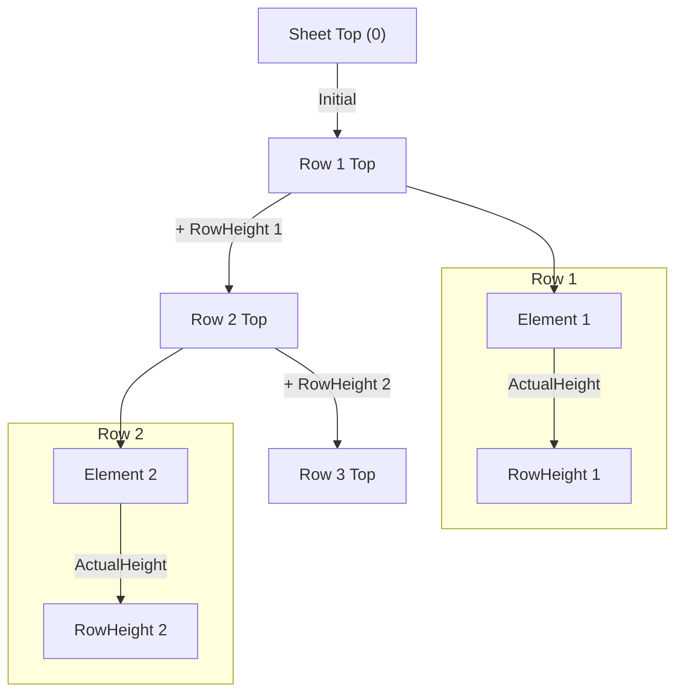
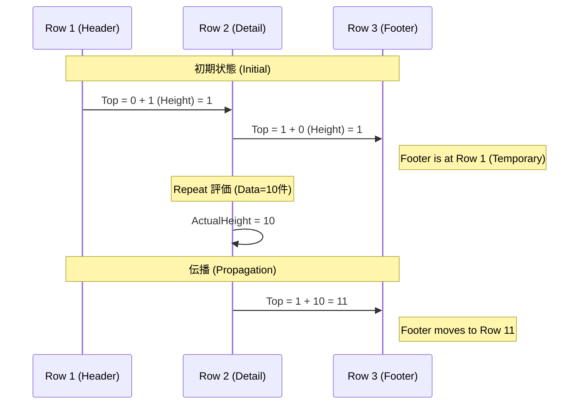
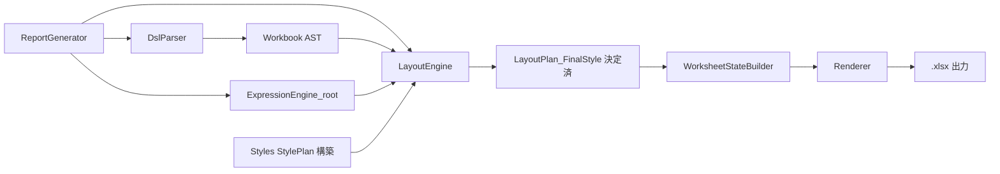

# LayoutEngine 詳細設計書 v1

## Status
- As-Is (Planned): 実装クラスは未着手（証跡: `reports/implementation-inventory-2026-02-13.md:31`）。
- To-Be (Planned): Styles/ExpressionEngine 依存で論理レイアウトを実装する（証跡: `reports/issues-and-improvements-2026-02-13.md:98`）。

---

## 1. 概要

LayoutEngine は、DSL AST と root データを入力として、  
**論理レイアウト（LayoutPlan）を構築するモジュールである。**

LayoutEngine の役割は大きく 2 つに分類される。

1. **配置計画（レイアウト計算）**  
   - LogicalGrid（行・列ブロック）を構築し、  
     Rx / スタック計算によりセル位置・行高・列幅・Repeat 展開等を決定する。

2. **スタイル適用の最終決定（優先順位・競合解決）**  
   - Styles モジュールから受け取る StylePlan（スタイル候補リスト）を元に、  
     **スタイル適用順序・プロパティ単位の優先順位・競合解決を LayoutEngine が最終的に確定する。**
   - LayoutPlan 内の各セルには、論理的に確定済みの  
     **FinalStyle（最終スタイル値）** を埋め込む。  
   - 以降のモジュール（WorksheetState / Renderer）は、  
     **スタイル判断を一切行わない。**

これにより、WorksheetState は LayoutPlan の最終結果をそのままコピーし、  
Renderer は StyleSnapshot に変換して OpenXML に反映するだけとなる。

LayoutEngine は Excel の物理操作（OpenXML/ClosedXML）を行わない。

---

## 2. コンセプト: 論理グリッド (Logical Grid)

### 2.1 論理座標モデル
LayoutEngine は物理セル番地を直接扱わず、  
**LogicalRow / LogicalCol（論理スロット）** を単位としてレイアウト計算を行う。

- LogicalRow: コンテナ内の「N 番目の行ブロック」。高さは動的に決まる。
- LogicalCol: コンテナ内の「N 番目の列ブロック」。幅は動的に決まる。
- 各要素は (r, c) で論理的に配置され、後続フェーズで物理座標に展開される。

### 2.2 行・列の同期 (Synchronization)
同じ論理行に属するすべての要素は、  
**その行の最大高さに揃う**（列も同様）。

例: Row2 に 2 つの要素があり、右側が Repeat 展開で 10 高さになれば、  
Row2 全体が高さ 10 になる。

### 2.3 伝播モデル (Reactive / Stacking)
行・列の高さ・幅は前後に伝播する。

- Row[N].Top = Σ(Row[0..N-1].Height)
- Col[N].Left = Σ(Col[0..N-1].Width)

変更が起きると後続要素へ伝播し、  
最終的な座標計算が安定（Fixpoint）した時点で LayoutPlan が確定する。

### 2.4 論理スタイル適用の位置づけ
Logical Grid は位置の計算のみを扱い、  
**スタイル優先順位の決定は LogicalCell 単位で LayoutEngine が行う**。  
StylePlan を読み取り、最終スタイル値（FinalStyle）を LogicalCell に付与してから  
LayoutPlan に出力する。

---

## 3. 公開 API

### 3.1 ILayoutEngine

LayoutEngine が外部に公開する唯一のエントリポイント。

```csharp
public interface ILayoutEngine
{
    /// <summary>
    /// AST（WorkbookNode）と RootData を入力として、
    /// LogicalGrid に基づくレイアウト計画（LayoutPlan）を構築する。
    /// スタイル適用優先順位の最終決定も本処理内で行われる。
    /// </summary>
    LayoutPlan Build(WorkbookNode workbookAst, object rootData);
}
```

### 3.2 API 契約

- **入力**
  - `workbookAst`  
    DslParser が生成した AST。構造検証・参照検証は済んでいる前提。
  - `rootData`  
    ExpressionEngine が利用するデータ。Repeat 展開や式評価に使用。

- **出力**
  - `LayoutPlan`  
    行列の論理座標、セル配置、Repeat 展開結果、結合セル、  
    Area 計画、FormulaRef 計画、並びに  
    **LayoutEngine が最終決定した FinalStyle（スタイル適用結果）**  
    がすべて含まれた論理レイアウト。

- **副作用**
  - Excel 物理操作なし（ClosedXML 等への依存なし）。
  - WorksheetState / Renderer に渡す前段階の論理結果のみを構築。

### 3.3 保証

- LayoutEngine から出力される LayoutPlan は  
  WorksheetState で追加の判断なしで利用できる一貫性を持つ。
- 特にスタイルについては  
  Styles モジュールから渡された StylePlan の候補順序に基づき、  
  **LayoutEngine がプロパティ単位の競合解決・優先順位付けを完了した状態**  
  を FinalStyle として埋め込む。

### 3.4 非保証

- Excel 表示上の「最終スタイル ID」や「スタイル辞書 ID 採番」は  
  WorksheetState / Renderer 側の責務であり、本モジュールは扱わない。

---

## 4. データモデル

### 4.1 LayoutPlan（論理レイアウトの最終成果物）

LayoutEngine が出力する中心データ構造であり、  
WorksheetState がそのまま物理座標に転写できる状態を保持する。

```
LayoutPlan:
  Sheets: List<LayoutSheet>
  Issues: List<Issue>
```

#### 特記事項
- 各シート内のすべてのセルに **FinalStyle（最終スタイル適用結果）** が含まれる。
- WorksheetState / Renderer は LayoutPlan 内のスタイルを再解釈しない。

### 4.2 LayoutSheet

```
LayoutSheet:
  Name: string
  Cells: List<LayoutCell>
  Areas: List<AreaLayout>
  FormulaSeries: List<FormulaSeriesLayout>
```

- 1シート分の論理レイアウト。
- Repeat 展開や位置決定が完了したセルが `Cells` に並ぶ。

### 4.3 LayoutCell（最重要：最終スタイル付きセル）

```
LayoutCell:
  Row: int               // 物理行（1-based）
  Col: int               // 物理列（1-based）
  Value: object?
  Formula: string?
  Merge: (RowSpan, ColSpan)?
  FinalStyle: FinalStyleDefinition   // LayoutEngine が最終決定したスタイル
```

#### FinalStyle について
- Styles の StylePlan（候補）を LayoutEngine が解決し、  
  **プロパティ単位で最終値を決定したもの**。
- WorksheetState の StyleSnapshot は FinalStyle をそのまま展開する。

### 4.4 FinalStyleDefinition（LayoutEngine が作る最終スタイル）

```
FinalStyleDefinition:
  FontName: string?
  FontSize: double?
  Bold: bool?
  Italic: bool?
  Underline: bool?
  FillColor: string?
  NumberFormat: string?
  Border: BorderDefinition?
  AppliedStyleNames: List<string>   // どのスタイルが使われたかの履歴
```

- Styles モジュールが構成した StylePlan は  
  「候補順序とメタ情報」だけを持つ。
- LayoutEngine がそれを読み取り、  
  条件・階層・優先順位にもとづいて最終値を確定する。

### 4.5 LogicalContainer（内部用）

論理行・列を保持する中間構造。

```
LogicalContainer:
  RowHeights: Dictionary<int, Subject<int>>
  ColWidths: Dictionary<int, Subject<int>>
  AbsTop: IObservable<int>
  AbsLeft: IObservable<int>
```

- Rx により高さ・幅の変更を後続へ伝播する。

### 4.6 LayoutElement（Cell/Repeat/Use 等の内部表現）

```
LayoutElement:
  LogicalRow: int
  LogicalCol: int
  ActualHeight: Subject<int>
  ActualWidth: Subject<int>
```

- 「どの論理スロットに置かれているか」と  
  「展開結果のサイズ」を持つ。

---

## 5. 処理フロー

### 5.1 行高さ伝播のイメージ（Mermaid）

LayoutEngine のコアは「各要素の ActualHeight/Width が、行・列の高さ・座標にどう伝播するか」である。  
行方向の高さ伝播は、概念的には次のようになる。



- 各要素は自分の高さを `ActualHeight` として発行する。
- RowHeight は同一行の全要素の ActualHeight の最大値になる。
- RowTop は「一つ上の RowTop + 一つ上の RowHeight」で決まる。
- この伝播を Rx (Subject/Observable) で表現し、変更があれば後続行が自動で再計算される。

列方向（幅・Left）も同様の仕組みで扱う。

### 5.2 全体フェーズ一覧

LayoutEngine の処理は、次のフェーズに分かれる。

1. **構築フェーズ**  
   AST を走査し、LogicalContainer と LayoutElement を構築する。
2. **スタイル候補取得フェーズ**  
   各セルについて Styles モジュールから StylePlan（候補リスト）を取得する。
3. **接続フェーズ**  
   行高・列幅・座標の依存関係を Rx で接続する。
4. **評価フェーズ**  
   Repeat 展開・式評価により ActualHeight/Width を確定し、座標を安定させる。
5. **FinalStyle 決定フェーズ**  
   StylePlan と階層情報から、プロパティ単位で最終スタイル値を決定する。
6. **LayoutPlan 出力フェーズ**  
   物理座標・値・結合セル・Area・FormulaSeries・FinalStyle をすべて含んだ LayoutPlan を構築する。

### 5.3 各フェーズの概要

#### 5.3.1 構築フェーズ

- Sheet / Grid / Component / Cell / Repeat / Use を論理座標 (r, c) にマッピングする。
- 各 LayoutElement は、自分が属する論理行・列と、ActualHeight/Width を持つ。
- Repeat は「未展開 Repeat ノード」として登録するだけで、この時点では展開しない。

#### 5.3.2 スタイル候補取得フェーズ

- 各 Cell ノードについて、Styles から StylePlan を取得する。
- StylePlan には「どのスタイルがどの順で候補になるか」「scope 検証結果」「インラインスタイル」などが含まれる。
- この段階ではまだ FinalStyle は決まらない（候補だけを受け取る）。

#### 5.3.3 接続フェーズ（Wiring）

- RowHeight / RowTop / ColWidth / ColLeft を Rx で接続する。
- 行方向は 5.1 の Mermaid 図のとおり、RowTop が順に累積されていく。
- これにより、Repeat 展開などで高さが変わった場合も、後続行の Top が自動更新される。

#### 5.3.4 評価フェーズ（Repeat・式評価）

- ExpressionEngine を用いてセルの値・式を評価する。
- フォントサイズなどからセル高さ・幅を推定し、ActualHeight/Width に流す。
- Repeat はデータ件数 N に応じて子要素を展開し、その合計高さを ActualHeight として発行する。

#### 5.3.5 FinalStyle 決定フェーズ（スタイル最終決定）

- LayoutEngine は StylePlan の候補群と階層情報（sheet → component → grid → cell）を読み取り、
  1. 外側 → 内側（sheet → component → grid → cell）
  2. StylePlan 内の候補順（styleRef 属性 → `<styleRef>` → inline）
  3. scope 補正後のプロパティ
  4. 未指定項目の継承
  の規則で、**プロパティ単位の最終値を決定する。**
- 決定された結果は `FinalStyleDefinition` として LayoutCell に格納される。
- WorksheetState / Renderer は FinalStyle を一切再解釈しない。

#### 5.3.6 LayoutPlan 出力フェーズ

- 行・列・セルの物理座標 (Row, Col)、値 / 式、結合セル、Area、FormulaSeries、FinalStyle が
  すべて確定した状態で LayoutPlan を構築する。
- LayoutPlan は WorksheetStateBuilder にそのまま渡され、  
  WorksheetState は「コピー＋Excel 実体へのマッピング」のみを行う。

---

## 6. 座標追従ワークフロー例 (Rx)

**例**: Header (r=1), Detail (r=2, Repeat), Footer (r=3)



1.  **初期状態**:
    *   `Row1.Height` = 1 (Header)
    *   `Row2.Height` = 0 (未評価)
    *   `Row3.Top` = `Row1.Top` + `Row1.Height` + `Row2.Height`
        *   仮に Top=1, H1=1, H2=0 なら、Row3.Top = 2。

2.  **Repeat 評価 (Detail)**:
    *   データが 10 件あると判明。
    *   内部で 10 行分のサブレイアウトが生成され、合計高さが 10 になる。
    *   `DetailElement.ActualHeight` が `10` を発行。

3.  **Row2 更新**:
    *   `Row2` にある要素 (Detail) が 10 になったので、`Row2.Height` が `10` を発行。

4.  **Row3 更新 (自動伝播)**:
    *   `Row3.Top` の購読元である `Row2.Height` が変わったため再計算。
    *   `Row3.Top` = 1 (Row1) + 10 (Row2) + 1 (Start) = **12**。
    *   Footer は自動的に 12 行目に配置される。

---

## 7. エラーモデル

### 7.1 Issue の生成源

LayoutEngine が生成しうる Issue は次の領域に分類される。

- **レイアウト構造エラー**  
  - anchor / pos の不正  
  - コンテナ階層の不整合  
  - Repeat 展開不能（null データ・配列でないなど）

- **行列計算エラー**  
  - 行数・列数の上限超過  
  - 座標計算が Fixpoint に収束しないケース（循環参照）

- **スタイル適用エラー（StylePlan → FinalStyle 決定中）**  
  - スタイルの参照不整合（StylePlan に undefined が混入した場合）  
  - 全候補が scope 違反で無効化された場合（フォールバック動作）

### 7.2 Severity の方針

| Severity | 説明 | LayoutEngine の挙動 |
|----------|------|----------------------|
| Fatal | レイアウト結果が生成不能 | Build() を中断し LayoutPlan に Fatal を付加 |
| Error | 一部セルが欠損しうる | 生成継続、WorksheetState 側で警告として扱われる |
| Warning | 実行は可能だが注記が必要 | 生成継続、Logger に記録 |
| Info | 情報レベル | 処理継続 |

### 7.3 Fatal となる代表例

- 行数・列数の上限超過（Excel の限界 1,048,576 行 / 16,384 列）  
- Repeat / anchor の構造不正で位置計算が破綻  
- FinalStyle 作成時にプロパティ評価不能（内部バグレベル）

### 7.4 Error となる代表例

- FinalStyle の決定に使用する StylePlan の一部が無効だが、代替値が存在する  
- Repeat 展開で一部データが null などでスキップされた場合  

### 7.5 Warning となる代表例

- scope 違反補正を受けたスタイルが使われた  
- 値の高さ・幅推定が閾値を超えて丸められた場合  

### 7.6 Error / Warning の扱い

- LayoutEngine は Build の続行を優先する  
- WorksheetState / Renderer は Issue 内容に依存しない  
- ReportGenerator によって集約され、Issue 一覧として返される

### 7.7 例外の扱い

LayoutEngine 内部実装で例外が発生した場合:

- 原則として **Fatal Issue に変換** し Build を中断  
- 重大な実装バグの場合のみ例外をそのまま透過させる（ReportGenerator がキャッチ）

---

## 8. テスト観点

### 8.1 構築フェーズのテスト

- AST から LogicalContainer / LayoutElement を正しく生成できるか  
- Repeat / Use / Component / Grid / Cell の構造が正しく論理座標へマッピングされるか  
- anchor / pos の不正を適切に検出して Issue を出すか  
- 空要素や不要なノードが混入しても例外を出さず正常処理できるか

### 8.2 スタイル候補取得フェーズのテスト

- Styles から取得した StylePlan の順序が DSL の指定順通りであること  
- scope 違反補正が StylePlan に正しく反映されていること  
- undefined なスタイル参照があった場合に Warning が生成されること  
- InlineStyle と styleRef の同時指定時に順序が崩れないこと

### 8.3 接続フェーズ（Wiring, Rx）のテスト

- RowHeight / RowTop / ColWidth / ColLeft の依存関係が正しく接続されること  
- 任意の LayoutElement の高さ変更が後続の RowTop に伝播すること  
- 行の高さが複数要素の Max で正しく決定されること  
- 行・列方向の循環参照が Fatal として検出されること

### 8.4 評価フェーズ（Repeat・式評価）のテスト

- ExpressionEngine による値評価が正しく行われること  
- Repeat 展開が N データに応じて正しく展開されること  
- Repeat 展開による高さの合計が RowHeight に正しく反映されること  
- 高さ/幅推定ロジックが正しく動作し、伝播が途切れないこと

### 8.5 FinalStyle 決定フェーズのテスト（最重要）

- StylePlan の候補順序・階層情報を用いて、  
  **外→内（sheet → component → grid → cell）** の優先順位が正しく適用されること  
- styleRef 属性 → `<styleRef>` 要素 → inline の決定順序が正しく扱われること  
- scope 違反補正後のプロパティが正しく最終値に反映されること  
- FinalStyle が WorksheetState にそのまま渡される一貫性を保つこと  
- FinalStyle のプロパティごとの競合解決が正しく行われること  

### 8.6 LayoutPlan 出力フェーズのテスト

- 物理座標 (Row, Col) がすべて正しく計算されていること  
- 値 / 式 / 結合セル / Area / FormulaSeries が全て LayoutPlan に含まれていること  
- FinalStyle が全セルに付与されており欠落がないこと  
- WorksheetStateBuilder が LayoutPlan を判断なしでそのまま取り込めること  

### 8.7 Issue ハンドリングのテスト

- Fatal / Error / Warning / Info が適切な場面で発生すること  
- Fatal 時に Build が中断されること  
- Error / Warning がレイアウト結果に影響しつつも Build を継続できること  
- Issue が ReportGenerator に正しく集約されること

---

## 9. 最小実装例（参考実装）

以下は LayoutEngine の主要概念（Row/Col 伝播、Repeat 展開、FinalStyle 決定）を  
最小限の C# で示した参考実装である。  
実際のプロダクションコードは最適化やユーティリティ分割が行われる。

### 9.1 LogicalRow / LogicalCol（Rx ベース実装例）

```csharp
public sealed class LogicalRow
{
    public Subject<int> Height { get; } = new Subject<int>();
    public BehaviorSubject<int> Top { get; }

    public LogicalRow(IObservable<int> previousTop, IObservable<int> previousHeight)
    {
        // Top = 前行.Top + 前行.Height
        Top = new BehaviorSubject<int>(0);
        Observable.CombineLatest(previousTop, previousHeight)
            .Select(t => t.First + t.Second)
            .Subscribe(Top);

        // Height 初期値
        Height.OnNext(0);
    }
}
```

### 9.2 LayoutElement（Cell/Repeat の共通部分）

```csharp
public abstract class LayoutElement
{
    public int LogicalRow { get; }
    public int LogicalCol { get; }

    public Subject<int> ActualHeight { get; } = new Subject<int>();
    public Subject<int> ActualWidth { get; } = new Subject<int>();

    protected LayoutElement(int row, int col)
    {
        LogicalRow = row;
        LogicalCol = col;
        ActualHeight.OnNext(0);
        ActualWidth.OnNext(0);
    }
}
```

### 9.3 RepeatElement（Repeat 展開）

```csharp
public sealed class RepeatElement : LayoutElement
{
    private readonly IEnumerable<object> _items;
    private readonly Func<object, IEnumerable<LayoutElement>> _factory;

    public RepeatElement(int r, int c,
        IEnumerable<object> items,
        Func<object, IEnumerable<LayoutElement>> factory)
        : base(r, c)
    {
        _items = items;
        _factory = factory;
    }

    public void Evaluate()
    {
        int total = 0;

        foreach (var item in _items)
        {
            foreach (var e in _factory(item))
            {
                // 子要素の評価 (Cell/Component など)
                // 実際にはここで ExpressionEngine や高さ推定が入る
                total += 1; 
            }
        }

        // Repeat 全体の高さ
        ActualHeight.OnNext(total);
    }
}
```

### 9.4 FinalStyle 決定（StylePlan → FinalStyleDefinition）

```csharp
public static FinalStyleDefinition ComputeFinalStyle(StylePlan plan)
{
    var result = new FinalStyleDefinition();

    foreach (var style in plan.AppliedStyles)
    {
        // 各プロパティは「後勝ち」
        if (style.FontName != null) result.FontName = style.FontName;
        if (style.FontSize != null) result.FontSize = style.FontSize;
        if (style.Bold != null)     result.Bold     = style.Bold;

        if (style.FillColor != null)
            result.FillColor = style.FillColor;

        if (style.NumberFormat != null)
            result.NumberFormat = style.NumberFormat;

        if (style.Border != null)
            result.Border = style.Border;

        result.AppliedStyleNames.Add(style.Name);
    }

    if (plan.InlineStyle != null)
    {
        // Inline は最後に適用される
        var s = plan.InlineStyle;
        if (s.FontName != null) result.FontName = s.FontName;
        if (s.FillColor != null) result.FillColor = s.FillColor;
        if (s.NumberFormat != null) result.NumberFormat = s.NumberFormat;
    }

    return result;
}
```

### 9.5 LayoutPlan 生成

```csharp
public sealed class LayoutPlanBuilder
{
    public LayoutPlan Build(IEnumerable<LayoutCell> cells)
    {
        var plan = new LayoutPlan();

        foreach (var cell in cells)
        {
            plan.Cells.Add(cell);
        }

        return plan;
    }
}
```

この最小実装例は、次の原則を示すためのもの：

- Row/Col の高さと Top/Left 伝播は Rx によって自動更新される  
- Repeat は内部で子要素を展開して高さを発行する  
- FinalStyle は Styles の StylePlan に基づき LayoutEngine が最終決定する  
- WorksheetState / Renderer は FinalStyle を再解釈しない

---

## 10. LayoutEngine 全体フロー（高粒度 Mermaid 図）

LayoutEngine の全体像を、他モジュールとの関係も含めて高粒度のフローとして示す。



- ReportGenerator は DslParser, ExpressionEngine, LayoutEngine, Styles を統括して呼び出す。
- Styles は DSL および外部ファイルから StylePlan（スタイル候補）を構築する。
- LayoutEngine は AST・root データ・StylePlan を受け取り、  
  行・列・座標・結合・Area・FormulaSeries に加えて  
  **FinalStyle（スタイル最終決定結果）を含む LayoutPlan** を生成する。
- WorksheetStateBuilder は LayoutPlan をそのまま取り込み、  
  Excel に投影可能な WorksheetState / WorkbookState を構築する。
- Renderer は WorksheetState を OpenXML へ機械的に写像し、最終的な .xlsx を出力する。
