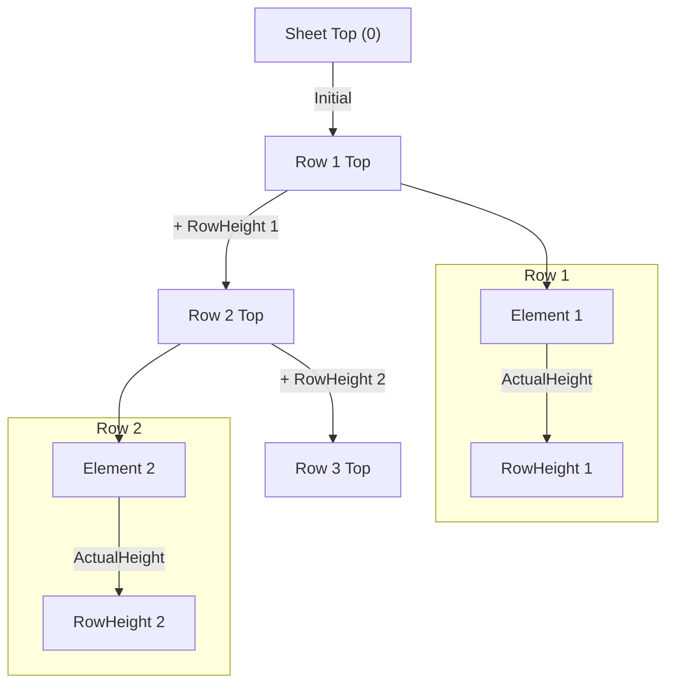
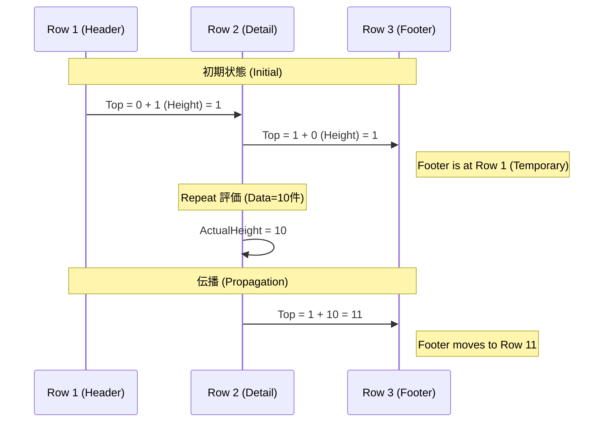

# LayoutEngine 詳細設計 (Rx/Logical Grid)

## 1. 概要
LayoutEngine は、DSL で定義された「論理グリッド (Logical Grid)」上の配置を、物理的な Excel 座標に変換するモジュールである。
各要素のサイズ（高さ・幅）はデータ展開（Repeat 等）によって動的に変化するため、**Reactive Extensions (Rx)** を用いてサイズ変更イベントを伝播させ、依存する後続要素の座標を動的に解決する。

## 2. コンセプト: 論理グリッド (Logical Grid)

### 2.1 定義
DSL の属性 `r` (Row) と `c` (Column) は、物理的なセル番地ではなく、コンテナ内の **「論理スロット」** を指す。

*   **Logical Row**: コンテナ内の「N番目の行ブロック」。高さは可変。
*   **Logical Column**: コンテナ内の「N番目の列ブロック」。幅は可変。

### 2.2 座標決定の仕組み
1.  **高さの自動拡張**:
    *   ある `LogicalRow` に配置された要素の中で、最も高い要素に合わせてその行の高さ (`Height`) が決定する。
2.  **行・列の同期 (Synchronization)**:
    *   **同じコンテナ内の行・列は常に同期する**。
    *   例: `Row 2` に配置された複数の要素（左側の小さい表、右側の大きい表）のうち、右側が Repeat で 10 行に伸びた場合、`Row 2` 全体の高さが 10 になる。
    *   結果として、左側の要素の下にある `Row 3` も、右側の表の終了位置（10行下）まで押し下げられる。
    *   これにより、2次元グリッド全体の整合性が保たれる。
3.  **積み上げ (Stacking)**:
    *   `LogicalRow[N]` の開始位置 (`Top`) は、`LogicalRow[0]` ～ `LogicalRow[N-1]` の高さの合計によって決まる。
    *   これを Rx のストリームで接続し、前の行の高さが確定・変更されると、自動的に次の行の開始位置が再計算される。

## 3. API (Public Interfaces)

### 3.1 ILayoutEngine
```csharp
public interface ILayoutEngine
{
    /// <summary>
    /// AST とデータを元にレイアウト計画を生成する。
    /// </summary>
    LayoutPlan Build(WorkbookNode workbookAst, object rootData);
}
```

## 4. データモデル (Reactive)

### 4.1 LogicalContainer (Sheet, Grid, Component)
論理的な行・列を管理するコンテナ。

```csharp
public class LogicalContainer
{
    // 行ごとの高さ管理 (Key: LogicalRowIndex)
    // BehaviorSubject により、高さの変化を通知可能
    public Dictionary<int, BehaviorSubject<int>> RowHeights { get; }
    
    // 列ごとの幅管理
    public Dictionary<int, BehaviorSubject<int>> ColWidths { get; }

    // このコンテナ自体の物理的な開始位置 (親から購読)
    public IObservable<int> AbsTop { get; }
    public IObservable<int> AbsLeft { get; }
}
```

### 4.2 LayoutElement (Cell, Use, Repeat)
配置される個々の要素。

```csharp
public abstract class LayoutElement
{
    // 配置された論理座標
    public int LogicalRow { get; }
    public int LogicalCol { get; }

    // 自身のサイズ (展開結果によって変化)
    public BehaviorSubject<int> ActualHeight { get; }
    public BehaviorSubject<int> ActualWidth { get; }
}
```

## 5. 処理フロー (Reactive Workflow)

### 5.1 構築フェーズ (Construction)
AST をトラバースし、オブジェクトグラフ（`LogicalContainer` と `LayoutElement` のツリー）を構築する。まだ値の評価や座標計算は行わない。

1.  **Sheet 作成**: ルートとなる `LogicalContainer` を作成。
2.  **要素配置**: AST ノードごとに `LayoutElement` を作成し、コンテナに登録。
    *   この時、`LayoutElement.ActualHeight` を `Container.RowHeights[r]` に **Merge (Max)** する依存関係を定義する。
    *   つまり、「行の高さ」＝「その行にある全要素の高さの最大値」。

### 5.2 接続フェーズ (Wiring)
各行・列の依存関係を Rx で接続する。



1.  **縦方向の依存 (Y座標)**:
    *   `Row[N].Top` = `Row[N-1].Top` + `Row[N-1].Height`
    *   この連鎖を構築する。
2.  **横方向の依存 (X座標)**:
    *   同様に `Col[N].Left` を定義。

### 5.3 評価フェーズ (Evaluation)
データを流し込み、サイズを確定させていく。

1.  **Cell の評価**:
    *   `ExpressionEngine` で値を評価。
    *   値が決まると、フォントサイズ等から物理的な高さ・幅 (`ActualHeight/Width`) が算出される。
    *   -> `BehaviorSubject` に値が発行される。
2.  **Repeat の評価**:
    *   データ数 N が判明。
    *   N 個のサブ要素を展開（行複製）。
    *   Repeat 要素自体の `ActualHeight` が「N行分の合計」として確定し、発行される。
3.  **伝播 (Propagation)**:
    *   要素の高さ変更 -> 行の高さ変更 -> 次の行の Top 変更 -> その行の要素の AbsTop 変更...
    *   全ての変更が静まった時点（または完了シグナル）で、最終的な配置 (`LayoutPlan`) をスナップショットとして出力する。

## 6. 座標追従ワークフロー例 (Rx)

**例**: Header (r=1), Detail (r=2, Repeat), Footer (r=3)



1.  **初期状態**:
    *   `Row1.Height` = 1 (Header)
    *   `Row2.Height` = 0 (未評価)
    *   `Row3.Top` = `Row1.Top` + `Row1.Height` + `Row2.Height`
        *   仮に Top=1, H1=1, H2=0 なら、Row3.Top = 2。

2.  **Repeat 評価 (Detail)**:
    *   データが 10 件あると判明。
    *   内部で 10 行分のサブレイアウトが生成され、合計高さが 10 になる。
    *   `DetailElement.ActualHeight` が `10` を発行。

3.  **Row2 更新**:
    *   `Row2` にある要素 (Detail) が 10 になったので、`Row2.Height` が `10` を発行。

4.  **Row3 更新 (自動伝播)**:
    *   `Row3.Top` の購読元である `Row2.Height` が変わったため再計算。
    *   `Row3.Top` = 1 (Row1) + 10 (Row2) + 1 (Start) = **12**。
    *   Footer は自動的に 12 行目に配置される。

## 7. メリット
*   **宣言的**: 「Aが決まればBが決まる」というルールを書くだけで、複雑な再計算ロジックを記述しなくて済む。
*   **柔軟性**: 将来的に「可変高さのテキスト折り返し」などで行の高さが変わっても、自動的に後続がずれる。
*   **論理/物理の分離**: DSL の `r/c` (論理) と Excel の `row/col` (物理) のマッピングが明確になる。
