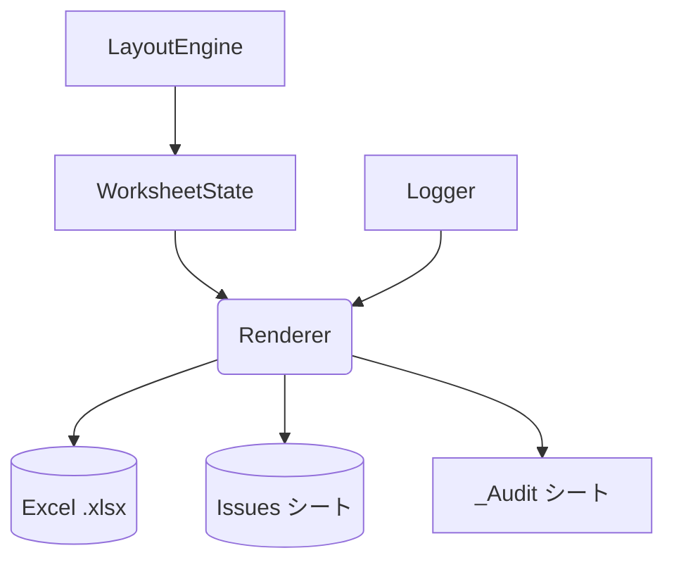

# Renderer 詳細設計書 v1
## 1. 概要・位置づけ

本章では、Renderer モジュールの概要、役割、および他モジュールとの境界を定義する。

Renderer は、LayoutEngine / WorksheetState によって完全に確定した **最終シート状態（WorksheetWorkbookState）** を入力として受け取り、
判断ロジックを一切持たずに、それをそのまま Excel(OpenXML) 物理構造へ写像するモジュールである。

### 1.1 モジュール名
- モジュール名: `Renderer`
- 所属アセンブリ想定: `ExcelReport.Core`

### 1.2 役割
Renderer は、WorksheetState が保持する **最終状態データ** を入力として、物理 `.xlsx` を生成する唯一のモジュールである。

ここでいう「最終状態データ」とは、LayoutEngine によるレイアウト計画とスタイル優先順位の決定がすべて完了し、
WorksheetState によって統合・検証された後の状態を指す。

Renderer の役割は次の点に集約される。

- WorksheetState / WorksheetWorkbookState が保持する情報を **変更せずに** 物理 Excel に投影すること  
  - セル値・数式・エラー情報（CellState）
  - 結合セル情報（MergedRanges）
  - 名前付き領域（NamedAreas）
  - 数式系列（FormulaSeries）
  - **最終合成済みスタイル（StyleSnapshot）**
  - **確定済みシートオプション（SheetOptions）**
- 進捗・監査情報を Logger と連携しながら、ファイルまたは Stream への I/O を実行すること

### 1.3 入力 (IN)
Renderer は以下の入力を受け取る。

- `WorksheetWorkbookState`
- `IReportLogger`
- `IAuditLogExporter`
- `RendererOptions`
- `CancellationToken`

### 1.4 出力 (OUT)
- `.xlsx` 物理ファイルまたは Stream
- Issues シート
- `_Audit` シート
- RenderResult

### 1.5 他モジュールとの関係


---
### 7.8 性能総括

Renderer の性能は次の 3 点で決まる。

```
1. Excel API 書き込み性能
2. セル数（N）
3. スタイル変換キャッシュの有無
```

Renderer 自身は計算ロジックを持たないため、
WorksheetState から Excel への写像処理が大部分を占める。

---

## 9. Logger 連携（Renderer における進捗・監査出力）

Renderer は Excel 出力処理の最終工程として、進捗報告および監査記録を Logger と連携して行う。
ここでは Renderer が実施するログ関連動作を定義する。

### 9.1 進捗通知（Progress Logging）

Renderer は処理の主要ポイントで Logger に通知を送る。

```
OnBookStart(bookName)
OnSheetStart(sheetName)
OnCellBatch(cellsProcessed)
OnError(issue)
OnCompleted()
```

セル数が多い場合、CellBatch 単位で処理進捗を通知する。

### 9.2 監査ログ（Audit Logging）

監査情報は `_Audit` シートとして非表示で出力される。
Renderer は Logger または IAuditLogExporter から行データを受け取り、そのまま書き込む。

AuditRow の例:

```
AuditRow
  - Timestamp
  - Module
  - Action
  - Message
  - Severity
  - ExtraData
```

Renderer は内容を加工せず記録する。

### 9.3 Issue の記録

Renderer 内で発生したエラーは Issue に変換され Logger に渡される。

```
IssueKind.IOError
IssueKind.RenderError
IssueKind.OperationCanceled
```

DSL・レイアウト・スタイルなどの上流エラーは Renderer が生成せず、
WorksheetStateBuilder / LayoutEngine から集約された Issue をそのまま Issues シートに記録する。

### 9.4 Issues シート出力

Renderer は WorkbookState.Issues の内容を「Issues」シートに書き出す。

```
Columns:
  - Severity
  - Message
  - Module
  - Position
```

並び替えやフィルタ適用などの判断は行わない。

### 9.5 ログ処理の例外対応

```
try:
    logger.OnSheetStart(name)
catch Exception:
    // ログ例外は処理継続
```

ログ処理の失敗は Excel 出力の妨げにならないように扱う。

### 9.6 Logger 連携総括

Renderer が Logger に対して行うことは次のとおり。

```
1. 処理開始・進捗・終了の通知
2. I/O 例外を Issue として記録
3. AuditRow をそのまま _Audit シートに反映
4. Issues 一覧を Issues シートに出力
```

Renderer はログ内容の判断・整形・解釈を行わず、
Logger が提供する内容をそのまま記録するだけである。

---

## 10. テスト観点（Renderer の検証項目）

Renderer は WorksheetState を変更せずに Excel 物理層へ写像するモジュールであるため、
テスト観点は「正しく写像されているか」「I/O 時のエラー処理が正しいか」に集中する。

### 10.1 シート生成のテスト

```
1. WorksheetState.Sheets の順番どおりに Excel シートが生成されること
2. シート名が正しく設定されること
3. 空シートでも例外が発生しないこと
```

### 10.2 セル出力テスト

```
1. Constant 値がそのまま Excel に書き込まれる
2. Formula が文字列として正しく設定される（書き換え・補完が行われない）
3. Error が正しく Excel エラー値に変換される
4. Blank が空文字として出力される
5. すべての座標が WorksheetState に一致している
```

### 10.3 スタイル適用テスト

```
1. StyleSnapshot のすべてのプロパティが Excel Style に正しく反映される
2. 未定義プロパティが補完されない（Renderer が判断しないことを確認）
3. 同一 StyleSnapshot に対して同一 Excel Style が再利用される（任意の最適化）
```

### 10.4 結合セルのテスト

```
1. WorksheetState の MergedRanges がそのまま MergeCells として作成される
2. 範囲が正しく反映されている（Top/Left/Bottom/Right）
3. 既存セルの内容が消えないこと
```

### 10.5 NamedArea のテスト

```
1. すべての Area が NamedRange として作成される
2. 参照範囲が WorksheetState と一致している
3. 重複名の後勝ちが正しく反映されている（WorksheetState 側の仕様確認）
```

### 10.6 FormulaSeries のテスト

```
1. 名前付き数式が正しく生成される
2. 参照セルの順序が変更されていない
3. Orientation（Row/Column）が正しく反映されている
```

### 10.7 SheetOptions のテスト

```
1. FreezePane が WorksheetState の値どおりに適用される
2. AutoFilter が指定範囲に正しく適用される
3. PrintOptions（PrintArea、Landscape など）がそのまま反映される
```

Renderer が判断しないことを確認するため、
期待値は WorksheetState の値と一致することを必須とする。

### 10.8 Issues シートのテスト

```
1. WorkbookState.Issues の全件が行として記録される
2. Severity / Message / Position が正しく反映される
3. ソートやフィルタが適用されない（Renderer が判断しないことの確認）
```

### 10.9 _Audit シートのテスト

```
1. AuditLogExporter が返す行がすべて記録される
2. _Audit シートが非表示であること
3. 列構造・フォーマットが固定であること
```

### 10.10 I/O エラー処理のテスト

```
1. 出力先パスが無効な場合に IOError Issue が生成される
2. Stream 書き込み中の例外が RenderError として扱われる
3. CancellationToken による中断が OperationCanceled Issue を出す
```

### 10.11 性能テスト

```
1. 1万セル・10万セル規模での出力時間の計測
2. スタイルキャッシュの有無による出力性能差の検証
3. Stream 出力・ファイル出力それぞれの性能検証
```

### 10.12 総括

Renderer のテスト観点は次の 3 点に集約される。

```
1. WorksheetState と一致した内容がそのまま物理 Excel に写像されていること
2. Renderer が判断・補正・再計算していないことの検証
3. I/O・Excel API の例外処理が正しく行われること
```
---


---

## 11. 実装例（C# サンプルコード）

この章では、Renderer の挙動を示すための最小限の C# 実装例を示す。
ここでのクラス・メソッドはあくまで参考実装であり、実際のライブラリ構成や名前空間はプロジェクトに合わせて調整する。

### 11.1 Render メインフロー（C#）

```csharp
public sealed class Renderer : IRenderer
{
    private readonly IExcelWorkbookFactory _workbookFactory;
    private readonly IAuditLogExporter _auditLogExporter;

    public Renderer(IExcelWorkbookFactory workbookFactory, IAuditLogExporter auditLogExporter)
    {
        _workbookFactory = workbookFactory;
        _auditLogExporter = auditLogExporter;
    }

    public RenderResult Render(
        WorksheetWorkbookState workbookState,
        RendererOptions options,
        IReportLogger logger,
        CancellationToken cancellationToken = default)
    {
        logger.OnBookStart(workbookState.Sheets.Count);

        using var workbook = _workbookFactory.Create();

        foreach (var sheetState in workbookState.Sheets)
        {
            cancellationToken.ThrowIfCancellationRequested();

            logger.OnSheetStart(sheetState.Name);

            var sheet = workbook.AddWorksheet(sheetState.Name);

            WriteCells(sheet, sheetState.Cells, logger, cancellationToken);
            ApplyMergedRanges(sheet, sheetState.MergedRanges, cancellationToken);
            ApplyNamedAreas(workbook, sheetState.NamedAreas);
            ApplyFormulaSeries(workbook, sheetState.FormulaSeriesMap);
            ApplySheetOptions(sheet, sheetState.SheetOptions);

            // スタイルはセル出力時に適用している想定
        }

        WriteIssuesSheet(workbook, workbookState.Issues);
        WriteAuditSheet(workbook, _auditLogExporter.Export());

        OutputWorkbook(workbook, options, cancellationToken);

        logger.OnCompleted();

        return new RenderResult(
            sheetCount: workbookState.Sheets.Count,
            cellCount: workbookState.Sheets.Sum(s => s.Cells.Count),
            issueCount: workbookState.Issues.Count);
    }
}
```

### 11.2 セル出力とスタイル適用（C#）

```csharp
private static void WriteCells(
    IExcelWorksheet sheet,
    IReadOnlyList<CellState> cells,
    IReportLogger logger,
    CancellationToken cancellationToken)
{
    const int batchSize = 1000;
    var processed = 0;

    foreach (var cell in cells)
    {
        cancellationToken.ThrowIfCancellationRequested();

        var excelCell = sheet.GetCell(cell.Row, cell.Col);

        switch (cell.ValueKind)
        {
            case CellValueKind.Constant:
                excelCell.Value = cell.ConstantValue;
                break;
            case CellValueKind.Formula:
                excelCell.FormulaA1 = cell.Formula ?? string.Empty;
                break;
            case CellValueKind.Error:
                excelCell.Value = cell.ErrorText ?? string.Empty;
                break;
            case CellValueKind.Blank:
            default:
                excelCell.Value = string.Empty;
                break;
        }

        // StyleSnapshot は最終合成済みなのでそのまま適用する
        ApplyStyle(excelCell, cell.Style);

        processed++;
        if (processed % batchSize == 0)
        {
            logger.OnCellBatch(processed);
        }
    }

    if (processed % batchSize != 0)
    {
        logger.OnCellBatch(processed);
    }
}
```

```csharp
private static void ApplyStyle(IExcelCell cell, StyleSnapshot style)
{
    if (style == null) return;

    var s = cell.Style;

    if (!string.IsNullOrEmpty(style.FontName))
        s.Font.Name = style.FontName;

    if (style.FontSize.HasValue)
        s.Font.Size = style.FontSize.Value;

    if (style.FontBold.HasValue)
        s.Font.Bold = style.FontBold.Value;

    if (style.FontItalic.HasValue)
        s.Font.Italic = style.FontItalic.Value;

    if (style.FontUnderline.HasValue && style.FontUnderline.Value)
        s.Font.Underline = true;

    if (!string.IsNullOrEmpty(style.FillColor))
        s.Fill.BackgroundColor = style.FillColor;

    if (!string.IsNullOrEmpty(style.NumberFormatCode))
        s.NumberFormat.Format = style.NumberFormatCode;

    if (style.Border is { } b)
    {
        if (!string.IsNullOrEmpty(b.Top))
            s.Border.TopStyle = b.Top;
        if (!string.IsNullOrEmpty(b.Bottom))
            s.Border.BottomStyle = b.Bottom;
        if (!string.IsNullOrEmpty(b.Left))
            s.Border.LeftStyle = b.Left;
        if (!string.IsNullOrEmpty(b.Right))
            s.Border.RightStyle = b.Right;
        if (!string.IsNullOrEmpty(b.Color))
            s.Border.Color = b.Color;
    }
}
```

### 11.3 結合セル・NamedArea・FormulaSeries（C#）

```csharp
private static void ApplyMergedRanges(
    IExcelWorksheet sheet,
    IReadOnlyList<MergedRange> mergedRanges,
    CancellationToken cancellationToken)
{
    foreach (var m in mergedRanges)
    {
        cancellationToken.ThrowIfCancellationRequested();
        sheet.Merge(m.Top, m.Left, m.Bottom, m.Right);
    }
}

private static void ApplyNamedAreas(
    IExcelWorkbook workbook,
    IReadOnlyDictionary<string, Area> namedAreas)
{
    foreach (var kv in namedAreas)
    {
        var name = kv.Key;
        var area = kv.Value;
        workbook.DefineNamedRange(
            name,
            area.Top,
            area.Left,
            area.Bottom,
            area.Right);
    }
}

private static void ApplyFormulaSeries(
    IExcelWorkbook workbook,
    IReadOnlyDictionary<string, FormulaSeries> seriesMap)
{
    foreach (var kv in seriesMap)
    {
        var name = kv.Key;
        var series = kv.Value;
        workbook.DefineNamedFormula(name, series);
    }
}
```

### 11.4 SheetOptions の適用（C#）

```csharp
private static void ApplySheetOptions(
    IExcelWorksheet sheet,
    SheetOptions options)
{
    if (options == null) return;

    if (options.View is { } view)
    {
        if (view.FreezeTopRow.HasValue)
            sheet.FreezeTopRow(view.FreezeTopRow.Value);

        if (view.FreezeLeftColumn.HasValue)
            sheet.FreezeLeftColumn(view.FreezeLeftColumn.Value);

        if (view.ZoomScale.HasValue)
            sheet.Zoom(view.ZoomScale.Value);
    }

    if (options.AutoFilter is { } filter)
    {
        sheet.SetAutoFilter(
            filter.HeaderRow,
            filter.FirstColumn,
            filter.LastColumn);
    }

    if (options.Print is { } print)
    {
        if (!string.IsNullOrEmpty(print.PrintArea))
            sheet.SetPrintArea(print.PrintArea);

        if (print.FitToPage.HasValue)
            sheet.SetFitToPage(print.FitToPage.Value);

        if (print.Landscape.HasValue)
            sheet.SetLandscape(print.Landscape.Value);
    }
}
```

### 11.5 Issues シートと _Audit シート（C#）

```csharp
private static void WriteIssuesSheet(
    IExcelWorkbook workbook,
    IReadOnlyList<Issue> issues)
{
    var sheet = workbook.AddWorksheet("Issues");

    var row = 1;
    foreach (var issue in issues)
    {
        sheet.GetCell(row, 1).Value = issue.Severity.ToString();
        sheet.GetCell(row, 2).Value = issue.Message;
        sheet.GetCell(row, 3).Value = issue.Module;
        sheet.GetCell(row, 4).Value = issue.Position;
        row++;
    }
}

private static void WriteAuditSheet(
    IExcelWorkbook workbook,
    IEnumerable<AuditRow> auditRows)
{
    var sheet = workbook.AddWorksheet("_Audit");
    sheet.Hidden = true;

    var row = 1;
    foreach (var a in auditRows)
    {
        sheet.GetCell(row, 1).Value = a.Timestamp;
        sheet.GetCell(row, 2).Value = a.Module;
        sheet.GetCell(row, 3).Value = a.Action;
        sheet.GetCell(row, 4).Value = a.Message;
        sheet.GetCell(row, 5).Value = a.Severity.ToString();
        sheet.GetCell(row, 6).Value = a.ExtraData;
        row++;
    }
}
```

### 11.6 出力処理（C#）

```csharp
private static void OutputWorkbook(
    IExcelWorkbook workbook,
    RendererOptions options,
    CancellationToken cancellationToken)
{
    if (options.OutputPath is not null)
    {
        workbook.SaveAs(options.OutputPath, cancellationToken);
    }
    else if (options.OutputStream is not null)
    {
        workbook.SaveAs(options.OutputStream, cancellationToken);
    }
    else
    {
        throw new InvalidOperationException("OutputPath または OutputStream が指定されていません。");
    }
}
```

