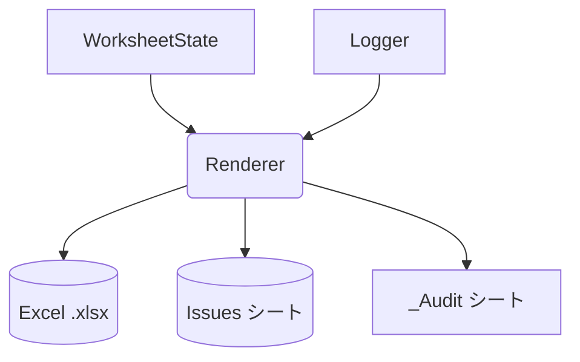
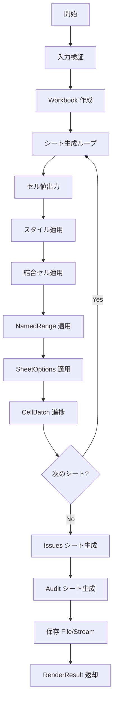
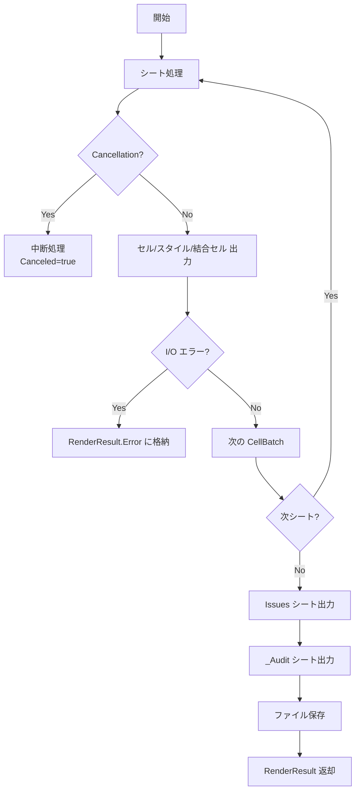
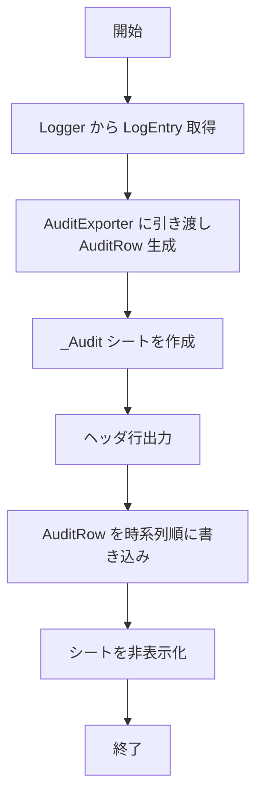
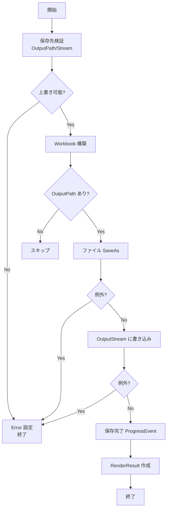
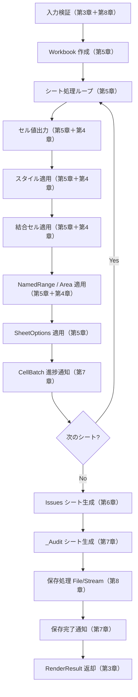
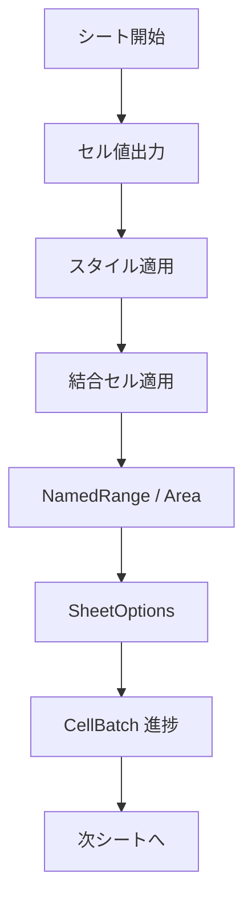
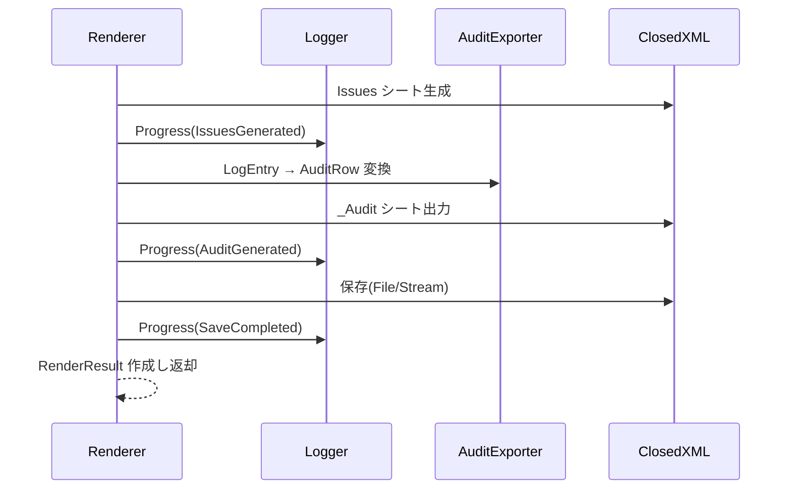

# Renderer 詳細設計書 v1
---
## 1. 概要・位置づけ
本章では、Renderer モジュールの概要、役割、および他モジュールとの境界を定義する。

### 1.1 モジュール名
- モジュール名: `Renderer`
- 所属アセンブリ想定: `ExcelReport.Core`

### 1.2 役割
Renderer は、WorksheetState が確定した Excel 論理シート状態を入力として、  
物理 `.xlsx` を生成する唯一のモジュールである。

主な責務は以下のとおりである。

- セル値（定数・数式・エラー）の物理出力
- スタイル（フォント・塗り・罫線・表示形式）の物理適用
- 結合セル適用
- NamedRange / Area の適用
- Freeze / Group / AutoFilter の適用
- Issues シート生成（可視）
- `_Audit` シート生成（Logger の監査ログ、非表示）
- ファイルまたは Stream への `.xlsx` 出力
- Book / Sheet / CellBatch 単位の進捗通知
- キャンセル要求への応答

### 1.3 入力 (IN)
- `WorksheetWorkbookState`
  - Cells（値・数式・Error）
  - MergedRanges
  - NamedAreas
  - FormulaSeries
  - StyleSnapshot
  - SheetOptions
- `IReportLogger`（進捗・ログ・Issue 連携）  
  
- `IAuditLogExporter`（監査シート行データ生成）  
  
- `RendererOptions`

### 1.4 出力 (OUT)
- `.xlsx` 物理ファイル
- Issues シート（可視）
- `_Audit` シート（非表示）

### 1.5 他モジュールとの関係（図）


---

## 2. 責務・非責務
本章では Renderer モジュールの **責務（行うこと）** と  
**非責務（行わないこと）** を定義する。

## 2.1 責務
Renderer は WorksheetState の確定済み情報を元に、Excel 物理構造を生成する。

- **Workbook / Sheet の生成**  
  - WorksheetWorkbookState のシート構造をそのまま ClosedXML Workbook へ反映する。  
  - シート名・行数・列数の設定を行う。  

- **セル値の出力**  
  - CellState の ValueKind（Constant / Formula / Error / Blank）に応じて値・数式・エラー文字列を設定する。

- **スタイル適用**  
  - StyleSnapshot のフォント・塗り・罫線・表示形式を ClosedXML スタイルへ反映する。  
  
- **結合セル適用**  
  - MergedRanges の矩形情報を Excel Range.Merge() として適用する。

- **NamedRange / Area の適用**  
  - WorksheetState.NamedAreas の座標情報を Excel NamedRange として登録する。

- **SheetOptions の適用**  
  - FreezePane / GroupRows / GroupCols / AutoFilter を Excel に適用する。  

- **Issues シート生成（可視）**  
  - 各モジュールが生成した Issue を一覧として出力する。

- **監査シート `_Audit` の生成（非表示）**  
  - Logger の LogEntry および Issue を IAuditLogExporter によって行データ化し、非表示シートとして出力する。  

- **ファイル出力 (.xlsx)**  
  - 指定パスまたは Stream へ書き込みを行う。  
  - Overwrite 指定が false の場合、既存ファイルがあるとエラーとする。

- **進捗通知**  
  - Book / Sheet / CellBatch 単位で ProgressEvent を Logger に送信する。

- **キャンセル応答**  
  - CancellationToken が発火した場合、処理を即時停止する。

## 2.2 非責務
Renderer は Excel 出力以外のロジックは持たない。
- **DSL パース**（DslParser の責務）  
- **C# 式評価**（ExpressionEngine の責務）  
- **レイアウト計画生成**（LayoutEngine の責務）  
- **シート状態の構築・検証**（WorksheetState の責務）  
- **スタイル定義・スコープ警告**（Styles の責務）  
- **Excel 行列上限の検証**  
  - WorksheetState が Fatal を生成済みとする。
- **Issue の生成**  
  - Renderer は Issue を新規生成せず、出力のみ行う。

---

## 3. 公開 API
本章では Renderer モジュールが外部へ提供する公開 API を定義する。

### 3.1 RendererOptions
Renderer の挙動を制御するための設定。

```csharp
public sealed class RendererOptions
{
    public string? OutputPath { get; init; }
    public Stream? OutputStream { get; init; }
    public bool Overwrite { get; init; } = false;
    public bool EmitIssuesSheet { get; init; } = true;
    public bool EmitAuditSheet { get; init; } = true;
    public string? BookId { get; init; }
}
```

#### 説明
- **OutputPath**  
  `.xlsx` の出力先ファイルパス。`null` の場合は Stream 出力のみとなる。
- **OutputStream**  
  書き込み対象の Stream。ファイルと併用可能。
- **Overwrite**  
  `false` の場合、既存ファイルが存在するとエラーとする。
- **EmitIssuesSheet**  
  Issues シートを生成するかどうか。
- **EmitAuditSheet**  
  `_Audit` シートを生成するかどうか。
- **BookId**  
  進捗ログ・監査ログに関連付けるレポート単位 ID。


### 3.2 RenderResult
レンダリング結果を表す返却オブジェクト。

```csharp
public sealed class RenderResult
{
    public int SheetCount { get; init; }
    public int CellCount { get; init; }
    public int IssueCount { get; init; }
    public Exception? Error { get; init; }
    public bool Canceled { get; init; }
}
```

#### 説明
- **SheetCount**  
  出力したシート数。
- **CellCount**  
  書き込んだセルの総数。
- **IssueCount**  
  Issues シートに出力された Issue 件数。
- **Error**  
  物理出力中に発生した例外（致命的な場合のみ）。
- **Canceled**  
  キャンセル要求により処理が停止したかどうか。

### 3.3 IRenderer
Renderer が提供する唯一の公開インターフェース。

```csharp
public interface IRenderer
{
    RenderResult Render(
        WorksheetWorkbookState workbookState,
        IReportLogger logger,
        IAuditLogExporter auditExporter,
        RendererOptions options,
        CancellationToken cancellationToken = default);
}
```

#### 引数仕様
- **workbookState**  
  WorksheetState により構築された論理シート状態。
- **logger**  
  進捗通知および Issue/ログの連携先。
- **auditExporter**  
  Audit シートへ書き込む行データを生成するコンポーネント。
- **options**  
  出力形式・パス・フラグ類。
- **cancellationToken**  
  外部からの処理中断要求。

#### 戻り値
- **RenderResult**  
  レンダリング結果（件数情報・中断情報・例外情報）。

### 3.4 API 契約事項
- Excel 出力は **同期的実行** で行われる。
- 例外発生時は RenderResult.Error に格納し、可能な範囲で処理継続を試みる。
- WorksheetState 内のデータは **改変しない**（読み取り専用）。
- Stream 出力利用時は呼び出し側が Stream を管理する。

---

## 4. データモデル
本章では Renderer が参照・利用する内部および外部データモデルを定義する。  
Renderer は WorksheetState の出力を直接参照し、Excel 物理構造へ変換する。

## 4.1 入力データモデル（WorksheetState）
Renderer は WorksheetState が提供する以下の情報を利用する。

### WorksheetWorkbookState
- Sheets: `WorksheetState` の一覧
- Issues: 全シートで検出された Issue 一覧

### WorksheetState
- Name: シート名
- Rows / Cols: シートの最終行列数
- Cells: `CellState` の一覧
- MergedRanges: 結合セル範囲
- NamedAreas: 名前付き領域
- FormulaSeriesMap: 数式参照名（系列）マッピング
- Issues: シート内の Issue 一覧

### CellState
```csharp
public sealed class CellState
{
    public int Row { get; }
    public int Col { get; }
    public CellValueKind ValueKind { get; }
    public object? ConstantValue { get; }
    public string? Formula { get; }
    public string? ErrorText { get; }
    public StyleSnapshot Style { get; }
    public bool IsMergedHead { get; }
    public MergedRange? MergedRange { get; }
    public string? FormulaRefName { get; }
}
```

### CellValueKind
- Blank  
- Constant  
- Formula  
- Error  

### MergedRange
```csharp
public sealed class MergedRange
{
    public int Top { get; }
    public int Left { get; }
    public int RowSpan { get; }
    public int ColSpan { get; }
}
```

### Named Area
```csharp
public sealed class Area
{
    public string Name { get; }
    public int Top { get; }
    public int Bottom { get; }
    public int Left { get; }
    public int Right { get; }
}
```

### FormulaSeries
数式中の論理名を物理セル番地に解決するための情報。

```csharp
public sealed class FormulaSeries
{
    public string Name { get; }
    public FormulaSeriesOrientation Orientation { get; }
    public IReadOnlyList<(int Row, int Col)> Cells { get; }
}
```

## 4.2 スタイルモデル（StyleSnapshot）
Renderer は Styles モジュールではなく、WorksheetState が提供する **最終合成済みの StyleSnapshot** を利用する。

```csharp
public sealed class StyleSnapshot
{
    public string? FontName { get; }
    public double? FontSize { get; }
    public bool? FontBold { get; }
    public bool? FontItalic { get; }
    public bool? FontUnderline { get; }
    public string? FillColor { get; }
    public string? NumberFormatCode { get; }
    public BorderSnapshot? Border { get; }
    public IReadOnlyList<string> AppliedStyleNames { get; }
}
```

### BorderSnapshot
```csharp
public sealed class BorderSnapshot
{
    public string? Top { get; }
    public string? Bottom { get; }
    public string? Left { get; }
    public string? Right { get; }
    public string? Color { get; }
}
```

## 4.3 Logger / 監査関連モデル
Renderer は監査シート生成のために Logger のデータも利用する。

### LogEntry
- Timestamp  
- Level  
- Category  
- Message  
- Module  
- SheetName / RegionName / Location  
- Issue（関連 Issue がある場合）

### AuditRow（auditExporter によって生成）
```csharp
public sealed class AuditRow
{
    public DateTimeOffset Timestamp { get; init; }
    public LogLevel Level { get; init; }
    public LogCategory Category { get; init; }
    public string Module { get; init; }
    public string BookId { get; init; }
    public string? SheetName { get; init; }
    public string? RegionName { get; init; }
    public string? Location { get; init; }
    public string Message { get; init; }
    public IssueSeverity? IssueSeverity { get; init; }
    public IssueKind? IssueKind { get; init; }
    public string? IssueMessage { get; init; }
    public string? Extra { get; init; }
}
```

## 4.4 Renderer 内部データ
Renderer 自体は複雑な独自モデルを持たず、ほぼ WorksheetState の値をそのまま ClosedXML API に渡す。

内部的に保持するのは以下程度。

### CellRenderTarget（内部処理用）
```csharp
private sealed class CellRenderTarget
{
    public int Row { get; }
    public int Col { get; }
    public CellState State { get; }
}
```

### WorkbookContext（進捗通知用）
```csharp
private sealed class WorkbookContext
{
    public string BookId { get; }
    public IReportLogger Logger { get; }
    public RendererOptions Options { get; }
}
```

## 4.5 データモデルに関する不変条件
Renderer は WorksheetState のデータに対し、以下の前提が保証されているものとして処理する。

- セル座標はすべて Excel の有効範囲内である  
- 結合セルは矩形であり、他の結合と重複しない  
- NamedArea はすべてシート範囲内である  
- StyleSnapshot はすでに合成済みであり、矛盾は無い  
- FormulaSeries は 1次元連続系列であり、レイアウト済み  

これらはすべて WorksheetState / LayoutEngine 側で検証済みであり、  
Renderer は検証を行わず **適用するだけ** とする。

---

# Renderer 詳細設計書 v1

## 5. 処理フロー
本章では Renderer が WorksheetState を受け取り、最終的な `.xlsx` を生成するまでの処理手順を定義する。

## 5.1 全体フロー概要
Renderer の処理は以下の大きな流れで構成される。

1. 入力検証（options・出力先の確認）
2. Workbook の生成
3. 各シートの生成処理
4. Issues シート生成（任意）
5. Audit シート生成（任意）
6. ファイルまたは Stream への書き込み
7. RenderResult の作成と返却

## 5.2 シート生成フロー
シート生成は Workbook 内で順次行われる。

1. 新規シートの作成（名称設定）
2. セル値の書き込み  
   - Constant / Formula / Error / Blank の判定
3. スタイルの適用  
   - Font / Fill / Border / NumberFormat の設定
4. 結合セルの適用
5. NamedRange / Area の登録
6. SheetOptions の反映  
   - FreezePane  
   - GroupRows / GroupCols  
   - AutoFilter
7. CellBatch 単位での進捗通知

## 5.3 セル出力フロー
### 5.3.1 値の出力
- `ConstantValue` が存在する場合：そのまま出力  
- `Formula` が存在する場合：Excel 数式として設定  
- `ErrorText` が存在する場合：文字列として設定  
- いずれも存在しない場合：空白セル

### 5.3.2 スタイルの適用フロー
1. フォント（名前・サイズ・太字・イタリック・下線）
2. 塗り（単色指定）
3. 罫線（上下左右）
4. 表示形式（NumberFormatCode）

StyleSnapshot に含まれる値がそのまま適用される。

## 5.4 SheetOptions の処理
### FreezePane
- Freeze 対象となる Area の左上座標を取得し設定する。

### GroupRows / GroupCols
- Area の範囲に基づき行・列のグループ化を行う。

### AutoFilter
- ヘッダ行の連続セル範囲を対象として AutoFilter を設定する。

## 5.5 Issues シート生成処理
次の情報を行単位で列挙する：

- Severity  
- Kind  
- Message  
- SheetName / RegionName  
- Location（行列）  
- Module（生成元）

Issues シートはユーザが確認できる可視シートとして作成する。

## 5.6 Audit シート生成処理
監査ログは `_Audit` シートとして作成し、非表示で保持する。

処理内容：

1. `IAuditLogExporter` により `AuditRow` 列挙を生成
2. Timestamp 昇順で並べ替え
3. ログ項目を表形式で出力
4. シートを非表示設定にする

## 5.7 出力処理
### ファイル出力
- OutputPath が指定されている場合はファイルとして保存
- Overwrite = false の場合は既存ファイルを上書きしない

### Stream 出力
- OutputStream が指定されている場合は Stream に書き込む  
- 呼び出し元が Stream の寿命管理を行う

## 5.8 キャンセル応答
処理の主要ループ（シート単位・CellBatch単位）で `cancellationToken.IsCancellationRequested` を確認し、  
発火している場合は即時中断し `RenderResult.Canceled = true` を設定して返却する。

## 5.9 フロー図（Mermaid）



---

## 6. エラー処理・Issue 取り扱い
本章では Renderer が扱うエラー、Issue、例外処理、進捗ロギングとの関係を定義する。

## 6.1 Issue の扱い方針
Renderer は **Issue を新規生成しない**。  
扱うのは WorksheetState・LayoutEngine・DslParser・Styles・ExpressionEngine など  
上流モジュールで生成された Issue の出力のみである。

### Issue を扱う処理
- Issues シートに一覧として出力する  
- `_Audit` シートにも監査ログとして記録される  
- RenderResult.IssueCount に件数を反映する  

### Renderer が行わないこと
- Issue 内容の編集  
- 重複排除  
- シリアス度の再分類（Warning → Error のような変更）

## 6.2 I/O 例外処理
Renderer の唯一の例外発生ポイントは I/O（ファイル保存、Stream 書き込み）である。

### 発生しうる例外
- ファイルパスが無効  
- 書き込み権限なし  
- ファイルがロックされている  
- Overwrite = false で既存ファイルが存在  
- Stream 書き込み時の IOException

### 例外処理ルール
- 例外発生時は RenderResult.Error に例外オブジェクトを格納する  
- 可能であれば以降の処理は継続し、全体の停止を避ける  
- 保存そのものが失敗した場合は結果として `.xlsx` は生成されない

## 6.3 キャンセル処理
CancellationToken が発火した場合、Renderer は即時に中断を行う。

### 中断ポイント
- シートループの先頭  
- CellBatch 単位での処理箇所  

### 中断時の返却仕様
- RenderResult.Canceled = true  
- RenderResult.Error は null  
- 中断までに作成された Workbook は保存されない

## 6.4 ロガー連携（進捗および監査）
Renderer は唯一の I/O 層として進捗通知が必須となる。

### 進捗通知
- Book 開始・終了  
- Sheet 開始・終了  
- CellBatch 処理ごとの進捗  

### 監査ログへの反映
- `IAuditLogExporter` により LogEntry → AuditRow が生成され、`_Audit` シートに書き込まれる  
- Issue とログは共通フォーマットで監査シートに統合される

## 6.5 エラー・Issue 処理フロー（Mermaid）



---

## 7. 監査および Logger 連携
本章では Renderer が Logger とどのように連携し、監査情報を `_Audit` シートとして出力するかを定義する。

## 7.1 Logger 連携の目的
Renderer は Excel 出力の最終工程を担当するため、  
**処理進捗・Issue・監査情報を確実に Logger に通知する義務がある。**

Logger との連携目的は以下のとおり。

- UI や呼び出し元へ進捗を提供する
- 各モジュールが生成した Issue を最終レポートに反映する
- 監査用にすべての操作ログ（LogEntry）を `_Audit` シートへ残す

## 7.2 進捗通知（ProgressEvent）
Renderer は処理の節目ごとに ProgressEvent を Logger に送信する。

### 通知タイミング
- Book の開始 / 終了
- 各シートの開始 / 終了
- CellBatch 単位での処理完了
- Issues シート生成時
- Audit シート生成時
- 出力完了時

### 通知内容の例
- BookId  
- SheetName  
- 処理済みセル数  
- ステージ（BookStart / SheetStart / CellBatch / SaveCompleted など）

## 7.3 監査ログ（AuditRow）の生成
監査ログは Renderer 自身が生成するのではなく、  
**IAuditLogExporter が LogEntry を AuditRow に変換する。**

Renderer の責務は次のとおり。

- LogEntry の取得（Loggerから）
- IAuditLogExporter への引き渡し
- 返却された `IEnumerable<AuditRow>` を `_Audit` シートに書き込む

### AuditRow 内容
- Timestamp  
- LogLevel  
- Category  
- Module  
- BookId  
- SheetName / RegionName / Location  
- Message  
- IssueSeverity / IssueKind（Issue 関連ログの場合）  
- Extra（モジュール固有拡張）

## 7.4 `_Audit` シート出力仕様
監査ログは専用の非表示シート `_Audit` に出力する。

### 出力仕様
- シート名は `_Audit`（固定）
- 1 行目はヘッダ行（列名）
- 2 行目以降に AuditRow を時系列順に出力
- 保存後にシートを非表示に設定する

### 列構成例
1. Timestamp  
2. Level  
3. Category  
4. Module  
5. BookId  
6. SheetName  
7. RegionName  
8. Location  
9. Message  
10. IssueSeverity  
11. IssueKind  
12. IssueMessage  
13. Extra

## 7.5 Issues シートとの違い
| 項目 | Issues シート | `_Audit` シート |
|------|--------------|------------------|
| 対象 | 各モジュールが生成した Issue のみ | 全 LogEntry（Issue 以外のログも全て） |
| 表示 | 可視 | 非表示 |
| 目的 | ユーザ確認用 | 完全な監査証跡 |
| 行構成 | Issue 単位 | LogEntry 単位 |

## 7.6 監査処理フロー（Mermaid）



---

## 8. ファイル出力処理（保存処理）
本章では Renderer が生成した Workbook を、  
**ファイル** または **Stream** へ書き込む際の処理仕様を定義する。

## 8.1 出力方式
Renderer は次の 2 種類の出力方式をサポートする。

### 8.1.1 ファイル出力（OutputPath）
- `RendererOptions.OutputPath` が指定されている場合に使用する。
- `.xlsx` ファイルとして保存される。

### 8.1.2 Stream 出力（OutputStream）
- `RendererOptions.OutputStream` が指定されている場合に使用する。
- 呼び出し元が Stream を保持し、寿命管理を行う。

両方指定されている場合は **両方へ書き込む**。

## 8.2 Overwrite の扱い
`RendererOptions.Overwrite` が `false` の場合：

- OutputPath に既存ファイルが存在すれば保存を中断し、  
  RenderResult.Error に例外を設定して返却する。
- Stream の場合は無関係（常に上書きされる）。

## 8.3 保存処理の詳細
### 8.3.1 ファイル保存手順
1. 出力ディレクトリの存在を確認  
   - 存在しない場合は作成しない（呼び出し側の責務）
2. OpenXML / ClosedXML により Workbook を生成
3. SaveAs(OutputPath) を実行
4. IOException / UnauthorizedAccessException 発生時は  
   RenderResult.Error に例外を格納

### 8.3.2 Stream 保存手順
1. OutputStream に対して Write() を実行
2. Flush()
3. Stream の Close / Dispose は行わない（呼び出し元責務）
4. 書き込み中に IOException が発生した場合は  
   RenderResult.Error に例外を格納

## 8.4 出力前の検証
Renderer は以下のチェックを行う。

- OutputPath と OutputStream が共に null の場合  
  → 保存先が存在しないため Error とする  
- Overwrite=false かつ OutputPath が既に存在  
  → 保存不可として Error  
- Stream が書き込み可能でない  
  → Error

これらのエラーは **開始時点で検知して中断** する。

## 8.5 出力後の後処理
保存後に行う処理は次のとおり。

- RenderResult に SheetCount / CellCount / IssueCount を格納
- RenderResult.Error が null であれば成功として返却
- Logger に対して「保存完了」ProgressEvent を送信

## 8.6 保存処理フロー（Mermaid）



---

# Renderer 詳細設計書 v1

## 9. Renderer 全体フロー（1〜8章の統合）
本章では、Renderer の全処理（第1〜8章で説明した責務）が  
**実際にどの順序で実行されるのか** を体系的に示す。

Renderer は「Workbook の準備 → 各シートの出力 → Issues → Audit → 保存」の  
**直線的な処理フロー**を持ち、並列実行や分岐は存在しない。

## 9.1 Renderer 全体処理フロー（概要）

Renderer の処理は次の順で必ず実行される：

1. **入力と出力先の検証**（第3章・第8章）  
2. **Workbook オブジェクト生成**（第5章）  
3. **シート単位で出力処理**（第5章・第4章）  
   - セル値出力  
   - スタイル適用  
   - 結合セル適用  
   - NamedRange 生成  
   - SheetOptions 適用  
4. **Issues シート生成**（第6章）  
5. **Audit シート生成**（第7章）  
6. **ファイル／Stream への保存**（第8章）  
7. **RenderResult 作成し返却**

この順序は固定であり、任意に入れ替えることはできない。

## 9.2 章と処理ステップの対応表

| ステップ順 | 実行内容 | 対応章 |
|-----------|----------|--------|
| 1 | 入力の妥当性検証（options・出力先・Overwrite） | 第3章 / 第8章 |
| 2 | Workbook 作成 | 第5章 |
| 3 | シート作成開始通知 | 第7章 |
| 4 | セル値出力 | 第5章 / 第4章 |
| 5 | スタイル適用 | 第5章 / 第4章 |
| 6 | 結合セル適用 | 第5章 / 第4章 |
| 7 | NamedRange・Area 適用 | 第5章 / 第4章 |
| 8 | SheetOptions（Freeze / Group / AutoFilter）適用 | 第5章 |
| 9 | CellBatch 進捗通知 | 第7章 |
| 10 | 次のシートへ（3〜9 が繰り返し） | 第5章 |
| 11 | Issues シート生成 | 第6章 |
| 12 | Audit シート生成 | 第7章 |
| 13 | Workbook 保存（File/Stream） | 第8章 |
| 14 | 保存完了通知 → RenderResult 作成 | 第7章 / 第3章 |

## 9.3 Renderer 全体フロー（第1〜8章の統合・高粒度）



## 9.4 シート単位処理だけの詳細フロー



## 9.5 Issues → Audit → 保存 の終端シーケンス



## 9.6 全体フロー要点まとめ

- **Renderer の全処理は直列実行であり、順序が重要である。**
- **第1〜8章の内容はすべて、この 9 章の順序に従って実行される。**
- 進捗通知は **処理の節目すべて** で Logger へ送られる。
- Issues / Audit の生成は **必ずシート処理の後に実行される。**
- ファイル保存は **すべての処理が完了した後にだけ** 行われる。

この章により、Renderer の全体像が明確に把握できる。