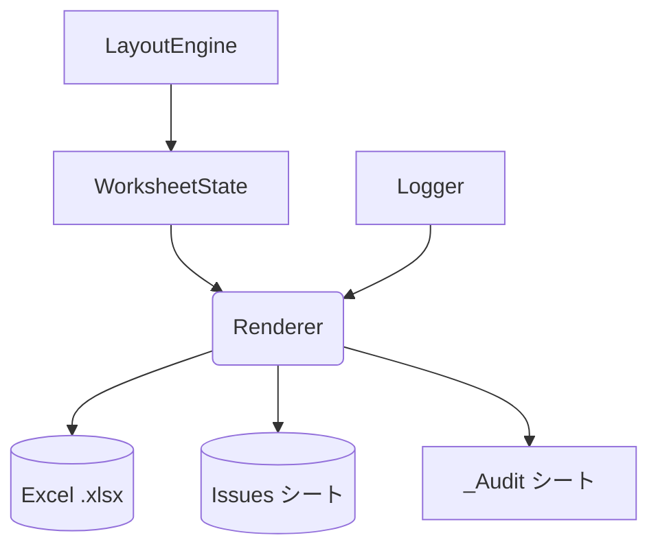

# Renderer 詳細設計書 v1

## Status
- As-Is (Planned): 実装クラス/IF は未実装（証跡: `reports/implementation-inventory-2026-02-13.md:34`）。
- To-Be (Planned): WorksheetState を機械的に xlsx へ投影する実装を追加する（証跡: `reports/issues-and-improvements-2026-02-13.md:98`）。

---
## 1. 概要・位置づけ

本章では、Renderer モジュールの概要、役割、および他モジュールとの境界を定義する。

Renderer は、LayoutEngine / WorksheetState によって完全に確定した **最終シート状態（WorksheetWorkbookState）** を入力として受け取り、
判断ロジックを一切持たずに、それをそのまま Excel(OpenXML) 物理構造へ写像するモジュールである。

### 1.1 モジュール名
- モジュール名: `Renderer`
- 所属アセンブリ想定: `ExcelReport.Core`

### 1.2 役割
Renderer は、WorksheetState が保持する **最終状態データ** を入力として、物理 `.xlsx` を生成する唯一のモジュールである。

ここでいう「最終状態データ」とは、LayoutEngine によるレイアウト計画とスタイル優先順位の決定がすべて完了し、
WorksheetState によって統合・検証された後の状態を指す。

Renderer の役割は次の点に集約される。

- WorksheetState / WorksheetWorkbookState が保持する情報を **変更せずに** 物理 Excel に投影すること  
  - セル値・数式・エラー情報（CellState）
  - 結合セル情報（MergedRanges）
  - 名前付き領域（NamedAreas）
  - 数式系列（FormulaSeries）
  - **最終合成済みスタイル（StyleSnapshot）**
  - **確定済みシートオプション（SheetOptions）**
- 進捗・監査情報を Logger と連携しながら、ファイルまたは Stream への I/O を実行すること

### 1.3 入力 (IN)
Renderer は以下の入力を受け取る。

- `WorksheetWorkbookState`
- `IReportLogger`
- `IAuditLogExporter`
- `RendererOptions`
- `CancellationToken`

### 1.4 出力 (OUT)
- `.xlsx` 物理ファイルまたは Stream
- Issues シート
- `_Audit` シート
- RenderResult

### 1.5 他モジュールとの関係


---

## 2. 責務

本章では Renderer モジュールが担う **正しい責務のみ** を明確化する。

Renderer は、WorksheetState が保持する **最終確定済みデータ** をそのまま Excel(OpenXML) に写像するだけのモジュールであり、  
上流で完了している判断処理を再解釈・再計算してはならない。


## 2.1 コア責務（MUST）

Renderer が必ず実行すべき責務は以下のとおり。

### 1. **セル内容（CellState）の出力**
- Constant / Formula / Error / Blank の区別をそのまま出力
- 数式は WorksheetState が保持する文字列をそのまま設定する
- Error の場合は Excel が認識可能なエラー表現へ変換

### 2. **スタイルの物理適用（StyleSnapshot）**
- StyleSnapshot 内のフォント、塗り、罫線、表示形式などを  
  **変更せずにそのまま適用する**
- **優先順位決定 / 合成 / 上書き判断は一切行わない**
  → LayoutEngine → WorksheetState にて既に確定済み

### 3. **結合セル（MergedRanges）の適用**
- シート定義に従い、指定範囲を結合する
- 不正範囲は WorksheetState によって排除済みであり、Renderer は検証しない

### 4. **名前付き領域（NamedAreas）の登録**
- WorksheetState が保持する名称・座標をそのまま NamedRange として登録

### 5. **数式系列（FormulaSeries）の適用**
- WorksheetState が提供する系列名およびセル座標一覧を  
  Excel の NamedFormula として登録

### 6. **シートオプション（SheetOptions）の適用**
- FreezePane / AutoFilter / 印刷設定などの値を  
  **判断せずにそのまま Excel API に反映**
- 「どの行を固定するか」等は WorksheetState が確定済み

### 6. **Issues シートの生成**
- WorksheetWorkbookState.Issues を表形式で記録する  
- 書式は固定（Header, Severity, Message, Position 等）

### 9. **_Audit シート（非表示）の生成**
- Logger / IAuditLogExporter が提供する監査ログを行単位で記録
- シートは非表示とする

### 7. **xlsx 出力（ファイルまたは Stream）**
- 出力先は RendererOptions に従う
- Stream / FilePath のいずれもサポート

### 10. **進捗通知**
- Book / Sheet / CellBatch 単位で Logger に進捗イベントを送信


## 2.2 副作用（Side Effects）

Renderer は外部への I/O を伴う唯一のモジュールである。

- ファイルシステムへの書き込み  
- Stream への書き込み  
- Logger への進捗通知  
- Audit シート書き込み  

ただし、

**WorksheetState / WorksheetWorkbookState は絶対に変更しない（read-only）**


## 2.3 並列性・スレッド安全性

- Renderer 自体はシングルスレッド実行を前提とする  
- WorkbookState の読み取りは複数スレッドでも安全（不変のため）  
- 出力時は Excel(OpenXML) の制約上、単一スレッドが必須  


## 2.4 セキュリティ観点

- 外部入力は WorksheetState 経由ですべて検証済み  
- Renderer は外部データを解釈・評価しない  
- 任意コード実行リスクなし（式評価は上流の ExpressionEngine のみ）  


## 2.5 責務の境界まとめ（IN / OUT）

### Renderer が **行うこと**
- 物理 Excel ファイルの構築  
- StyleSnapshot の機械的適用  
- WorksheetState の情報を左から右へ写像  
- Issues / Audit の出力  
- I/O エラーの捕捉と記録  

### Renderer が **行わないこと（NOT）**
- スタイル合成・優先順位付け → **LayoutEngine の責務**  
- 最終スタイル辞書（StyleSnapshot）の構築 → **WorksheetState の責務**  
- 値や式の評価 → **ExpressionEngine の責務**  
- レイアウト計算（行高/列幅/Repeat 展開等） → **LayoutEngine の責務**  
- 不整合検証（行重複・結合セル不正等） → **WorksheetState の責務**  


## 2.6 責務として明文化されるべき重要方針

1. **Renderer は判断しない**  
2. **Renderer は WorksheetState を変更しない**  
3. **Renderer は StyleSnapshot を再解釈しない**  
4. **Renderer は SheetOptions を再計算しない**  
5. **Renderer は Excel 物理 API に対する唯一の窓口**  

---

## 3. 非責務（Renderer が担当しない領域）

Renderer は WorksheetState によって確定済みの最終状態を  
**変更せずに写像するだけのモジュール**であり、  
判断ロジック・推論・補完処理を一切持たない。

### 3.1 スタイル関連（NON-Responsibility）

Renderer が行わないこと：

- **スタイル優先順位の決定**
- **スタイル合成（外→内、scope 補正など）**
- **デフォルト補完**
- **競合解決**

StyleSnapshot は **最終合成済み** であり、そのまま適用する。

### 3.2 レイアウト関連（NON-Responsibility）

Renderer は次を行わない：

- 行高・列幅の計算  
- Repeat の展開  
- Top/Left の算出  
- 結合セルの検証  
- Area / FormulaSeries の整合性チェック  

これらは LayoutEngine / WorksheetState の責務。

### 3.3 値・式関連（NON-Responsibility）

Renderer は以下を行わない：

- C# 式評価  
- 数式生成  
- データ型変換  

CellState に格納されている値・式をそのまま書き込む。

### 3.4 Issue 生成（NON-Responsibility）

Renderer は新たな Issue を基本的に作らない。

生成対象は **I/O エラーのみ**。

DSL 構文、レイアウト、スタイル不整合などの Issue は  
上流モジュールの責務。

### 3.5 SheetOptions 判断（NON-Responsibility）

Renderer は以下を行わない：

- FreezePane の行列決定  
- AutoFilter の範囲判断  
- 印刷設定の推論  

WorksheetState が提供する値を **そのまま Excel に反映**。

### 3.6 WorksheetState の変更禁止

Renderer は WorksheetState を絶対に変更しない：

- セル値変更なし  
- スタイル変更なし  
- 結合情報変更なし  
- NamedRange 変更なし  
- SheetOptions 変更なし  

WorksheetState は **read-only** として扱う。

### 3.7 総括

Renderer の非責務は次の1行に要約される：

**Renderer は「判断」をしない。  
Renderer は「写像」だけを行う。**

---

## 4. データモデル（Renderer が扱う最終物理写像用モデル）

Renderer は WorksheetState / WorksheetWorkbookState によって確定済みのデータを読み取り、
内容を変更せずに Excel(OpenXML) に写像するだけのモジュールである。

### 4.1 Renderer の入力モデル全体像

```
WorksheetWorkbookState
  ├─ Sheets: List<WorksheetState>
  ├─ Styles: List<StyleSnapshot>
  └─ Issues: List<Issue>
```

### 4.2 WorksheetState（シート単位の最終状態）

```
WorksheetState
  - Name: string
  - Rows: int
  - Cols: int
  - Cells: List<CellState>
  - MergedRanges: List<MergedRange>
  - NamedAreas: Dictionary<string, Area>
  - FormulaSeriesMap: Dictionary<string, FormulaSeries>
  - SheetOptions: SheetOptions
  - Issues: List<Issue>
```

### 4.3 CellState

```
CellState
  - Row: int
  - Col: int
  - ValueKind: Constant / Formula / Error / Blank
  - ConstantValue: object?
  - Formula: string?
  - ErrorText: string?
  - Style: StyleSnapshot
  - IsMergedHead: bool
  - MergedRange: MergedRange?
  - FormulaRefName: string?
```

### 4.4 StyleSnapshot

```
StyleSnapshot
  - FontName: string?
  - FontSize: double?
  - FontBold: bool?
  - FontItalic: bool?
  - FontUnderline: bool?
  - FillColor: string?
  - NumberFormatCode: string?
  - Border: BorderSnapshot?
  - AppliedStyleNames: List<string>
```

### 4.5 BorderSnapshot

```
BorderSnapshot
  - Top: string?
  - Bottom: string?
  - Left: string?
  - Right: string?
  - Color: string?
```

### 4.6 SheetOptions

```
SheetOptions
  - Print: PrintOptions?
  - View: ViewOptions?
  - AutoFilter: AutoFilterOptions?
```

### 4.7 MergedRange

```
MergedRange
  - Top: int
  - Left: int
  - RowSpan: int
  - ColSpan: int
  - Bottom = Top + RowSpan - 1
  - Right  = Left + ColSpan - 1
```

### 4.8 Area

```
Area
  - Name: string
  - Top: int
  - Bottom: int
  - Left: int
  - Right: int
```

### 4.9 FormulaSeries

```
FormulaSeries
  - Name: string
  - Orientation: Row / Column
  - Cells: List<(Row, Col)>
```

### 4.10 データモデル総括

Renderer の入力はすべて最終確定済みであり、
Renderer はこの内容を変更せずに Excel 物理層へ写像する。

---

## 5. 処理フロー（Renderer の具体的実行手順）

Renderer は WorksheetWorkbookState を読み取り、内容を変更せずに Excel(OpenXML) に写像する。
ここでは処理の全体フローを示す。

### 5.1 全体処理フロー

```
1. RendererOptions の検証
2. Workbook オブジェクトの初期化
3. WorksheetState ごとのシート生成
4. セル出力（CellState の写像）
5. 結合セルの適用（MergedRanges）
6. スタイル適用（StyleSnapshot → Excel Style 変換）
7. NamedAreas の登録
8. FormulaSeries の登録
9. SheetOptions の適用
10. Issues シートの生成
11. _Audit シートの生成
12. ファイルまたは Stream への書き込み
13. RenderResult の返却
```

### 5.2 シート生成フロー

```
foreach WorksheetState ws in WorkbookState.Sheets:
    create ExcelWorksheet(ws.Name)
```

WorksheetState の数だけ物理シートを作成する。

### 5.3 セル出力フロー

```
foreach CellState cell in ws.Cells:
    excelCell = worksheet.Cell(cell.Row, cell.Col)

    switch(cell.ValueKind):
        Constant      -> excelCell.Value = cell.ConstantValue
        Formula       -> excelCell.FormulaA1 = cell.Formula
        Error         -> excelCell.Value = cell.ErrorText
        Blank         -> excelCell.Value = ""
```

CellState の値はそのまま出力し、変換ロジックは持たない。

### 5.4 結合セルの適用

```
foreach MergedRange m in ws.MergedRanges:
    worksheet.Range(m.Top, m.Left, m.Bottom, m.Right).Merge()
```

不整合検証は WorksheetState の責務。Renderer は適用するだけ。

### 5.5 スタイル適用フロー

```
foreach CellState cell in ws.Cells:
    excelStyle = ConvertToExcelStyle(cell.Style)
    worksheet.Cell(cell.Row, cell.Col).Style = excelStyle
```

StyleSnapshot は最終決定済みであり、再計算しない。

### 5.6 NamedAreas の登録

```
foreach Area a in ws.NamedAreas:
    workbook.NamedRange(a.Name).RefersTo = a.Top..a.Bottom, a.Left..a.Right
```

### 5.7 FormulaSeries の登録

```
foreach FormulaSeries series in ws.FormulaSeriesMap:
    workbook.NamedFormula(series.Name) = MakeReference(series.Cells)
```

Excel の NamedFormula として登録するだけ。

### 5.8 SheetOptions の適用

```
if ws.SheetOptions.View.FreezeTopRow != null:
    worksheet.FreezeTopRow(ws.SheetOptions.View.FreezeTopRow)

if ws.SheetOptions.View.FreezeLeftColumn != null:
    worksheet.FreezeLeftColumn(ws.SheetOptions.View.FreezeLeftColumn)
```

WorksheetState が決定した値をそのまま使用する。

AutoFilter / PrintOptions なども同様。

### 5.9 Issues シートの生成

```
create worksheet named "Issues"

foreach Issue issue in WorkbookState.Issues:
    write Severity, Message, Position
```

### 5.10 _Audit シートの生成

```
create worksheet named "_Audit"
sheet.Hidden = true

foreach AuditRow row in AuditLogExporter.Export():
    write row fields
```

### 5.11 ファイル出力

```
if RendererOptions.OutputPath != null:
    workbook.SaveAs(RendererOptions.OutputPath)

if RendererOptions.OutputStream != null:
    workbook.SaveAs(RendererOptions.OutputStream)
```

### 5.12 キャンセル処理

```
if cancellation.IsCancellationRequested:
    throw new OperationCanceledException()
```

### 5.13 RenderResult の返却

```
return new RenderResult
{
    SheetCount = WorkbookState.Sheets.Count,
    CellCount = total cell count,
    IssueCount = WorkbookState.Issues.Count
}
```

---

## 6. 性能（Renderer のパフォーマンス設計）

Renderer は WorksheetState を読み取り、Excel 物理層へ写像する処理のみを行うため、
性能ボトルネックは主に Excel(OpenXML) の書き込み処理に依存する。
ここでは Renderer 自身の性能方針を定義する。

### 6.1 設計上の前提

```
1. WorksheetState は最終確定済みであり、再計算を行わない
2. セル数に比例する O(N) 処理が中心となる
3. Excel API の呼び出しが最も高コスト
4. スタイル適用は StyleSnapshot を直接写像するだけ
```

Renderer 内に複雑な計算は存在しない。

### 6.2 時間計算量

```
セル出力                 → O(N)
結合セル出力             → O(M)
スタイル適用             → O(N)
NamedRange 出力          → O(K)
FormulaSeries 出力       → O(K)
SheetOptions 適用        → O(1) または O(K)
```

N はセル数、M は結合セル数、K は各種要素の件数。

### 6.3 スタイル適用の最適化

StyleSnapshot は WorkbookState によって重複排除されているため、
Renderer では以下の最適化が可能。

```
1. StyleSnapshot → ExcelStyle の変換結果をキャッシュ
2. 同一スタイルを持つセルは同一 ExcelStyle を再利用
```

ただし、キャッシュ実装は必須ではなく、実装方針に依存する。

### 6.4 メモリ利用

Renderer は WorksheetState の参照のみであり、
内部に大量の中間データを保持しない。

```
必要メモリ量 ≒ Excel API が要求する内部構造体のサイズ
```

セル数が多い場合は Excel API 側のメモリ使用量が支配的となる。

### 6.5 大規模シートへの対応

```
セル数 10万〜100万 → 書き込み回数がボトルネック
スタイル適用回数  → キャッシュで削減可能
結合セル数が多い  → OpenXML の構造上コストが増大
```

Renderer が行うべき追加策は以下。

```
・セル出力を列単位/行単位でバッチ化
・必要に応じて行バッチ通知 (OnCellBatch) を活用
```

### 6.6 ストリーム出力時の性能

```
ファイル出力       → ディスク I/O が支配
Stream 出力        → メモリ I/O が支配
```

RendererOptions で Stream が指定されている場合は、
Flush を適切に行うこと以外の特別な処理は不要。

### 6.7 例外処理による性能影響

例外発生は Excel API 呼び出し時に限定される。
Renderer は例外をキャッチして Issue に変換するのみであり、
スタックトレース解析などは行わないため、性能への影響は軽微。

### 6.8 性能総括

Renderer の性能は次の 3 点で決まる。

```
1. Excel API 書き込み性能
2. セル数（N）
3. スタイル変換キャッシュの有無
```

Renderer 自身は計算ロジックを持たないため、
WorksheetState から Excel への写像処理が大部分を占める。

---

## 7. Logger 連携（Renderer における進捗・監査出力）

Renderer は Excel 出力処理の最終工程として、進捗報告および監査記録を Logger と連携して行う。
ここでは Renderer が実施するログ関連動作を定義する。

### 7.1 進捗通知（Progress Logging）

Renderer は処理の主要ポイントで Logger に通知を送る。

```
OnBookStart(bookName)
OnSheetStart(sheetName)
OnCellBatch(cellsProcessed)
OnError(issue)
OnCompleted()
```

セル数が多い場合、CellBatch 単位で処理進捗を通知する。

### 7.2 監査ログ（Audit Logging）

監査情報は `_Audit` シートとして非表示で出力される。
Renderer は Logger または IAuditLogExporter から行データを受け取り、そのまま書き込む。

AuditRow の例:

```
AuditRow
  - Timestamp
  - Module
  - Action
  - Message
  - Severity
  - ExtraData
```

Renderer は内容を加工せず記録する。

### 7.3 Issue の記録

Renderer 内で発生したエラーは Issue に変換され Logger に渡される。

```
IssueKind.IOError
IssueKind.RenderError
IssueKind.OperationCanceled
```

DSL・レイアウト・スタイルなどの上流エラーは Renderer が生成せず、
WorksheetStateBuilder / LayoutEngine から集約された Issue をそのまま Issues シートに記録する。

### 7.4 Issues シート出力

Renderer は WorkbookState.Issues の内容を「Issues」シートに書き出す。

```
Columns:
  - Severity
  - Message
  - Module
  - Position
```

並び替えやフィルタ適用などの判断は行わない。

### 7.5 ログ処理の例外対応

```
try:
    logger.OnSheetStart(name)
catch Exception:
    // ログ例外は処理継続
```

ログ処理の失敗は Excel 出力の妨げにならないように扱う。

### 7.6 Logger 連携総括

Renderer が Logger に対して行うことは次のとおり。

```
1. 処理開始・進捗・終了の通知
2. I/O 例外を Issue として記録
3. AuditRow をそのまま _Audit シートに反映
4. Issues 一覧を Issues シートに出力
```

Renderer はログ内容の判断・整形・解釈を行わず、
Logger が提供する内容をそのまま記録するだけである。

---

## 8. エラー処理（Renderer のエラーモデル）

Renderer は WorksheetState によって整合性検証済みのデータを受け取るため、
上流モジュールのような構造的エラー検出を行わない。
Renderer が扱うエラーは主に I/O 処理および Excel 物理層への写像時の例外である。

### 8.1 Renderer が扱うエラー種別

```
1. I/O 例外
   - 出力パスのアクセス不可
   - 書き込み時の失敗
   - Stream の異常終了

2. Excel(OpenXML) API 例外
   - セル出力中の例外
   - スタイル適用中の例外
   - 結合セル適用中の例外
   - NamedRange 作成中の例外

3. キャンセル要求
   - CancellationToken による中断
```

### 8.2 Renderer が生成する Issue

Renderer が生成する Issue は限定的である。

```
IssueKind.IOError
IssueKind.RenderError
IssueKind.OperationCanceled
```

WorksheetState の整合性エラー（結合セルの重複、Area の競合など）は
WorksheetStateBuilder の責務であり、Renderer は新規に検証・分類しない。

### 8.3 例外 → Issue 変換ポリシー

```
catch IOException ex:
    Issue(IOError, ex.Message)

catch OpenXmlException ex:
    Issue(RenderError, ex.Message)

catch OperationCanceledException:
    Issue(OperationCanceled, "Rendering canceled")
```

Renderer 内で発生した例外はすべて Issue に変換し、処理を継続できない場合には即終了する。

### 8.4 処理継続ポリシー

```
致命的 I/O 例外              → 即停止
Excel API 例外               → 原則停止
セル単位の軽微例外            → 記録後継続（ただし原則モデル外）
キャンセル要求               → 即停止 (OperationCanceled)
```

### 8.5 Logger との連携

```
renderer notifies:
    OnBookStart / OnSheetStart / OnCellBatch
    OnError (Issue)
    OnCompleted
```

Renderer は進捗通知の中で発生した I/O 例外も Logger に転送する。

### 8.6 エラー処理の総括

Renderer のエラー処理は以下に集約される。

```
1. WorksheetState の構造エラーを検出しない
2. Excel 物理層で発生する例外のみ扱う
3. 例外は Issue に変換し、必要に応じて出力を中断する
4. Renderer は状態を変更しないため、再試行が容易
```

WorksheetState / LayoutEngine で整合性が保証されているため、
Renderer は最小限の I/O 例外処理に専念する構造となる。

---

## 9. テスト観点（Renderer の検証項目）

Renderer は WorksheetState を変更せずに Excel 物理層へ写像するモジュールであるため、
テスト観点は「正しく写像されているか」「I/O 時のエラー処理が正しいか」に集中する。

### 9.1 シート生成のテスト

```
1. WorksheetState.Sheets の順番どおりに Excel シートが生成されること
2. シート名が正しく設定されること
3. 空シートでも例外が発生しないこと
```

### 9.2 セル出力テスト

```
1. Constant 値がそのまま Excel に書き込まれる
2. Formula が文字列として正しく設定される（書き換え・補完が行われない）
3. Error が正しく Excel エラー値に変換される
4. Blank が空文字として出力される
5. すべての座標が WorksheetState に一致している
```

### 9.3 スタイル適用テスト

```
1. StyleSnapshot のすべてのプロパティが Excel Style に正しく反映される
2. 未定義プロパティが補完されない（Renderer が判断しないことを確認）
3. 同一 StyleSnapshot に対して同一 Excel Style が再利用される（任意の最適化）
```

### 9.4 結合セルのテスト

```
1. WorksheetState の MergedRanges がそのまま MergeCells として作成される
2. 範囲が正しく反映されている（Top/Left/Bottom/Right）
3. 既存セルの内容が消えないこと
```

### 9.5 NamedArea のテスト

```
1. すべての Area が NamedRange として作成される
2. 参照範囲が WorksheetState と一致している
3. 重複名の後勝ちが正しく反映されている（WorksheetState 側の仕様確認）
```

### 9.6 FormulaSeries のテスト

```
1. 名前付き数式が正しく生成される
2. 参照セルの順序が変更されていない
3. Orientation（Row/Column）が正しく反映されている
```

### 9.7 SheetOptions のテスト

```
1. FreezePane が WorksheetState の値どおりに適用される
2. AutoFilter が指定範囲に正しく適用される
3. PrintOptions（PrintArea、Landscape など）がそのまま反映される
```

Renderer が判断しないことを確認するため、
期待値は WorksheetState の値と一致することを必須とする。

### 9.8 Issues シートのテスト

```
1. WorkbookState.Issues の全件が行として記録される
2. Severity / Message / Position が正しく反映される
3. ソートやフィルタが適用されない（Renderer が判断しないことの確認）
```

### 9.9 _Audit シートのテスト

```
1. AuditLogExporter が返す行がすべて記録される
2. _Audit シートが非表示であること
3. 列構造・フォーマットが固定であること
```

### 9.10 I/O エラー処理のテスト

```
1. 出力先パスが無効な場合に IOError Issue が生成される
2. Stream 書き込み中の例外が RenderError として扱われる
3. CancellationToken による中断が OperationCanceled Issue を出す
```

### 9.11 性能テスト

```
1. 1万セル・10万セル規模での出力時間の計測
2. スタイルキャッシュの有無による出力性能差の検証
3. Stream 出力・ファイル出力それぞれの性能検証
```

### 9.12 総括

Renderer のテスト観点は次の 3 点に集約される。

```
1. WorksheetState と一致した内容がそのまま物理 Excel に写像されていること
2. Renderer が判断・補正・再計算していないことの検証
3. I/O・Excel API の例外処理が正しく行われること
```

---

## 10. 実装例（C# サンプルコード）

この章では、Renderer の挙動を示すための最小限の C# 実装例を示す。
ここでのクラス・メソッドはあくまで参考実装であり、実際のライブラリ構成や名前空間はプロジェクトに合わせて調整する。

### 10.1 Render メインフロー（C#）

```csharp
public sealed class Renderer : IRenderer
{
    private readonly IExcelWorkbookFactory _workbookFactory;
    private readonly IAuditLogExporter _auditLogExporter;

    public Renderer(IExcelWorkbookFactory workbookFactory, IAuditLogExporter auditLogExporter)
    {
        _workbookFactory = workbookFactory;
        _auditLogExporter = auditLogExporter;
    }

    public RenderResult Render(
        WorksheetWorkbookState workbookState,
        RendererOptions options,
        IReportLogger logger,
        CancellationToken cancellationToken = default)
    {
        logger.OnBookStart(workbookState.Sheets.Count);

        using var workbook = _workbookFactory.Create();

        foreach (var sheetState in workbookState.Sheets)
        {
            cancellationToken.ThrowIfCancellationRequested();

            logger.OnSheetStart(sheetState.Name);

            var sheet = workbook.AddWorksheet(sheetState.Name);

            WriteCells(sheet, sheetState.Cells, logger, cancellationToken);
            ApplyMergedRanges(sheet, sheetState.MergedRanges, cancellationToken);
            ApplyNamedAreas(workbook, sheetState.NamedAreas);
            ApplyFormulaSeries(workbook, sheetState.FormulaSeriesMap);
            ApplySheetOptions(sheet, sheetState.SheetOptions);

            // スタイルはセル出力時に適用している想定
        }

        WriteIssuesSheet(workbook, workbookState.Issues);
        WriteAuditSheet(workbook, _auditLogExporter.Export());

        OutputWorkbook(workbook, options, cancellationToken);

        logger.OnCompleted();

        return new RenderResult(
            sheetCount: workbookState.Sheets.Count,
            cellCount: workbookState.Sheets.Sum(s => s.Cells.Count),
            issueCount: workbookState.Issues.Count);
    }
}
```

### 10.2 セル出力とスタイル適用（C#）

```csharp
private static void WriteCells(
    IExcelWorksheet sheet,
    IReadOnlyList<CellState> cells,
    IReportLogger logger,
    CancellationToken cancellationToken)
{
    const int batchSize = 1000;
    var processed = 0;

    foreach (var cell in cells)
    {
        cancellationToken.ThrowIfCancellationRequested();

        var excelCell = sheet.GetCell(cell.Row, cell.Col);

        switch (cell.ValueKind)
        {
            case CellValueKind.Constant:
                excelCell.Value = cell.ConstantValue;
                break;
            case CellValueKind.Formula:
                excelCell.FormulaA1 = cell.Formula ?? string.Empty;
                break;
            case CellValueKind.Error:
                excelCell.Value = cell.ErrorText ?? string.Empty;
                break;
            case CellValueKind.Blank:
            default:
                excelCell.Value = string.Empty;
                break;
        }

        // StyleSnapshot は最終合成済みなのでそのまま適用する
        ApplyStyle(excelCell, cell.Style);

        processed++;
        if (processed % batchSize == 0)
        {
            logger.OnCellBatch(processed);
        }
    }

    if (processed % batchSize != 0)
    {
        logger.OnCellBatch(processed);
    }
}
```

```csharp
private static void ApplyStyle(IExcelCell cell, StyleSnapshot style)
{
    if (style == null) return;

    var s = cell.Style;

    if (!string.IsNullOrEmpty(style.FontName))
        s.Font.Name = style.FontName;

    if (style.FontSize.HasValue)
        s.Font.Size = style.FontSize.Value;

    if (style.FontBold.HasValue)
        s.Font.Bold = style.FontBold.Value;

    if (style.FontItalic.HasValue)
        s.Font.Italic = style.FontItalic.Value;

    if (style.FontUnderline.HasValue && style.FontUnderline.Value)
        s.Font.Underline = true;

    if (!string.IsNullOrEmpty(style.FillColor))
        s.Fill.BackgroundColor = style.FillColor;

    if (!string.IsNullOrEmpty(style.NumberFormatCode))
        s.NumberFormat.Format = style.NumberFormatCode;

    if (style.Border is { } b)
    {
        if (!string.IsNullOrEmpty(b.Top))
            s.Border.TopStyle = b.Top;
        if (!string.IsNullOrEmpty(b.Bottom))
            s.Border.BottomStyle = b.Bottom;
        if (!string.IsNullOrEmpty(b.Left))
            s.Border.LeftStyle = b.Left;
        if (!string.IsNullOrEmpty(b.Right))
            s.Border.RightStyle = b.Right;
        if (!string.IsNullOrEmpty(b.Color))
            s.Border.Color = b.Color;
    }
}
```

### 10.3 結合セル・NamedArea・FormulaSeries（C#）

```csharp
private static void ApplyMergedRanges(
    IExcelWorksheet sheet,
    IReadOnlyList<MergedRange> mergedRanges,
    CancellationToken cancellationToken)
{
    foreach (var m in mergedRanges)
    {
        cancellationToken.ThrowIfCancellationRequested();
        sheet.Merge(m.Top, m.Left, m.Bottom, m.Right);
    }
}

private static void ApplyNamedAreas(
    IExcelWorkbook workbook,
    IReadOnlyDictionary<string, Area> namedAreas)
{
    foreach (var kv in namedAreas)
    {
        var name = kv.Key;
        var area = kv.Value;
        workbook.DefineNamedRange(
            name,
            area.Top,
            area.Left,
            area.Bottom,
            area.Right);
    }
}

private static void ApplyFormulaSeries(
    IExcelWorkbook workbook,
    IReadOnlyDictionary<string, FormulaSeries> seriesMap)
{
    foreach (var kv in seriesMap)
    {
        var name = kv.Key;
        var series = kv.Value;
        workbook.DefineNamedFormula(name, series);
    }
}
```

### 10.4 SheetOptions の適用（C#）

```csharp
private static void ApplySheetOptions(
    IExcelWorksheet sheet,
    SheetOptions options)
{
    if (options == null) return;

    if (options.View is { } view)
    {
        if (view.FreezeTopRow.HasValue)
            sheet.FreezeTopRow(view.FreezeTopRow.Value);

        if (view.FreezeLeftColumn.HasValue)
            sheet.FreezeLeftColumn(view.FreezeLeftColumn.Value);

        if (view.ZoomScale.HasValue)
            sheet.Zoom(view.ZoomScale.Value);
    }

    if (options.AutoFilter is { } filter)
    {
        sheet.SetAutoFilter(
            filter.HeaderRow,
            filter.FirstColumn,
            filter.LastColumn);
    }

    if (options.Print is { } print)
    {
        if (!string.IsNullOrEmpty(print.PrintArea))
            sheet.SetPrintArea(print.PrintArea);

        if (print.FitToPage.HasValue)
            sheet.SetFitToPage(print.FitToPage.Value);

        if (print.Landscape.HasValue)
            sheet.SetLandscape(print.Landscape.Value);
    }
}
```

### 10.5 Issues シートと _Audit シート（C#）

```csharp
private static void WriteIssuesSheet(
    IExcelWorkbook workbook,
    IReadOnlyList<Issue> issues)
{
    var sheet = workbook.AddWorksheet("Issues");

    var row = 1;
    foreach (var issue in issues)
    {
        sheet.GetCell(row, 1).Value = issue.Severity.ToString();
        sheet.GetCell(row, 2).Value = issue.Message;
        sheet.GetCell(row, 3).Value = issue.Module;
        sheet.GetCell(row, 4).Value = issue.Position;
        row++;
    }
}

private static void WriteAuditSheet(
    IExcelWorkbook workbook,
    IEnumerable<AuditRow> auditRows)
{
    var sheet = workbook.AddWorksheet("_Audit");
    sheet.Hidden = true;

    var row = 1;
    foreach (var a in auditRows)
    {
        sheet.GetCell(row, 1).Value = a.Timestamp;
        sheet.GetCell(row, 2).Value = a.Module;
        sheet.GetCell(row, 3).Value = a.Action;
        sheet.GetCell(row, 4).Value = a.Message;
        sheet.GetCell(row, 5).Value = a.Severity.ToString();
        sheet.GetCell(row, 6).Value = a.ExtraData;
        row++;
    }
}
```

### 10.6 出力処理（C#）

```csharp
private static void OutputWorkbook(
    IExcelWorkbook workbook,
    RendererOptions options,
    CancellationToken cancellationToken)
{
    if (options.OutputPath is not null)
    {
        workbook.SaveAs(options.OutputPath, cancellationToken);
    }
    else if (options.OutputStream is not null)
    {
        workbook.SaveAs(options.OutputStream, cancellationToken);
    }
    else
    {
        throw new InvalidOperationException("OutputPath または OutputStream が指定されていません。");
    }
}
```
