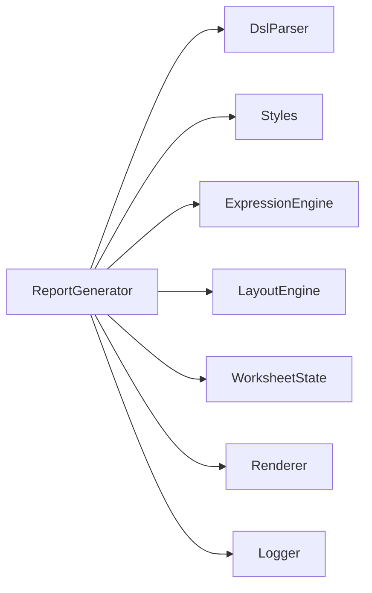
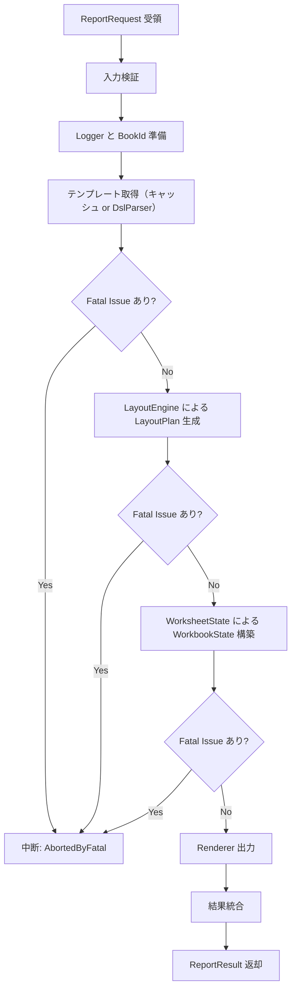
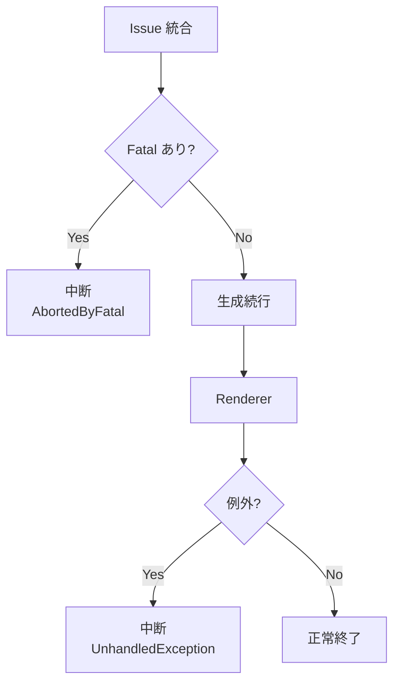

# ReportGenerator 詳細設計書 v1  
---
## 1. 概要・位置づけ

本章では **ReportGenerator モジュール** の役割、全体アーキテクチャにおける位置づけ、外部との境界、ライフサイクル、設計上の基本方針を定義する。

## 1.1 モジュール名 / アセンブリ

| 項目 | 内容 |
|||
| モジュール名 | `ReportGenerator` |
| 想定アセンブリ | `ExcelReport.Core` |
| 公開クラス | `ReportGenerator`（IReportGenerator 実装） |

ReportGenerator は Optimizer Excel Report Library の **トップレベル・ファサード** として機能し、  
以下のモジュールを統合してレポート生成パイプラインを構築する。

- DslParser  
- ExpressionEngine  
- Styles  
- LayoutEngine  
- WorksheetState  
- Renderer  
- Logger  

これらの下位モジュールは **ReportGenerator からのみ直接呼び出される**。

## 1.2 役割（高粒度）

ReportGenerator の主な役割は以下である。

1. テンプレート指定の解決（ファイルパス / Stream / XML / AST）  
2. DSL パースおよび検証の実行（DslParser 呼び出し）  
3. Global.root を設定し ExpressionEngine 利用の準備  
4. LayoutEngine によるレイアウト計画の生成  
5. WorksheetState による状態構築  
6. Renderer による `.xlsx` 出力  
7. 全 Issue の集約と中断条件の制御  
8. ログ・監査（Logger）との連携  
9. テンプレート AST キャッシュの管理  

ReportGenerator 自体は Excel の描画や式評価など個別処理を行わず、  
**下位モジュール間のスケジューラ兼オーケストレータ**として振る舞う。

## 1.3 外部インターフェース（呼び出し元との境界）

### 1.3.1 入力（呼び出し元 → ReportGenerator）

| 入力項目 | 説明 |
|---|---|
| TemplateSource | レポートテンプレート（XML/AST/Stream） |
| RootData | ExpressionEngine の `Global.root` として利用される |
| RendererOptions | 出力パス / Stream / BookId など Renderer 向け |
| Logger（任意） | 外部提供の IReportLogger（未指定なら内部生成） |
| BookId（任意） | 監査用 ID。未指定なら自動生成 |

入力は **ReportRequest** として統一モデルに集約する。  

### 1.3.2 出力（ReportGenerator → 呼び出し元）

| 出力 | 説明 |
|---|---|
| ReportResult | Issue 一覧、RenderResult、Elapsed、Fatal 状態、例外などを含む |

## 1.4 下位モジュールとの境界

ReportGenerator は **個々の責務に介入しない**  
（例：セル描画の仕様は Renderer、式評価の仕様は ExpressionEngine）。

| モジュール | ReportGenerator から見た役割 |
|---|---|
| DslParser | AST を返す・DSL Issues を返す |
| ExpressionEngine | LayoutEngine 内で使用する準備を行う |
| Styles | グローバルスタイル辞書の読み込み・警告生成 |
| LayoutEngine | AST + root → LayoutPlan |
| WorksheetState | LayoutPlan → WorkbookState |
| Renderer | WorkbookState → XLSX 出力 |
| Logger | 進捗・監査ログ収集 |

各モジュールの詳細責務は対応する詳細設計書に委ねる。

## 1.5 ライフサイクルとスレッドモデル

ReportGenerator は **ステートレス**な設計とする（キャッシュを除く）。  
以下の性質を持つ。

- 複数スレッドから同時に呼び出してもよい  
- TemplateCache は ConcurrentDictionary によりスレッドセーフ  
- 下位モジュールもスレッドセーフである前提  

呼び出し元は複数のレポート生成を並列実行できる。

## 1.6 キャッシュ戦略（AST）

テンプレートは更新頻度が低いため、  
DSL パース結果である AST をキャッシュする。

キャッシュキーは TemplateSource.CacheKey による。

用途  
- 同一テンプレートの高速再実行  
- サーバー環境でのロード削減  

## 1.7 想定されるユースケース

1. テンプレートファイルを指定してレポートを生成  
2. メモリ中の XML テキストからテンプレートを生成  
3. すでに AST が構築済みの場合、PreParsedAst を使って高速生成  
4. Web API などの高頻度・並列実行環境でテンプレートキャッシュを多用  
5. Logger を外部 DI で注入し、監査ログを DB に保存する構成  

## 1.8 設計上の前提条件

- 全モジュールは Issue モデルを共有している  
- Fatal Issue が出たら ReportGenerator は後続処理を呼び出さない  
- LayoutEngine / WorksheetState / Renderer は null 非許容  
- 入力検証は ReportGenerator 側で統一的に行う  
- レポート生成時間は必ず計測して返す  
- Logger は任意注入だが、未指定でも常に動作可能でなければならない  

---

## 2. 責務・非責務

本章では ReportGenerator モジュールが担うべき責務と、  
意図的に担わない（下位モジュールへ委譲する）非責務を明確にする。

## 2.1 責務

ReportGenerator が担う責務は以下のとおりである。  
いずれも「レポート生成パイプラインの統括者」としての責務に分類される。

### 2.1.1 公開 API の提供
- `GenerateAsync` を通じ、レポート生成の統一エントリポイントを提供する。  
- 呼び出し元はこの API 以外に下位モジュールを直接触る必要がない。

### 2.1.2 入力の前提検証
ReportRequest を受け取った際に、以下を確認する。
- TemplateSource が null ではない  
- RootData が null ではない  
- RendererOptions の必須項目が有効  
- TemplateSource が指すファイル/Stream が読み取り可能  

これにより、下位モジュールに不正データが渡らないようにする。

### 2.1.3 テンプレート読込と AST キャッシュ管理
- TemplateSource から XML を読み込み、DslParser で AST に変換する。  
- 同じテンプレートを再利用する場合、パース済み AST をキャッシュする。  
- キャッシュキーは TemplateSource.CacheKey により決定する。

### 2.1.4 パイプラインの統合・呼び出し順制御
以下のモジュールを正しい順序で連携させる。
1. DslParser  
2. Styles（テンプレート内スタイルの収集・検証）  
3. ExpressionEngine（root 設定と評価準備）  
4. LayoutEngine  
5. WorksheetState  
6. Renderer  

ReportGenerator 自体は処理ロジックを持たず、  
各モジュールを「どの順番で・どのデータを渡して呼ぶか」を確実に制御する。

### 2.1.5 Issue 統合・ Fatal 判定
- 各モジュールの Issue を収集する。  
- Fatal が存在する場合、後続処理を停止する。  
- 最終的な Issue セットを ReportResult にまとめる。

### 2.1.6 監査・ログの管理（Logger 連携）
- BookId を生成または引き継ぐ。  
- 各モジュールで発生した Issue や進捗ログを Logger に転送する。  
- 監査ログ（AuditLog）は最終的に Renderer に渡され、Excel 内の `_Audit` シートへ出力される。

### 2.1.7 例外ハンドリングと中断制御
- 下位モジュールから予期しない例外が出た場合、  
  ReportResult.UnhandledException に格納し、安全にパイプラインを停止する。  
- CancellationToken を適切に伝播し、迅速にキャンセルできるようにする。

### 2.1.8 実行時間の計測
- DslParser / LayoutEngine / WorksheetState / Renderer / 全体 の所要時間を計測し、  
  Logger や最終結果に反映する。


## 2.2 非責務

以下は **ReportGenerator が意図的に担当しない領域**であり、  
各モジュールに専任させることで責務を分離する。

### 2.2.1 DSL 構文解析および詳細検証
- タグ構造の検証  
- XSD バリデーション  
- repeat の構造ルール  
- anchor/grid/cell の構文定義  
これらは DslParser の責務。

### 2.2.2 C# 式の評価ロジック
- Expression のコンパイル  
- Global オブジェクトの管理  
- 関数・演算子の評価  
これは ExpressionEngine の責務。

### 2.2.3 スタイル適用ルールの詳細
- scope（cell/grid/both）の判定  
- スタイル辞書の構築  
- スタイル警告の生成  
Styles モジュールが担う。

### 2.2.4 レイアウト計画の生成
- 行列の計算  
- repeat の展開  
- anchor の相対位置計算  
LayoutEngine が担当する。

### 2.2.5 WorksheetState の検証と状態構築
- 占有マップ  
- 結合セル整合性  
- 競合検出（勝ち/負けルールなど）  
WorksheetState モジュールに委ねる。

### 2.2.6 Excel 出力の物理実装
- ClosedXML 等を利用したセル書き込み  
- スタイル付与  
- 行高・列幅などの最終出力  
Renderer の責務。

### 2.2.7 ログシートの書式・構造
- `_Audit` シートの構造定義  
- Issue の書き込み形式  
Logger + Renderer で処理する。

### 2.2.8 進捗ステップ数の内部計算
- Sheet / Region / CellBatch 分割の詳細ルール  
- Renderer 側で保持する内部カウンタ  
これらは Logger と Renderer の仕様に従う。

---

## 3. 公開 API

本章では、ReportGenerator が提供する **外部公開 API** と、それを構成する  
主要データモデル（TemplateSource / ReportRequest / ReportResult / IReportGenerator）  
について詳細に定義する。

## 3.1 TemplateSource

ReportGenerator が受け取るテンプレート情報の統一モデル。  
テンプレートは以下のいずれかの形式で指定可能とする。

### 3.1.1 列挙型 TemplateSourceKind
```csharp
public enum TemplateSourceKind
{
    FilePath,
    XmlText,
    Stream,
    PreParsedAst
}
```

### 3.1.2 TemplateSource モデル
```csharp
public sealed class TemplateSource
{
    public TemplateSourceKind Kind { get; }
    public string? Path { get; }
    public string? XmlText { get; }
    public Stream? Stream { get; }
    public WorkbookAst? PreParsedAst { get; }

    public string? CacheKey { get; }
}
```

### 3.1.3 仕様詳細
- **FilePath**  
  - XML テンプレートファイルをそのまま指定。  
  - CacheKey が未指定の場合は絶対パスをデフォルトとする。

- **XmlText**  
  - 文字列として XML 全文を受け取る。  
  - CacheKey が無い場合、キャッシュは無効（再パース）。

- **Stream**  
  - テンプレートを含む読み取り可能な Stream。  
  - 読み取り後に内部で文字列化し、以降は Stream を保持しない。

- **PreParsedAst**  
  - すでに DslParser により解析済みの AST を直接渡す。  
  - DslParser のスキップが可能。

- **CacheKey**  
  - AST を再利用させるためのキー。  
  - テンプレート更新頻度が低い前提で、性能最適化に有効。

## 3.2 ReportRequest

レポート生成に必要なすべての入力を保持する。

```csharp
public sealed class ReportRequest
{
    public TemplateSource Template { get; init; } = default!;
    public object RootData { get; init; } = default!;
    public RendererOptions RendererOptions { get; init; } = new();
    public IReportLogger? Logger { get; init; }
    public string? BookId { get; init; }
    public bool UseTemplateCache { get; init; } = true;
}
```

### 3.2.1 各要素の説明
- **Template**  
  必須。レポートテンプレートのデータを指す。

- **RootData**  
  ExpressionEngine の `Global.root` として利用される。  
  DSL 内の式評価におけるデータソース。

- **RendererOptions**  
  Renderer に渡す出力パス、Stream、BookId などの出力設定。

- **Logger（任意）**  
  外部提供の IReportLogger を挿入可能。  
  未指定の場合は内部既定 Logger が生成される。

- **BookId（任意）**  
  ログ・監査用の識別子。未指定なら GUID 生成。

- **UseTemplateCache**  
  AST キャッシュを利用するかどうかの制御。

## 3.3 ReportResult

最終結果と実行中に発生した情報を統合したモデル。

```csharp
public sealed class ReportResult
{
    public IReadOnlyList<Issue> Issues { get; init; } = Array.Empty<Issue>();
    public RenderResult RenderResult { get; init; } = new();
    public TimeSpan Elapsed { get; init; }
    public bool AbortedByFatal { get; init; }
    public Exception? UnhandledException { get; init; }
}
```

### 3.3.1 要素詳細
- **Issues**  
  DslParser, Styles, LayoutEngine, WorksheetState, Renderer が発生させたすべての Issue を統合。

- **RenderResult**  
  Renderer による最終出力情報（ファイル保存の成功 / 例外 / Canceled など）。

- **Elapsed**  
  ReportGenerator 全体の実行時間。  
  性能監視に利用。

- **AbortedByFatal**  
  Fatal Issue によりパイプラインが強制停止したかを示す。

- **UnhandledException**  
  下位モジュールから予期せず伝播した例外を格納する。

## 3.4 IReportGenerator

ReportGenerator の外部公開インターフェース。

```csharp
public interface IReportGenerator
{
    Task<ReportResult> GenerateAsync(
        ReportRequest request,
        CancellationToken cancellationToken = default);
}
```

### 3.4.1 契約仕様
- request.Template と request.RootData は null ではならない。  
- CancellationToken のキャンセル要求は可能な限り伝播させる。  
- Fatal Issue 検出時は後続処理を呼ばずに即時終了する。  
- return 値の ReportResult は常に null ではない。

---

## 4. 依存関係とデータモデル

本章では ReportGenerator が直接依存するモジュール、および  
内部で保持・管理するデータモデル（特に AST キャッシュ）について定義する。

## 4.1 直接依存モジュール

ReportGenerator はレポート生成パイプラインの統括者として、  
以下のモジュールに **直接** 依存する。

依存の形態はすべて **インターフェース越し（DI 注入）** とする。

| モジュール | 依存理由（ReportGenerator から見た役割） |
|-----------|--------------------------------------------|
| IDslParser | テンプレート XML を AST (WorkbookAst) に変換 |
| IExpressionEvaluator / ExpressionEngine | root データの設定と式評価準備 |
| IStyleResolver / Styles | テンプレート内 style 要素の辞書化と scope 警告検知 |
| ILayoutEngine | AST + root を元に LayoutPlan を生成 |
| IWorksheetStateBuilder | LayoutPlan から WorkbookState を構築 |
| IRenderer | WorkbookState から xlsx を物理出力 |
| IReportLogger | 進捗・監査ログの記録 |

### 4.1.1 依存の設計方針
- ReportGenerator は **自身でロジックを持たず**、すべての解析・評価・描画は下位モジュールへ委譲する。  
- ReportGenerator はパイプライン統制（順序・中断条件・組み合わせ）のみを担う。  
- 下位モジュールの入出力モデル（AST, LayoutPlan, WorksheetState, RenderResult）を橋渡しする。

### 4.1.2 DI 構成（例）
```csharp
public ReportGenerator(
    IDslParser parser,
    ILayoutEngine layout,
    IWorksheetStateBuilder wsBuilder,
    IRenderer renderer,
    IReportLoggerFactory loggerFactory,
    IExpressionEvaluator evaluator,
    IStyleResolver styleResolver)
{
    ...
}
```

すべてが外部注入されるため、  
単体テスト時は各モジュールのモックを差し替え可能。

## 4.2 内部データモデル

ReportGenerator 内で保持する唯一の状態は **テンプレート AST キャッシュ** である。

その他の情報（root, LayoutPlan, WorkbookState 等）は一時データとし、  
インスタンス内部に保持しない。

## 4.3 AST キャッシュモデル

DSL のパースは比較的高コストであるため、  
ReportGenerator は WorkbookAst をキャッシュとして保持する。

### 4.3.1 TemplateCacheEntry

```csharp
private sealed class TemplateCacheEntry
{
    public WorkbookAst Ast { get; }
    public DateTimeOffset CreatedAt { get; }

    public TemplateCacheEntry(WorkbookAst ast, DateTimeOffset createdAt)
    {
        Ast = ast;
        CreatedAt = createdAt;
    }
}
```

### 4.3.2 キャッシュコンテナ

```csharp
private readonly ConcurrentDictionary<string, TemplateCacheEntry> _templateCache;
```

### 4.3.3 キャッシュキー

キャッシュキーは TemplateSource.CacheKey を使用する。  
未指定の場合の既定ルールは以下。

| TemplateSource.Kind | cacheKey 既定値 |
|---------------------|------------------|
| FilePath | 絶対パス |
| XmlText | なし（キャッシュしない） |
| Stream | なし（キャッシュしない） |
| PreParsedAst | 呼び出し側の明示指定のみ |

### 4.3.4 キャッシュ利用規則
- UseTemplateCache = true の場合のみキャッシュを利用。  
- キャッシュが存在すればパースは行わず AST を即返す。  
- AST の整合性検証（Fatal issue）は初回パース時にのみ実施される。  
- キャッシュ失効タイミングは ReportGenerator 側では制御しない（外部ポリシーに委ねる）。

## 4.4 下位モジュール間データフロー

ReportGenerator が取り扱うデータフローは以下のように定義する。

```
TemplateSource
    ↓ (XML読込 / キャッシュ参照)
WorkbookAst (from DslParser)
    ↓
LayoutPlan (from LayoutEngine)
    ↓
WorkbookState (from WorksheetStateBuilder)
    ↓
RenderResult (from Renderer)
```

ReportGenerator 自体は  
**これらモデルを加工せず、受け渡しの整合性のみ保証する**。

## 4.5 依存関係図（高粒度）



---

## 5. 処理フロー

本章では ReportGenerator が実行する **レポート生成パイプライン** の  
逐次フロー、処理順序、各ステップで使用されるモジュール、  
および中断条件（Fatal / キャンセル）を詳細に定義する。

## 5.1 高レベル処理フロー（全体像）

ReportGenerator の処理は **直列実行**であり、  
次の 8 ステップから構成される。

1. 入力検証  
2. Logger / BookId 準備  
3. テンプレート取得（キャッシュ or 読込 → DslParser）  
4. DSL Issue の Fatal 判定  
5. LayoutEngine による LayoutPlan 生成  
6. WorksheetState の構築  
7. Renderer の実行  
8. Issues / RenderResult の統合と返却  

各ステップは次のステップに必要なデータを確実に準備する責務をもつ。

## 5.2 ステップ詳細

### 5.2.1 Step 1: 入力検証
ReportRequest の必須項目を検証する。

- request.Template が null でない  
- request.RootData が null でない  
- RendererOptions が出力先として妥当  
- Stream やファイルパスが読める状態である

不正な場合は例外を投げ、パイプラインは開始しない。

### 5.2.2 Step 2: Logger / BookId 準備
- Logger が未指定の場合は内部既定 Logger を生成  
- BookId が未指定の場合は GUID を生成  
- Logger.Context に BookId を設定（監査ログ用）

### 5.2.3 Step 3: テンプレート取得
以下の順にテンプレートを取得する。

1. PreParsedAst（最優先）  
2. テンプレートキャッシュ（UseTemplateCache = true の場合）  
3. XML 読込  
4. DslParser によるパース → WorkbookAst 生成  

パース結果には Issue セットが付随するため、  
ReportGenerator はそれを収集して保持する。

### 5.2.4 Step 4: DSL Fatal 判定
収集された Issue を評価し、

- Fatal が含まれる → 直ちにパイプライン停止  
- Fatal が無い → 次へ進む

Fatal が検出された場合、  
LayoutEngine / WorksheetState / Renderer は呼び出されない。

### 5.2.5 Step 5: LayoutEngine による LayoutPlan 生成
LayoutEngine は次を行う。

- AST の走査  
- repeat の展開  
- anchor / pos / grid の相対位置計算  
- 行列位置の割り付け  
- レイアウトエラー（Fatal / Error / Warning）を Issue として返す  

ReportGenerator は LayoutPlan と Issues を受け取り、  
Fatal があれば停止する。

### 5.2.6 Step 6: WorksheetState の構築
WorksheetStateBuilder は次を行う。

- セル占有マップ構築  
- 結合セルの整合性検証  
- 最終的な WorkbookState の構築  
- 競合（後勝ち・無効エリア）などの Issue 生成  

ReportGenerator は Issue を統合し、Fatal であれば停止する。

### 5.2.7 Step 7: Renderer による最終出力
Renderer は以下を実行する。

- WorkbookState を ClosedXML（等）へマッピング  
- セル値、スタイル、行高・列幅の設定  
- AuditLog の書き込み  
- ファイル保存 or Stream 出力  
- RenderResult 生成（Error / Canceled 等の状態を含む）

ReportGenerator は RenderResult をそのまま受け取る。

### 5.2.8 Step 8: 結果統合と返却
最終的に以下を統合して ReportResult を返す。

- 全 Issue
- RenderResult
- 全体実行時間
- AbortedByFatal の有無
- UnhandledException（例外が発生した場合）

## 5.3 Mermaid フロー図



## 5.4 擬似コード（GenerateAsync の基準実装）

```csharp
public async Task<ReportResult> GenerateAsync(
    ReportRequest request,
    CancellationToken cancellationToken = default)
{
    var sw = Stopwatch.StartNew();
    var issues = new List<Issue>();
    Exception? fatalEx = null;
    bool aborted = false;

    ValidateRequest(request);

    var bookId = request.BookId ?? Guid.NewGuid().ToString("N");
    var logger = request.Logger ?? new ReportLogger();

    WorkbookAst ast;
    try
    {
        ast = await GetOrParseTemplateAsync(request.Template, logger, bookId, issues, cancellationToken);
    }
    catch (Exception ex)
    {
        fatalEx = ex;
        aborted = true;
        return new ReportResult
        {
            Issues = issues,
            RenderResult = new RenderResult { Error = ex },
            Elapsed = sw.Elapsed,
            AbortedByFatal = true,
            UnhandledException = ex
        };
    }

    if (issues.Any(i => i.Severity == IssueSeverity.Fatal))
        return Abort(sw, issues);

    var layout = _layoutEngine.Build(ast, request.RootData);
    issues.AddRange(layout.Issues);

    if (issues.Any(i => i.Severity == IssueSeverity.Fatal))
        return Abort(sw, issues);

    var workbook = _worksheetStateBuilder.Build(layout);
    issues.AddRange(workbook.Issues);

    if (issues.Any(i => i.Severity == IssueSeverity.Fatal))
        return Abort(sw, issues);

    var render = _renderer.Render(
        workbook,
        logger,
        _auditExporter,
        request.RendererOptions with { BookId = bookId },
        cancellationToken);

    sw.Stop();
    return new ReportResult
    {
        Issues = issues,
        RenderResult = render,
        Elapsed = sw.Elapsed,
        AbortedByFatal = false,
        UnhandledException = null
    };
}
```

---

## 6. エラーモデル

本章では ReportGenerator が扱う **エラーモデルと中断仕様** を  
Issue モデル・例外ハンドリング・キャンセル処理を中心に詳細化する。

## 6.1 Issue ベースのエラー処理

ReportGenerator の主要なエラー管理方式は **Issue モデルの統合管理**である。  
Issue は以下の Severity を持つ。

| Severity | 説明 | ReportGenerator の扱い |
|---------|------|--------------------------|
| Fatal | 続行不能 | 即時パイプライン停止 |
| Error | 部分的欠損 | 生成は続行、最終結果で通知 |
| Warning | 軽度の不整合 | 生成続行、ログ記録 |
| Info | 情報レベル | 生成続行 |

### 6.1.1 Issue の生成元
Issue は下位の各モジュールから発生する。

- DslParser  
- Styles  
- ExpressionEngine（評価エラー）  
- LayoutEngine  
- WorksheetState  
- Renderer  

ReportGenerator 自身は原則として独自 Issue を生成しない。

### 6.1.2 Fatal Issue の扱い
以下のステップで **Fatal を検出した時点で即中断**する。

1. DslParser（DSL 不正構造）  
2. LayoutEngine（repeat 不正、行列上限超過など）  
3. WorksheetState（結合セルの壊れなど）  

Fatal 発生時は後続モジュールは呼び出されず、  
ReportResult.AbortedByFatal = true が設定される。

### 6.1.3 Error / Warning / Info の統合
- ReportGenerator は **すべての Issue をリストに統合して返却**する。  
- Error であってもパイプラインは止めない（仕様に基づく）。  
- Warning / Info は Logger に記録される。

## 6.2 例外ベースのエラー処理

ReportGenerator は、下位モジュールが返す Issue とは別に、  
**予期せぬ例外（Exception）** に対するハンドリングを実施する。

### 6.2.1 例外の発生源
- テンプレートファイル I/O  
- Stream 読込  
- ExpressionEngine 内部例外（予期せぬ評価失敗）  
- Renderer の物理出力エラー  
- 依存コンポーネントの内部ロジック例外

### 6.2.2 例外処理方針
例外はキャッチされ、次のように扱われる。

1. `ReportResult.UnhandledException` に格納  
2. `RenderResult.Error` に設定（Renderer 例外の場合）  
3. パイプラインは即時停止  
4. AbortedByFatal = true として返却  

### 6.2.3 入力検証例外
入力が不正な場合（TemplateSource が null 等）は  
Issue ではなく **引数例外（ArgumentException）** をスローし、  
そもそもパイプラインは開始しない。

## 6.3 キャンセル制御（CancellationToken）

中断要求（Ctrl+C 等）が発生した場合の制御仕様を定める。

### 6.3.1 伝播設計
ReportGenerator は各主要ステップに入る前に  
`cancellationToken.ThrowIfCancellationRequested()` を呼び出す。

Renderer は CellBatch 単位（またはそれに準じた単位）で  
キャンセルチェックを実施する。

### 6.3.2 キャンセル時の結果
キャンセルが発生した場合は以下となる。

| 項目 | 内容 |
|------|------|
| RenderResult.Canceled | true |
| AbortedByFatal | false |
| UnhandledException | null |
| Issues | 途中までの Issue を返却 |

### 6.3.3 部分生成物の扱い
Renderer がファイル書き込み途中でキャンセルされた場合でも、  
原則として不完全ファイルは残さないようにする。

## 6.4 モジュール別に想定されるエラー例

### 6.4.1 DslParser 発生例
- XML 構文エラー  
- XSD 違反  
- repeat エレメント不正  
→ Fatal

### 6.4.2 LayoutEngine 発生例
- 行列上限超過  
- 不正な anchor 計算  
- 位置衝突で復旧不能  
→ Fatal

### 6.4.3 WorksheetState 発生例
- 結合セルが不整合  
- セル競合（後勝ちロジック適用）  
→ Error / Fatal（ケースにより）

### 6.4.4 Renderer 発生例
- ファイル保存エラー  
- Stream 書き込み失敗  
- 監査シート生成時の書式例外  
→ Error / Fatal

## 6.5 エラー処理フロー（Mermaid）



---

## 7. 性能

本章では ReportGenerator の性能設計方針、  
内部キャッシュの活用、下位モジュール依存における性能境界、  
および計測ポイントについて定義する。

## 7.1 全体方針

ReportGenerator 自体は **重い計算処理を持たず**、  
性能ボトルネックは主に以下の下位モジュールで発生する。

- DslParser（XML パース + 構文検証）
- LayoutEngine（repeat 展開・行列計算）
- WorksheetState（占有マップ・結合セル整合性）
- Renderer（Excel 物理出力）

ReportGenerator では以下の方針で性能最適化を行う。

- AST キャッシュによる DSL パース時間の削減  
- 計測情報の Logger への送信  
- 不要なデータ保持を避け、最小限のオブジェクトのみ保持  
- 直列処理で、競合やロックを最小化する

## 7.2 AST キャッシュによる最適化

テンプレートのパースは高コストであり、  
ReportGenerator が保持する AST キャッシュは性能最適化の中心要素となる。

### 7.2.1 キャッシュの適用効果
- 同一テンプレートを複数回使用するシナリオで **パース時間を 0 に近づける**  
- LayoutEngine や WorksheetState と異なり、DSL パース結果は不変で再利用可能  
- Web API 環境など高頻度リクエストに有効

### 7.2.2 キャッシュ利用時の注意点
- TemplateSourceKind.XmlText / Stream ではデフォルトではキャッシュされない  
- テンプレート更新を自動検知する機能は提供しない（外部管理）  
- キャッシュサイズ管理は ReportGenerator の責務外とする

## 7.3 スレッドセーフ設計

ReportGenerator は次の思想でスレッドセーフを達成する。

- インスタンス内部の唯一の共有資源は ConcurrentDictionary（AST キャッシュ）  
- 下位モジュールの実装もスレッドセーフである前提  
- ReportRequest は Immutable な値オブジェクトとして扱う  
- ワークフローはステートレスに実行される

これにより、複数のレポート生成を同時並行で実行可能。

## 7.4 計測ポイント（Performance Logging）

ReportGenerator は Logger に対して、  
各主要処理の実行時間を記録できるよう設計する。

### 7.4.1 計測対象
次の区間を個別に計測する。

- DSL パース時間（テンプレート取得処理）  
- LayoutEngine 実行時間  
- WorksheetStateBuilder 実行時間  
- Renderer 実行時間  
- ReportGenerator 全体の総所要時間  

### 7.4.2 計測結果の扱い
- Logger は `_Audit` シートに Performance レコードを追加する  
- 計測単位はミリ秒精度（Stopwatch）  
- ReportResult.Elapsed は総所要時間を保持

## 7.5 メモリ利用方針

ReportGenerator のメモリ負荷は最小限とする。

- AST, LayoutPlan, WorkbookState はステップ間のみ保持  
- 不要となったオブジェクトは即時スコープ外にする  
- 巨大な中間データ（行列展開後の構造など）は LayoutEngine / WorksheetState に委譲  

### 7.5.1 大規模テンプレート時の注意
- repeat により行数が大きく増えるケースでは LayoutEngine が支配的になる  
- ReportGenerator はメモリ圧迫の原因とならないよう、データコピーを避ける

## 7.6 並列化方針

ReportGenerator は **内部で並列化しない**。

### 理由
- 模板処理・レイアウト計算・Excel 出力はデータ依存性が強い  
- 下位モジュール内での並列化は副作用を引き起こす可能性がある  
- 並列化は呼び出し側が「複数レポートを並列生成する」形で実現すべき

## 7.7 大量生成時の運用指針

大量レポート生成（例: 1,000 件以上）を行う際の推奨方針。

### 7.7.1 キャッシュ前提運用
- テンプレートキャッシュの有効利用が必須  
- XmlText / Stream 指定の場合は CacheKey を指定してキャッシュ活用

### 7.7.2 インスタンス再利用
- ReportGenerator インスタンスは再利用可能  
- DI コンテナで Singleton 登録しても問題ない（ステートレスのため）

### 7.7.3 Logger の負荷
- 大量ログは監査シート生成が重くなるため、  
  Logger の出力を抑制する構成も可能（ログレベル設定など）

## 7.8 ハイパフォーマンス目標値（参考）

一般的なケースにおける性能目標（参考値）。

| 区間 | 目標値（目安） |
|------|----------------|
| DSL パース | 1–20 ms |
| LayoutEngine | データ量に比例（小～中規模 5–30 ms） |
| WorksheetState | 5–20 ms |
| Renderer | 10–50 ms（出力先による） |
| 全体 | 30–150 ms |

---

## 8. テスト観点

本章では ReportGenerator の品質保証のために必要となる  
**テスト観点、テストケース分類、下位モジュールとの連携検証**  
について体系的に定義する。

ReportGenerator は「オーケストレーション担当」であるため、  
単体テストは主に **制御フロー・中断条件・例外処理・キャッシュ挙動** に重点を置く。

## 8.1 正常系テスト

### 8.1.1 最小テンプレートでの生成
目的: ReportGenerator が基本パイプラインを問題なく通過することを確認。

条件:
- 1 シート / 数セル程度の単純テンプレート  
- RootData は単純な匿名オブジェクト  
- Issues は 0 件

期待結果:
- ReportResult.AbortedByFatal = false  
- RenderResult.Error = null  
- 出力ファイルが存在する

### 8.1.2 BasicDesign フルフローテンプレート
目的: 全機能が連携して動作するかの確認。

条件:
- styles / components / repeat / grid / anchor  
- 複数シート・複数レイヤを含むテンプレート

期待結果:
- 下位モジュールが返す Issue が正しく統合されている  
- 出力が Excel の基本要件を満たす

### 8.1.3 キャッシュ利用の確認
目的: AST キャッシュが有効に働くことを確認。

条件:
- 同一 TemplateSource の連続実行  
- UseTemplateCache = true

期待結果:
- DslParser が 1 回のみ実行される  
- 2 回目以降の Start〜Finish 時間が短縮される

## 8.2 異常系テスト（Fatal 想定）

### 8.2.1 DSL 構文エラー
条件:
- 不正な XML / XSD 違反

期待結果:
- DslParser が Fatal Issue を返す  
- LayoutEngine 以降が呼ばれない  
- ReportResult.AbortedByFatal = true

### 8.2.2 repeat 不正構造
条件:
- repeat 子要素が複数  
- 無効な anchor と組み合わせて不正

期待結果:
- LayoutEngine にて Fatal  
- WorksheetState/Renderer は呼ばれない

### 8.2.3 行・列の上限超過
期待結果:
- LayoutEngine または WorksheetState で Fatal  
- パイプラインは停止

### 8.2.4 テンプレートファイルが存在しない
期待結果:
- テンプレート読込時例外  
- ReportResult.UnhandledException に格納

## 8.3 Warning / Error 系テスト

### 8.3.1 スタイル scope の違反
条件:
- scope="grid" のスタイルをセルで使用する等

期待結果:
- Styles モジュールが Warning Issue を返す  
- レポートは正常生成される

### 8.3.2 結合セルの不整合
条件:
- WorksheetState でセル占有マップが破綻するケース

期待結果:
- Error Issue が発生  
- ファイルは生成されるが部分欠損がある

## 8.4 キャンセルテスト（CancellationToken）

### 8.4.1 LayoutEngine 中でキャンセル
期待結果:
- TaskCanceledException ではなく  
  RenderResult.Canceled = true で返却  
- AbortedByFatal = false

### 8.4.2 Renderer 中でキャンセル
期待結果:
- 部分的なファイル書き込みが残らない  
- RenderResult.Canceled = true

## 8.5 例外伝播テスト

### 8.5.1 Renderer 内部例外
条件:
- ファイル保存失敗など

期待結果:
- RenderResult.Error に例外情報  
- ReportResult.UnhandledException にも保持  
- AbortedByFatal = true

### 8.5.2 ExpressionEngine 予期せぬ例外
期待結果:
- ReportGenerator が例外を捕捉  
- Fatal 扱いで中断

## 8.6 モジュール連携テスト（モック利用）

ReportGenerator は DI による外部依存が大きいため、  
各モジュールをモック化して **制御フローが正しいか** を確認する。

### 8.6.1 LayoutEngine をモック
- Build() で任意 Issue セットを返す  
- Fatal / Warning の切替でパイプライン挙動を検証

### 8.6.2 WorksheetStateBuilder をモック
- Fatal が返る場合、Renderer が呼ばれないことを確認

### 8.6.3 Renderer をモック
- 出力の正常系 / Error / Canceled を再現可能  
- ReportResult.RenderResult への反映を検証

## 8.7 大量データ / ストレステスト

### 8.7.1 大量 repeat 展開
目的:
- LayoutEngine の負荷下での安定性確認

期待:
- Fatal が発生しない限り生成を継続  
- 性能の劣化を測定可能

### 8.7.2 多数シート生成
目的:
- WorksheetState → Renderer が大量リソース下で正常動作するか

### 8.7.3 大量レポート連続生成
目的:
- AST キャッシュの安定性  
- メモリリーク検証  
- Logger の負荷検証

## 8.8 回帰テスト方針

ReportGenerator の変更時は以下を最低限実施する。

1. 正常系フルフロー  
2. Fatal 中断シナリオ  
3. キャッシュ利用可否の切替  
4. 例外発生ケース  
5. LayoutEngine / WorksheetState / Renderer を含む統合テスト  