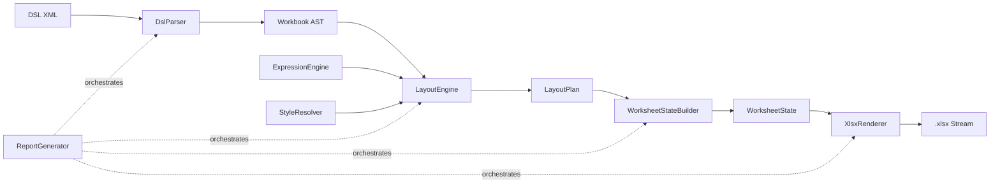

# ExcelReportLib

[](https://github.com/ssaattww/ExcelReport/actions/workflows/pr-xunit-tests.yml)
[](https://github.com/ssaattww/ExcelReport/actions/workflows/publish-nuget.yml)
[](https://www.nuget.org/packages/ExcelReportLib/)
[](https://www.nuget.org/packages/ExcelReportLib/)
[](LICENSE)

カスタム XML DSL（`urn:excelreport:v2`）と実行時データから `.xlsx` ワークブックを生成する .NET 8 ライブラリです。

## 概要

`ExcelReportLib` は、宣言的なレポート定義を段階的なパイプラインで Excel ファイルへ変換します。

1. XML DSL を AST ノードへパース
2. 式評価およびスタイル/コンポーネント参照の解決
3. レイアウト要素（`grid` / `repeat` / `use` / `cell`）を実座標へ展開
4. ワークシート状態（セル、結合範囲、名前付きエリア、シートオプション、チャート状態）を構築
5. OpenXML ワークブックをレンダリング（必要に応じて `_Issues` / `_Audit` シートを追加）

主なオーケストレーションは `ReportGenerator` が担当します。

## 主な機能

- XML DSL ベースの帳票定義（`urn:excelreport:v2`）
- 式評価（`@(root...)`、`@(data...)`、`@(vars...)`）
- `<component>` と `<use>` による再利用可能コンポーネント
- `<componentImport>` による外部コンポーネント取り込み
- `<repeat>` によるコレクション展開
- import/合成/罫線/数値書式に対応したスタイル解決
- 名前付きエリアと数式プレースホルダー解決（例: `#{Detail.Value:Detail.ValueEnd}`）
- 繰り返し行の `formulaRef` 集約解決（`formulaRef` / `formulaRefScope`）
- シートオプション（ウィンドウ枠固定、グループ化、オートフィルター、条件付き書式）
- チャート描画（`barStacked` / `line`、`chartPalette`、`color`、`colorKey`、`colorBy`）
- 非同期生成 API（`AsyncReportGenerator`）によるジョブ起動/進捗ポーリング/キャンセル
- 診断情報と監査メタデータを含む OpenXML 出力

## アーキテクチャ



主要モジュール:

- `DSL/DslParser`: パース、任意の XSD 検証、Issue 収集
- `ExpressionEngine`: 式の解析/評価（キャッシュ対応）
- `Styles/StyleResolver`: スタイル索引化と優先順位に基づく合成
- `LayoutEngine`: レイアウト展開、repeat/use 展開、条件描画
- `WorksheetState/WorksheetStateBuilder`: 結合/境界検証、formula/chart 参照解決
- `Renderer/XlsxRenderer`: OpenXML の出力生成
- `ReportGenerator`: エンドツーエンド実行とフェーズログ
- `AsyncReportGenerator`: 非ブロッキング実行、進捗/結果取得、キャンセル、後片付け

## インストール

### 前提条件

- .NET SDK 8.0 以上

### NuGet パッケージを追加

```bash
dotnet add package ExcelReportLib
```

### ソースからプロジェクト参照として追加

```bash
dotnet add <your-app>.csproj reference ExcelReport/ExcelReportLib/ExcelReportLib.csproj
```

### ビルド

```bash
dotnet build ExcelReport.sln
```

## クイックスタート

### 1) DSL を定義

```xml
<workbook xmlns="urn:excelreport:v2">
  <styles>
    <style name="HeaderCell" scope="cell">
      <font bold="true"/>
      <fill color="#F2F2F2"/>
      <border mode="cell" bottom="thin" color="#000000"/>
    </style>
  </styles>

  <sheet name="Summary">
    <cell r="1" c="1" value="@(root.Title)" />

    <grid rows="1" cols="2">
      <cell r="1" c="1" value="Item" />
      <cell r="1" c="2" value="Value" />
    </grid>

    <repeat r="3" c="1" direction="down" from="@(root.Items)" var="it">
      <grid rows="1" cols="2">
        <cell r="1" c="1" value="@(it.Name)" />
        <cell r="1" c="2" value="@(it.Value)" />
      </grid>
    </repeat>
  </sheet>
</workbook>
```

### 2) ワークブックを生成

```csharp
using ExcelReportLib;

var dsl = File.ReadAllText("report.xml");
var data = new
{
    Title = "Sales Report",
    Items = new[]
    {
        new { Name = "A", Value = 100 },
        new { Name = "B", Value = 200 }
    }
};

var generator = new ReportGenerator();
var result = generator.Generate(dsl, data);

if (result.Succeeded)
{
    File.WriteAllBytes("report.xlsx", result.Output.ToArray());
}
else
{
    foreach (var issue in result.Issues)
    {
        Console.WriteLine($"[{issue.Severity}] {issue.Kind}: {issue.Message}");
    }
}
```

## チャート例（formulaRef 参照）

```xml
<workbook xmlns="urn:excelreport:v2">
  <chartPalette>
    <color key="Done" value="#4CAF50" />
    <color key="Doing" value="#FF9800" />
    <color key="Todo" value="#BDBDBD" />
  </chartPalette>

  <component name="TaskRow">
    <grid>
      <cell value="@(data.Name)" formulaRef="Task.Name" />
      <cell c="2" value="@(data.Workload)" formulaRef="Task.Workload" />
      <cell c="3" value="@(data.State)" formulaRef="Task.State" />
      <cell c="4" value="@(data.Blocked)" formulaRef="Task.Blocked" />
    </grid>
  </component>

  <sheet name="Summary">
    <repeat direction="down" from="@(root.Tasks)" var="it">
      <use component="TaskRow" with="@(it)" />
    </repeat>

    <chart type="barStacked" title="Progress" r="2" c="8" width="10" height="16" category="Task.Name">
      <series name="Workload" value="Task.Workload" colorBy="Task.State" />
      <series name="Blocked" value="Task.Blocked" color="#1E88E5" />
    </chart>
  </sheet>
</workbook>
```

## 非同期生成と進捗ポーリング

```csharp
using ExcelReportLib;

var asyncGenerator = new AsyncReportGenerator();
var jobId = asyncGenerator.StartGenerate(dsl, data);

while (true)
{
    if (!asyncGenerator.TryGetStatus(jobId, out var status))
    {
        throw new InvalidOperationException("Job not found.");
    }

    Console.WriteLine(
        $"state={status.State}, progress={status.ProgressPercent}% " +
        $"render={status.RenderingCompletedUnits}/{status.RenderingTotalUnits}, " +
        $"phase={status.CurrentPhase}, elapsed={status.ElapsedMilliseconds}ms");

    if (status.State is AsyncReportJobState.Succeeded or AsyncReportJobState.Failed or AsyncReportJobState.Canceled)
    {
        break;
    }

    await Task.Delay(200);
}

if (asyncGenerator.TryGetResult(jobId, out var asyncResult) && asyncResult.Succeeded)
{
    File.WriteAllBytes("report-async.xlsx", asyncResult.Output!.ToArray());
}

_ = asyncGenerator.Remove(jobId); // 完了後ジョブレコードを削除（任意）
```

## API リファレンス要約

### 主要 API

- `ReportGenerator`
  - `Generate(string dsl, object? data, ReportGeneratorOptions? options = null, CancellationToken cancellationToken = default)`
  - `GenerateFromFile(string dslFilePath, object? data, ReportGeneratorOptions? options = null, CancellationToken cancellationToken = default)`
- `AsyncReportGenerator`
  - `StartGenerate(string dsl, object? data, ReportGeneratorOptions? options = null)`
  - `StartGenerateFromFile(string dslFilePath, object? data, ReportGeneratorOptions? options = null)`
  - `TryGetStatus(string jobId, out AsyncReportJobStatus status)`
  - `TryGetResult(string jobId, out ReportGeneratorResult result)`
  - `Cancel(string jobId)`
  - `Remove(string jobId)`
- `ReportGeneratorOptions`
  - `EnableSchemaValidation`
  - `TreatExpressionSyntaxErrorAsFatal`
  - `Logger`
  - `RenderOptions`
- `ReportGeneratorResult`
  - `Output`, `Issues`, `LogEntries`, `Succeeded`, `AbortedByFatal`, `UnhandledException`
- `AsyncReportJobStatus`
  - `State`, `ProgressPercent`, `CurrentPhase`, `ElapsedMilliseconds`
  - `CurrentPhaseElapsedMilliseconds`, `PhaseElapsedMilliseconds`
  - `RenderingCompletedUnits`, `RenderingTotalUnits`, `RenderingProgressPercent`

### 高度な合成可能 API

- パース: `DslParser`, `DslParserOptions`, `DslParseResult`, `Issue`
- 式評価: `IExpressionEngine`, `ExpressionEngine`, `ExpressionContext`, `ExpressionResult`
- レイアウト: `ILayoutEngine`, `LayoutEngine`, `LayoutPlan`, `LayoutSheet`, `LayoutCell`, `LayoutChart`
- スタイル: `IStyleResolver`, `StyleResolver`, `StylePlan`, `ResolvedStyle`
- ワークシート状態: `IWorksheetStateBuilder`, `WorksheetStateBuilder`, `WorksheetState`, `CellState`, `ChartState`
- レンダリング: `IRenderer`, `XlsxRenderer`, `RenderOptions`, `RenderResult`, `RenderProgressInfo`
- ロギング: `IReportLogger`, `ReportLogger`, `LogEntry`, `LogLevel`, `ReportPhase`

## プロジェクト構成

```text
.
├── ExcelReport.sln
├── ExcelReport/
│   ├── ExcelReportLib/
│   │   ├── DSL/
│   │   ├── ExpressionEngine/
│   │   ├── LayoutEngine/
│   │   ├── Styles/
│   │   ├── WorksheetState/
│   │   ├── Renderer/
│   │   ├── ReportGenerator.cs
│   │   └── AsyncReportGenerator.cs
│   └── ExcelReportLib.Tests/
│       ├── DslParserTests.cs
│       ├── LayoutEngineTests.cs
│       ├── RendererTests.cs
│       ├── ReportGeneratorTests.cs
│       ├── AsyncReportGeneratorTests.cs
│       └── ...
└── reports/
```

## テスト

全テストを実行:

```bash
dotnet test ExcelReport.sln
```

ライブラリテストのみ実行:

```bash
dotnet test ExcelReport/ExcelReportLib.Tests/ExcelReportLib.Tests.csproj
```

カバレッジ収集付きで実行:

```bash
dotnet test ExcelReport/ExcelReportLib.Tests/ExcelReportLib.Tests.csproj --collect:"XPlat Code Coverage"
```

## ライセンス

本プロジェクトは MIT ライセンスの下で提供されます。詳細は [LICENSE](LICENSE) を参照してください。
