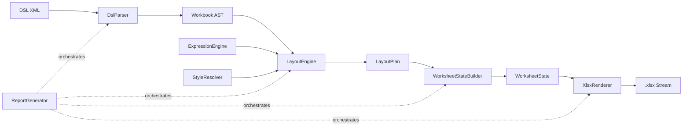

# ExcelReportLib

[](#)
[](#)
[](#)

A .NET 8 library for generating `.xlsx` workbooks from a custom XML DSL (`urn:excelreport:v1`) and runtime data.

## Overview

`ExcelReportLib` converts declarative report definitions into Excel files through a staged pipeline:

1. Parse XML DSL into AST nodes.
2. Evaluate expressions and resolve styles/components.
3. Expand layout primitives (`grid`, `repeat`, `use`, `cell`) into concrete coordinates.
4. Build worksheet state (cells, merges, named areas, sheet options).
5. Render OpenXML workbook streams, including `_Issues` and `_Audit` sheets when applicable.

Primary orchestration is handled by `ReportGenerator`.

## Features

- XML DSL-based report definitions (`urn:excelreport:v1`)
- Expression evaluation (`@(root...)`, `@(data...)`, `@(vars...)`)
- Reusable components via `<component>` and `<use>`
- External component import via `<componentImport>`
- Collection expansion via `<repeat>`
- Style system with imports, composition, borders, and number formats
- Named areas and formula placeholder resolution (e.g. `#{Detail.Value:Detail.ValueEnd}`)
- Worksheet options (freeze panes, grouping, auto filter)
- OpenXML rendering with diagnostics and generation audit metadata

## Architecture



Core modules:

- `DSL/DslParser`: parsing + optional XSD validation + issue collection
- `ExpressionEngine`: expression parsing/evaluation with cache support
- `Styles/StyleResolver`: style indexing and precedence composition
- `LayoutEngine`: layout expansion, repeat/use expansion, conditional rendering
- `WorksheetState/WorksheetStateBuilder`: merge/bounds validation and formula placeholder resolution
- `Renderer/XlsxRenderer`: OpenXML output generation
- `ReportGenerator`: end-to-end orchestration and phase logging

## Installation

### Prerequisites

- .NET SDK 8.0+

### Add as a project reference (from source)

```bash
dotnet add <your-app>.csproj reference ExcelReport/ExcelReportLib/ExcelReportLib.csproj
```

### Build

```bash
dotnet build ExcelReport.sln
```

## Quick Start

### 1) Define DSL

```xml
<workbook xmlns="urn:excelreport:v1">
  <styles>
    <style name="HeaderCell" scope="cell">
      <font bold="true"/>
      <fill color="#F2F2F2"/>
      <border mode="cell" bottom="thin" color="#000000"/>
    </style>
  </styles>

  <sheet name="Summary">
    <cell r="1" c="1" value="@(root.Title)" />

    <grid rows="1" cols="2">
      <cell r="1" c="1" value="Item" />
      <cell r="1" c="2" value="Value" />
    </grid>

    <repeat r="3" c="1" direction="down" from="@(root.Items)" var="it">
      <grid rows="1" cols="2">
        <cell r="1" c="1" value="@(it.Name)" />
        <cell r="1" c="2" value="@(it.Value)" />
      </grid>
    </repeat>
  </sheet>
</workbook>
```

### 2) Generate workbook

```csharp
using ExcelReportLib;

var dsl = File.ReadAllText("report.xml");
var data = new
{
    Title = "Sales Report",
    Items = new[]
    {
        new { Name = "A", Value = 100 },
        new { Name = "B", Value = 200 }
    }
};

var generator = new ReportGenerator();
var result = generator.Generate(dsl, data);

if (result.Succeeded)
{
    File.WriteAllBytes("report.xlsx", result.Output.ToArray());
}
else
{
    foreach (var issue in result.Issues)
    {
        Console.WriteLine($"[{issue.Severity}] {issue.Kind}: {issue.Message}");
    }
}
```

## API Reference Summary

### Primary API

- `ReportGenerator`
  - `Generate(string dsl, object? data, ReportGeneratorOptions? options = null, CancellationToken cancellationToken = default)`
  - `GenerateFromFile(string dslFilePath, object? data, ReportGeneratorOptions? options = null, CancellationToken cancellationToken = default)`
- `ReportGeneratorOptions`
  - `EnableSchemaValidation`
  - `TreatExpressionSyntaxErrorAsFatal`
  - `Logger`
  - `RenderOptions`
- `ReportGeneratorResult`
  - `Output`, `Issues`, `LogEntries`, `Succeeded`, `AbortedByFatal`, `UnhandledException`

### Advanced/Composable APIs

- Parsing: `DslParser`, `DslParserOptions`, `DslParseResult`, `Issue`
- Expression: `IExpressionEngine`, `ExpressionEngine`, `ExpressionContext`, `ExpressionResult`
- Layout: `ILayoutEngine`, `LayoutEngine`, `LayoutPlan`, `LayoutSheet`, `LayoutCell`
- Styles: `IStyleResolver`, `StyleResolver`, `StylePlan`, `ResolvedStyle`
- Worksheet state: `IWorksheetStateBuilder`, `WorksheetStateBuilder`, `WorksheetState`, `CellState`
- Rendering: `IRenderer`, `XlsxRenderer`, `RenderOptions`, `RenderResult`
- Logging: `IReportLogger`, `ReportLogger`, `LogEntry`, `LogLevel`, `ReportPhase`

## Project Structure

```text
.
├── ExcelReport.sln
├── ExcelReport/
│   ├── ExcelReportLib/
│   │   ├── DSL/
│   │   ├── ExpressionEngine/
│   │   ├── LayoutEngine/
│   │   ├── Styles/
│   │   ├── WorksheetState/
│   │   ├── Renderer/
│   │   └── ReportGenerator.cs
│   └── ExcelReportLib.Tests/
│       ├── DslParserTests.cs
│       ├── LayoutEngineTests.cs
│       ├── RendererTests.cs
│       ├── ReportGeneratorTests.cs
│       └── ...
└── reports/
```

## Testing

Run all tests:

```bash
dotnet test ExcelReport.sln
```

Run only library tests:

```bash
dotnet test ExcelReport/ExcelReportLib.Tests/ExcelReportLib.Tests.csproj
```

Run with coverage collector:

```bash
dotnet test ExcelReport/ExcelReportLib.Tests/ExcelReportLib.Tests.csproj --collect:"XPlat Code Coverage"
```

## License

License information placeholder. Replace this section with your project’s official license statement.

Example:

- This project is licensed under the terms described in [LICENSE](LICENSE).
